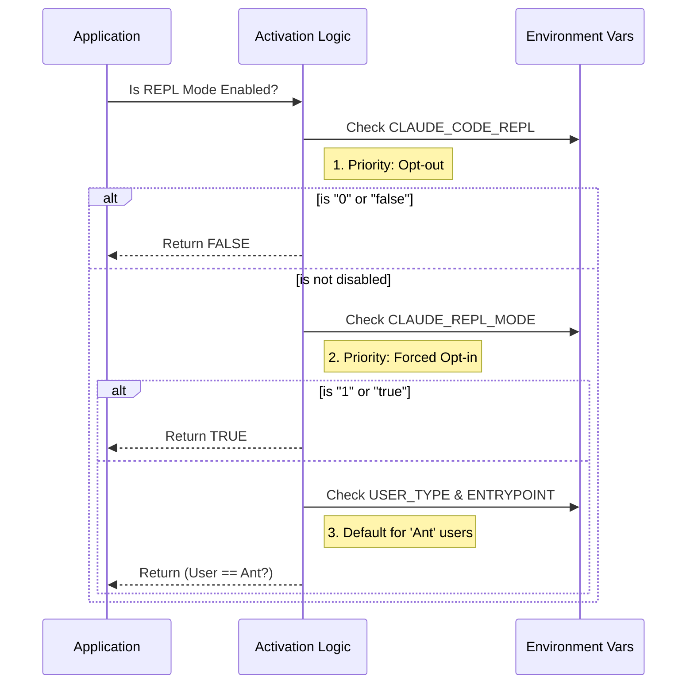

# Chapter 1: REPL Mode Activation

Welcome to the first chapter of the **REPLTool** tutorial! We are going to build an understanding of how an AI agent decides *how* to interact with your computer.

## The Motivation: Video Game Difficulty Settings

Imagine you are playing a video game.
*   **Normal Mode:** You press a button to open a door, and another button to pick up an item.
*   **Hacker Mode:** To open a door, you have to type `door.open()`. To pick up an item, you type `inventory.add(item)`.

In "Hacker Mode," the specific buttons for "Open" and "Pick Up" might disappear from your screen because you are expected to write code to do it instead.

**REPL Mode Activation** is exactly this setting for our AI tool.

### The Use Case
We want our AI to be smart. Sometimes, we want it to run simple commands one by one (Normal Mode). But for complex tasks, we want it to write and execute a full script in a "Read-Eval-Print Loop" or **REPL** (Hacker Mode).

We need a central "Master Switch" that looks at the environment and decides: **"Should the AI write code (REPL) today, or just use basic tools?"**

## How It Works

This logic doesn't require complex databases or AI thinking. It simply looks at the "settings" (Environment Variables) of the computer it is running on.

It asks three questions in order:
1.  **"Did the user explicitly turn this OFF?"**
2.  **"Did the user explicitly turn this ON?"**
3.  **"Is this an internal 'Ant' user running the CLI?"** (The default setting for specific internal users).

If the answer implies "Yes," REPL Mode is activated.

## Using the Abstraction

Let's look at how we check if this mode is active. You don't usually set this in TypeScript code; you check it to decide what tools to show the AI.

### Checking the Mode
Here is the simplest way to check our status:

```typescript
import { isReplModeEnabled } from './constants';

function main() {
  // Check the Master Switch
  const isHackerMode = isReplModeEnabled();

  if (isHackerMode) {
    console.log("REPL Mode Active: AI will write code.");
  } else {
    console.log("Standard Mode: AI will use direct tools.");
  }
}
```

### Setting the Mode (User Side)
To change this mode, a user doesn't rewrite code. They change their environment before running the tool.

**To Force it ON:**
```bash
# In your terminal
export CLAUDE_REPL_MODE=1
npm start
```

**To Force it OFF:**
```bash
# In your terminal
export CLAUDE_CODE_REPL=0
npm start
```

## Under the Hood

Let's look at what happens inside the system when it runs `isReplModeEnabled()`. It follows a strict hierarchy of checks.

### The Decision Flow



### Implementation Details

The code relies on a file usually named `constants.ts`. Let's look at the implementation logic.

#### 1. The Opt-Out Check
First, we respect the user's wish to disable it.

```typescript
// From constants.ts
export function isReplModeEnabled(): boolean {
  // If the user set CLAUDE_CODE_REPL to 0 or false, stop here.
  if (isEnvDefinedFalsy(process.env.CLAUDE_CODE_REPL)) {
      return false
  }
  
  // ... continued below
```
*Explanation:* `isEnvDefinedFalsy` checks if the variable exists AND equates to "no". If so, the switch is immediately `false`.

#### 2. The Legacy Opt-In
Next, we check if the user forced it on using an older variable method.

```typescript
  // ... continued
  
  // If CLAUDE_REPL_MODE is 1 or true, force it on.
  if (isEnvTruthy(process.env.CLAUDE_REPL_MODE)) {
      return true
  }

  // ... continued below
```
*Explanation:* `isEnvTruthy` does the opposite. If this flag is raised, we ignore everything else and return `true`.

#### 3. The Default Behavior
Finally, if the user didn't say Yes or No, we check who the user *is*.

```typescript
  // ... continued

  // Default to ON if user is an 'ant' using the 'cli'
  return (
    process.env.USER_TYPE === 'ant' &&
    process.env.CLAUDE_CODE_ENTRYPOINT === 'cli'
  )
}
```
*Explanation:* This acts as a default setting. If you are an internal user (`ant`) using the command line interface (`cli`), you get REPL mode automatically. SDK users (developers using this library in their own code) get it off by default.

## Why does this matter?

When **REPL Mode Activation** returns `true`, the system hides specific tools from the AI.

If `isReplModeEnabled()` is true, tools like `FILE_READ_TOOL` or `BASH_TOOL` are put onto a "Hidden List". This forces the AI to use the REPL execution environment to perform those tasks instead.

We will learn exactly how the system detects these environments in the next chapter, and how it hides those tools in [Tool Exclusivity Strategy](03_tool_exclusivity_strategy.md).

## Conclusion

You have learned about the **REPL Mode Activation** logic. It is the gatekeeper that looks at environment variables to decide if our AI should act as a coder (REPL mode) or a standard user (Direct tool mode).

In the next chapter, we will look deeper into how the system understands where it is running.

[Next Chapter: Environment Context Detection](02_environment_context_detection.md)

---

Generated by [Code IQ](https://github.com/adityasoni99/Code-IQ)