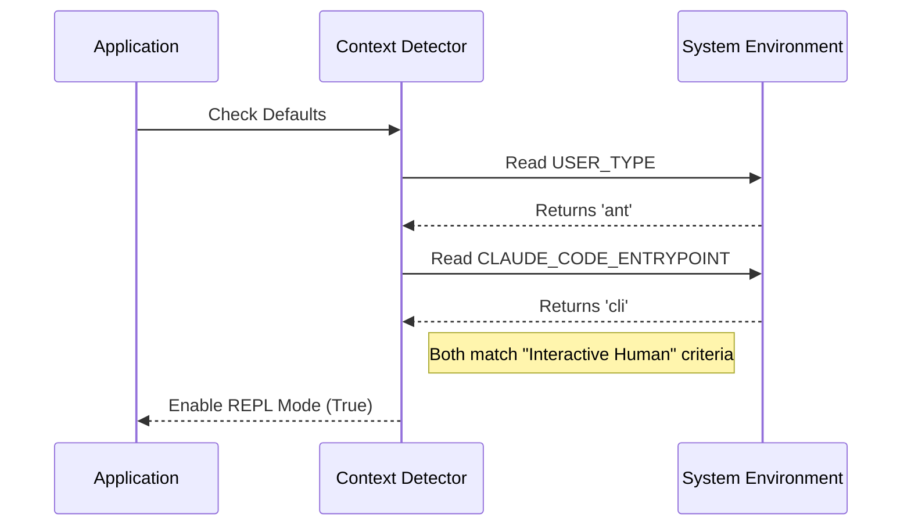

# Chapter 2: Environment Context Detection

Welcome back! In the previous chapter, [REPL Mode Activation](01_repl_mode_activation.md), we learned that our tool has a "Master Switch" (REPL Mode) that changes how the AI interacts with your computer.

But here is the catch: **We don't want users to have to flip this switch manually every time.**

In this chapter, we will learn about **Environment Context Detection**. This is the logic the system uses to automatically guess the best setting for you based on *who* you are and *how* you are running the program.

## The Motivation: Mobile vs. Desktop Views

Think about visiting a website on your phone versus your laptop.
*   **Phone:** The menu is hidden behind a "hamburger" icon to save space.
*   **Laptop:** The menu is fully visible at the top.

You didn't click a button saying "I am on a phone." The website **detected your environment** (screen size) and gave you the layout that makes the most sense.

### The Use Case

Our AI tool runs in two very different worlds:
1.  **The Interactive User:** You are typing commands in a terminal window manually. You want the smart "Hacker Mode" (REPL) so the AI can do complex work for you.
2.  **The SDK Developer:** You are writing a Python script that imports this tool to do one specific thing. You want "Normal Mode" so your script behaves predictably.

**Environment Context Detection** solves this by looking at the "Digital Fingerprint" of the current session to decide which default to pick.

## The Two Key Clues

To detect the context, the system looks for two specific "Environment Variables" (settings saved in the computer's temporary memory).

### 1. The Identity (`USER_TYPE`)
This asks: **"Who is running this?"**
*   **'ant':** This represents an internal user or the standard compiled binary.
*   **undefined:** This usually means an external user or a custom build.

### 2. The Doorway (`CLAUDE_CODE_ENTRYPOINT`)
This asks: **"How did they enter the program?"**
*   **'cli':** The user typed a command in the terminal (Command Line Interface).
*   **'sdk-py' / 'sdk-ts':** The user is running a script that imports our code as a library.

## How It Works

The system combines these two clues.

If the user is an **'ant'** (Identity) AND they are using the **'cli'** (Doorway), the system assumes: *"This is a human wanting to do complex work. Turn on REPL Mode!"*

If either of those is false (e.g., they are using the SDK), the system assumes: *"This is a script. Keep it simple. Turn off REPL Mode."*

## Under the Hood

Let's visualize the decision-making process before looking at the code.

### The Logic Flow



## Implementation Details

The code for this detection lives in the same `constants.ts` file we looked at in Chapter 1. It is the final "fallback" check if the user hasn't manually forced a setting.

### The Code Logic

Here is the exact logic used to detect the environment. We check two variables at the same time.

```typescript
// Inside constants.ts
function checkDefaultMode() {
  return (
    // Check Identity
    process.env.USER_TYPE === 'ant' &&
    
    // Check Doorway
    process.env.CLAUDE_CODE_ENTRYPOINT === 'cli'
  )
}
```

*   **`process.env`**: This accesses the environment variables of your computer.
*   **`&&` (AND)**: Both conditions must be true. If you are an 'ant' but using the 'sdk', this returns `false`.

### Why SDK users get "False"

Imagine you are a developer building a weather app. You want to use our tool to check a file.

If REPL Mode turned on automatically, the AI might try to write a Python script to check the file instead of just reading it. That would be overkill and might break your app!

By checking `CLAUDE_CODE_ENTRYPOINT`, we ensure that:
1.  **CLI Users** get the powerful, complex Agent.
2.  **SDK Users** get the predictable, simple Tools.

## Putting it Together

This detection logic connects directly to what we learned in [REPL Mode Activation](01_repl_mode_activation.md).

Here is the full picture of the `isReplModeEnabled` function:

```typescript
export function isReplModeEnabled(): boolean {
  // 1. Check for Manual Override (covered in Chapter 1)
  if (isEnvDefinedFalsy(process.env.CLAUDE_CODE_REPL)) return false
  if (isEnvTruthy(process.env.CLAUDE_REPL_MODE)) return true
  
  // 2. Environment Context Detection (This Chapter)
  return (
    process.env.USER_TYPE === 'ant' &&
    process.env.CLAUDE_CODE_ENTRYPOINT === 'cli'
  )
}
```

## Conclusion

You now understand **Environment Context Detection**. It is the system's way of being polite: it gives power users the "Hacker Mode" automatically, while keeping things simple for developers building apps.

But what actually happens when the system decides "Yes, this is a REPL environment"? The system begins to **lock away** certain tools so the AI *has* to write code.

In the next chapter, we will learn how the system hides tools like `FileRead` and `Bash` to force the AI to be smarter.

[Next Chapter: Tool Exclusivity Strategy](03_tool_exclusivity_strategy.md)

---

Generated by [Code IQ](https://github.com/adityasoni99/Code-IQ)