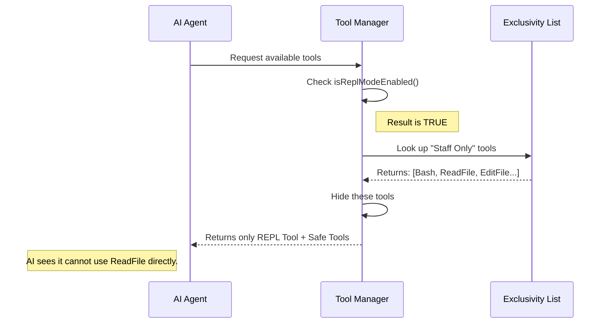

# Chapter 3: Tool Exclusivity Strategy

Welcome to Chapter 3! In the previous chapter, [Environment Context Detection](02_environment_context_detection.md), we learned how the system automatically decides whether to turn "REPL Mode" (Hacker Mode) ON or OFF.

Now we face a new question: **If REPL Mode is ON, how do we force the AI to actually use it?**

Just because we give the AI a powerful tool doesn't mean it will stop using the simple ones. This chapter introduces the **Tool Exclusivity Strategy**.

## The Motivation: The Restaurant Kitchen

To understand this strategy, let's go back to our restaurant analogy.

Imagine a restaurant with two ways to get food:
1.  **Buffet Style:** The customer walks into the kitchen, grabs one item, walks back to the table, eats it, and repeats.
2.  **Fine Dining:** The customer sits down, tells the waiter a complex order, and the waiter handles everything in the kitchen.

If we want a "Fine Dining" experience (efficiency), we cannot let the customer wander into the kitchen. We must put a **"Staff Only"** sign on the kitchen door.

### The Use Case

Let's apply this to our AI. Suppose you ask the AI: *"Count the lines of code in every file in this folder."*

*   **Without Exclusivity:** The AI sees a `ReadFile` tool. It might try to read 100 files one by one. This is slow and "spammy" (Buffet Style).
*   **With Exclusivity:** We **hide** the `ReadFile` tool. The AI looks for it, can't find it, and sees the `REPL` tool is available. It realizes: *"I must write a script to count these lines."* It writes one script, runs it once, and gets the answer instantly (Fine Dining).

## How It Works

The **Tool Exclusivity Strategy** is simply a "Blacklist."

It defines a specific list of tools that are **strictly forbidden** for direct use when REPL Mode is active. Instead of calling these tools directly, the AI must use the REPL environment to achieve the same result.

## Using the Strategy

You don't usually "call" this strategy; it is a passive definition list used by the system's tool manager. However, understanding it is crucial for knowing why certain tools suddenly disappear.

### The Logic Check

Here is a simplified view of how the system decides which tools to show the AI:

```typescript
function getToolsForAI() {
  const allTools = loadAllTools(); // Load everything
  
  // Check the "Master Switch" (from Chapter 1)
  if (isReplModeEnabled()) {
    // Filter out the "Staff Only" tools
    return allTools.filter(tool => !REPL_ONLY_TOOLS.has(tool.name));
  }

  return allTools;
}
```

If REPL mode is enabled, the system looks at the `REPL_ONLY_TOOLS` list. If a tool is on that list, it is removed from the AI's toolbox before the AI even sees it.

## Under the Hood

Let's visualize the flow of data when the AI asks "What tools can I use?"

### The Filtering Process



### Implementation Details

This logic is defined in `constants.ts` using a Javascript `Set`. A `Set` is like an array, but it is optimized to answer the question "Is this item in the list?" very quickly.

Let's look at the actual code defining this list:

```typescript
// Inside constants.ts

// A Set containing names of tools to hide in REPL mode
export const REPL_ONLY_TOOLS = new Set([
  FILE_READ_TOOL_NAME,
  FILE_WRITE_TOOL_NAME,
  FILE_EDIT_TOOL_NAME,
  GLOB_TOOL_NAME,      // Tool for finding files
  GREP_TOOL_NAME,      // Tool for searching text
  BASH_TOOL_NAME,      // Direct terminal command tool
  // ... others
])
```

### Breakdown of the Blocked Tools

Why are these specific tools hidden?

1.  **`FILE_READ` / `FILE_WRITE`**: Reading/Writing files one by one is inefficient for large tasks. We want the AI to write a script to handle file I/O.
2.  **`GLOB` / `GREP`**: These are search tools. It is much faster to run a `grep` command inside a REPL script than to call the `GrepTool` as a separate API request.
3.  **`BASH_TOOL`**: This is the most important one. If we give the AI a direct "Run Command" tool, it acts like a basic terminal. By hiding it, we force the AI to use the **REPL**, which offers a safer, more structured way to execute code and commands.

## Why use a `Set`?

You might notice the code uses `new Set([...])` instead of just `[...]` (an Array).

```typescript
// Fast check
REPL_ONLY_TOOLS.has("FileRead") // returns true instantly

// Slower check (if we used an Array)
// REPL_ONLY_TOOLS_ARRAY.includes("FileRead") 
```

Since the system might check this repeatedly for every single request the AI makes, using a `Set` ensures the check is instant, keeping the tool snappy.

## Conclusion

The **Tool Exclusivity Strategy** is the enforcement mechanism of REPLTool. It ensures that when we flip the switch to "Hacker Mode," the AI actually behaves like a hacker.

By hiding the "easy" tools (like `FileRead`), we force the AI to use the "smart" tool (`REPL`) to perform batched, efficient operations.

Now we know *what* tools we are hiding. But where do these tools come from in the first place? In the next chapter, we will learn about the **Primitive Tools Registry**, the central library where all these tools are born.

[Next Chapter: Primitive Tools Registry](04_primitive_tools_registry.md)

---

Generated by [Code IQ](https://github.com/adityasoni99/Code-IQ)