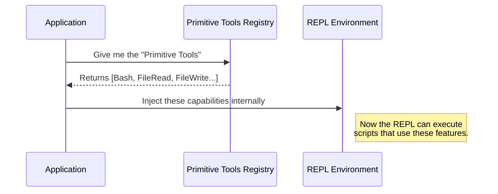

# Chapter 4: Primitive Tools Registry

Welcome to Chapter 4! In the previous chapter, [Tool Exclusivity Strategy](03_tool_exclusivity_strategy.md), we learned how the system hides certain tools (like `FileRead` or `Bash`) from the AI to force it to write code.

But here is a puzzle: **If we hide the `FileRead` tool from the AI, how does the AI actually read the file?**

The AI writes a script to read the file. But for that script to work, the system essentially needs to hand the "File Reading Capability" to the script execution engine.

This chapter introduces the **Primitive Tools Registry**, the collection of fundamental parts that make the system work.

## The Motivation: The Car Engine

Let's use an analogy to understand why we need this registry.

Imagine a car.
*   **The Driver (The AI):** The person making decisions.
*   **The Steering Wheel & Pedals (The REPL):** The interface the driver uses.
*   **The Pistons & Spark Plugs (Primitive Tools):** The internal parts that actually make the car move.

In "Normal Mode," the AI is like a mechanic. It picks up a spark plug (FileReadTool) and uses it directly.

In "REPL Mode," the AI is a driver. The driver **never touches the spark plugs**. They step on the gas pedal. However, the car still *needs* spark plugs inside the engine to work!

### The Use Case

We need a central box (The Registry) where we keep all these "engine parts" (Tools).

When the system starts up in REPL Mode, it grabs this box and says: *"I am not giving these to the AI directly. instead, I am installing them inside the execution engine so the AI's scripts can use them."*

## How It Works

The **Primitive Tools Registry** is simply a specific function that returns a list (an Array) of all the fundamental tools available to the system.

It acts as a single source of truth. If you want to know "What is this system physically capable of doing?", you look at the registry.

## Using the Abstraction

You generally don't "call" this registry in your daily code. It is used by the system during the setup phase.

However, understanding it helps you know where to look if you want to add a new capability (like a "DownloadFile" tool).

### The Concept

Imagine a function that acts like an inventory checklist:

```typescript
function getEngineParts() {
  return [
    "SparkPlug",
    "Piston",
    "FuelInjector"
  ];
}
```

In our system, these strings are actual software classes that perform actions.

## Under the Hood

Let's visualize how the system uses this registry to build the environment for the AI.

### The Assembly Line



### Implementation Details

Let's look at the actual code in `primitiveTools.ts`. It uses a pattern designed to be efficient and safe.

#### 1. The Storage Box
First, we define a variable to hold our tools.

```typescript
// primitiveTools.ts
import { FileReadTool } from '../FileReadTool/FileReadTool.js'
// ... other imports

// This variable acts as our cache
let _primitiveTools: readonly Tool[] | undefined
```
*   **`let`**: This means the value can change (initially it is empty).
*   **`undefined`**: When the program starts, this box is empty.

#### 2. The Registry Function
This is the main function that other parts of the application call.

```typescript
export function getReplPrimitiveTools(): readonly Tool[] {
  // If the box is already full, return it.
  // If empty, fill it with our tools.
  return (_primitiveTools ??= [
    FileReadTool,
    FileWriteTool,
    FileEditTool,
    GlobTool,       // For finding files
    GrepTool,       // For searching text
    BashTool,       // For running commands
    NotebookEditTool,
    AgentTool,
  ])
}
```

### Breaking Down the Syntax

You might notice this weird symbol: `??=`.

```typescript
_primitiveTools ??= [ ... ]
```

This is a modern JavaScript feature called **Logical Nullish Assignment**. It translates to:

> "Is `_primitiveTools` currently empty (undefined)?
>
> **YES:** Create the list of tools, save it into `_primitiveTools`, and then return it.
>
> **NO:** Ignore the list and just return what is already saved in `_primitiveTools`."

This ensures we only create the list **once**. This concept is so important for performance and stability that we will cover it in detail in the next chapter.

## Why is this "Primitive"?

We call these "Primitive" not because they are simple, but because they are **foundational**.

*   **`BashTool`**: Allows the execution of any shell command.
*   **`FileReadTool`**: Allows reading data.
*   **`FileWriteTool`**: Allows saving data.

These are the atoms of the operating system. Even if the AI is writing a complex Python script to analyze data, that script eventually boils down to "Read File" and "Write File."

By keeping them in a Registry, we ensure that both the **Normal Mode** (Direct use) and **REPL Mode** (Script use) rely on the exact same underlying code.

## Conclusion

You have learned about the **Primitive Tools Registry**. It is the "Parts Department" of our application. It holds the fundamental capabilities (like reading files and running commands) that the system needs to function.

We also saw a snippet of code that loads these tools only when requested (`??=`). This is a specific design choice known as the **Lazy Initialization Pattern**.

Why did we write it that way instead of just a simple list? The answer involves preventing startup crashes and circular dependencies. We will explain exactly how that works in the final chapter.

[Next Chapter: Lazy Initialization Pattern](05_lazy_initialization_pattern.md)

---

Generated by [Code IQ](https://github.com/adityasoni99/Code-IQ)