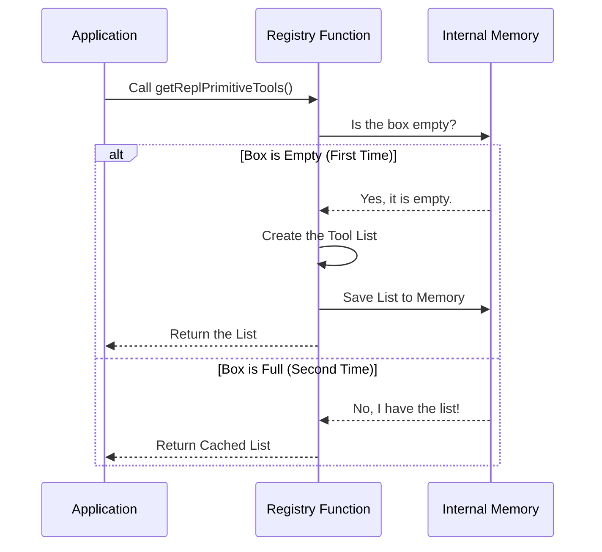

# Chapter 5: Lazy Initialization Pattern

Welcome to the final chapter of our series! In the previous chapter, [Primitive Tools Registry](04_primitive_tools_registry.md), we created a central "Parts Department" (Registry) that holds all the tools our AI needs, like `FileReadTool` and `BashTool`.

However, we ended that chapter with a mystery. We noticed the code used a strange symbol (`??=`) and wrapped the list in a function instead of just making a simple list.

This chapter explains **why**. We are going to learn about the **Lazy Initialization Pattern**.

## The Motivation: The "Chicken and Egg" Problem

To understand this pattern, we have to understand a specific computer error called a **Circular Dependency**.

Imagine two friends, Alice and Bob, trying to introduce each other at a party:
1.  **Alice says:** "I can't start talking until Bob is here."
2.  **Bob says:** "I can't start talking until Alice is here."

If they both wait for the other to start, **nobody ever talks**. The party freezes.

### The Use Case in Code
In our project, we have a similar situation:
1.  **The Registry** needs to import the **FileReadTool** to put it in the list.
2.  **The FileReadTool** (indirectly) needs to import the **Registry** to know how to display itself.

If we just wrote `const tools = [FileReadTool]`, the computer tries to load both files at the exact same millisecond. They get stuck waiting for each other, and the application crashes with an error saying "Cannot access before initialization."

**Lazy Initialization** solves this by saying: *"Don't try to load these tools when the application **starts**. Wait until the very last second when the user actually **asks** for them."*

## Key Concepts

There are two main concepts to understand here.

### 1. Immediate vs. Lazy
*   **Immediate:** You cook breakfast, lunch, and dinner at 6:00 AM, just in case you get hungry later. (Risky, takes up space).
*   **Lazy:** You wait until your stomach growls at 12:00 PM, *then* you make a sandwich. (Efficient, safe).

### 2. Caching (The Memory)
Being lazy is good, but we don't want to be inefficient.
*   **Without Cache:** Every time you want a sandwich, you go to the store to buy ingredients.
*   **With Cache:** You go to the store once. If you want a second sandwich, you use the ingredients you already have in the fridge.

## How to Use It

We implement this pattern by moving our list inside a **Function**.

### The "Dangerous" Way (Don't do this)
If we do this, the code runs immediately when the file loads, potentially causing a crash.

```typescript
// BAD: Runs immediately at startup
import { FileReadTool } from './FileReadTool';

export const ALL_TOOLS = [ FileReadTool ]; 
```

### The "Lazy" Way (Do this)
We wrap it in a function. The code inside the function **does not run** until someone calls `getTools()`.

```typescript
// GOOD: Runs only when requested
import { FileReadTool } from './FileReadTool';

export function getTools() {
    return [ FileReadTool ];
}
```

## Under the Hood

Let's look at how the application asks for tools using this pattern.

### The Sequence



1.  **First Call:** The system checks memory. It's empty. It takes the time to gather the tools (import them) and saves them.
2.  **Second Call:** The system checks memory. It sees the list is already there. It returns it instantly without doing any work.

## Implementation Details

Let's look at the actual code in `primitiveTools.ts`. It is designed to be concise using modern JavaScript features.

### Step 1: The Cache Variable
First, we create a variable outside the function to act as our "Memory Box".

```typescript
import type { Tool } from '../../Tool.js'
// ... imports ...

// This is our cache.
// Initially, it is 'undefined' (empty).
let _primitiveTools: readonly Tool[] | undefined
```

### Step 2: The Lazy Function
Next, we export the function that the rest of the app will use.

```typescript
export function getReplPrimitiveTools(): readonly Tool[] {
  // Use the "Nullish Coalescing Assignment" operator (??=)
  return (_primitiveTools ??= [
    FileReadTool,
    FileWriteTool,
    // ... other tools
    BashTool,
  ])
}
```

### Understanding `??=`

The magic symbol `??=` is a shortcut for the logic we diagrammed above.

```typescript
_primitiveTools ??= [ ... ]
```

This single line says:
> "If `_primitiveTools` is empty, **create** the array and save it.
> If `_primitiveTools` already has a value, **ignore** the array on the right and use the saved value."

### Why this fixes the crash

By using this function:
1.  The application starts up.
2.  It loads `primitiveTools.ts`, but it **skips over** the code inside the function.
3.  It finishes loading all other files (solving the circular dependency).
4.  Later, when the AI actually needs to run a command, it calls `getReplPrimitiveTools()`.
5.  By now, all files are safe and loaded, so the function runs without crashing.

## Conclusion

Congratulations! You have completed the **REPLTool** tutorial series.

In this chapter, you learned about the **Lazy Initialization Pattern**. We used it to make our **Primitive Tools Registry** safer and more stable.

**Let's recap your journey:**
1.  **[REPL Mode Activation](01_repl_mode_activation.md):** You learned how the system decides whether to be a "User" or a "Hacker".
2.  **[Environment Context Detection](02_environment_context_detection.md):** You learned how the system detects if it's running in a terminal or a script.
3.  **[Tool Exclusivity Strategy](03_tool_exclusivity_strategy.md):** You learned how we hide simple tools to force the AI to write code.
4.  **[Primitive Tools Registry](04_primitive_tools_registry.md):** You saw where the fundamental system tools live.
5.  **Lazy Initialization Pattern:** You learned how to load those tools safely without crashing the system.

You now have a complete understanding of how this complex AI tool manages its environment and capabilities!

---

Generated by [Code IQ](https://github.com/adityasoni99/Code-IQ)