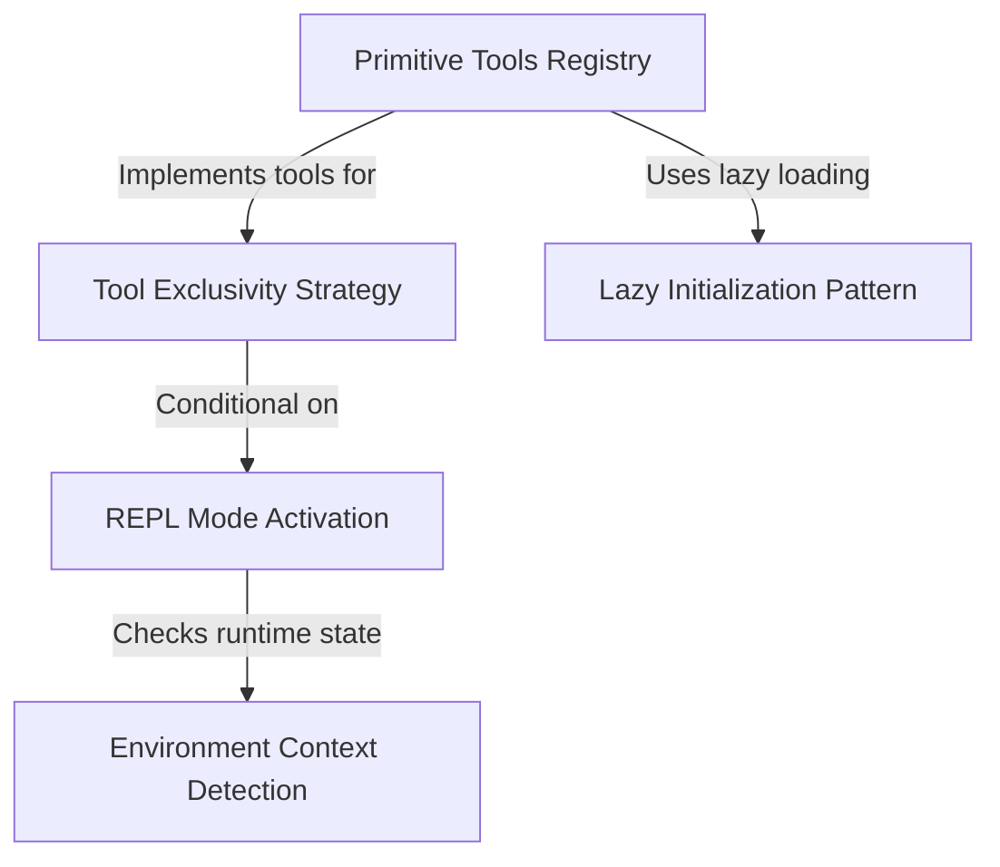

# Tutorial: REPLTool

The **REPLTool** project provides the infrastructure for a "Read-Eval-Print Loop" mode, enabling an AI agent to execute code for complex tasks rather than performing single actions. It manages a registry of *primitive tools* (like file editing or bash commands) that are hidden from direct use and only accessible via the REPL. The system uses **environment context** detection to automatically toggle this mode and configure tool exclusivity.

## Chapters

1. [REPL Mode Activation](01_repl_mode_activation.md)
2. [Environment Context Detection](02_environment_context_detection.md)
3. [Tool Exclusivity Strategy](03_tool_exclusivity_strategy.md)
4. [Primitive Tools Registry](04_primitive_tools_registry.md)
5. [Lazy Initialization Pattern](05_lazy_initialization_pattern.md)

---

Generated by [Code IQ](https://github.com/adityasoni99/Code-IQ)