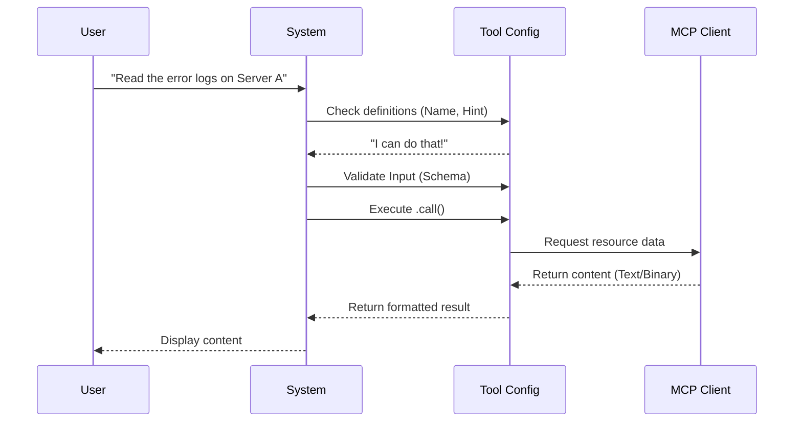

# Chapter 1: Tool Definition & Configuration

Welcome to the first chapter of our tutorial! Here, we will lay the foundation for creating a powerful tool called `ReadMcpResourceTool`.

## The Motivation

Imagine you have a library full of books (resources), but the librarian (the AI) doesn't know they exist or how to open them. You need a way to formally introduce a specific ability—like "Read Book"—to the AI.

In this project, our "books" are resources on an **MCP (Model Context Protocol)** server. The **Use Case** we are solving is simple:

> A user wants the AI to read the contents of a specific file or resource (identified by a URI) from a connected server.

To make this happen, we need to create a **Tool Definition**. Think of this as filling out a registration card or creating an "ID Badge" for the tool. This badge tells the system:
1.  **Who** the tool is (Name).
2.  **What** the tool does (Description/Prompt).
3.  **How** it behaves (Safety rules).
4.  **How** to execute it (The code logic).

## Key Concepts

We use a helper function called `buildTool` to create this definition. Let's break down the parts of our ID Badge.

### 1. Identity & Discovery
The system needs to know how to find your tool. We provide a unique `name` and a `searchHint` to help the system's "router" pick the right tool for the job.

### 2. Behavioral Flags
These are like safety labels on power tools.
*   **Read Only:** Can this tool change data? (e.g., delete files). If not, it's "Read Only."
*   **Concurrency Safe:** Can two people use this tool at the exact same time without breaking it?

### 3. The `call` Function
This is the engine. When the AI decides to use the tool, this function runs. It takes inputs (like a server name and a URI) and returns the result.

## Usage: Defining the Tool

Let's look at how we build the `ReadMcpResourceTool`. We will write this in a file typically named `ReadMcpResourceTool.ts`.

### Step 1: Identity and Metadata
First, we start the `buildTool` function and give it a name.

```typescript
export const ReadMcpResourceTool = buildTool({
  name: 'ReadMcpResourceTool',
  // A short hint for the system's search algorithm
  searchHint: 'read a specific MCP resource by URI', 
  
  // A detailed description for the AI to understand purpose
  async description() { return DESCRIPTION },
  
  // Specific instructions on how the AI should use it
  async prompt() { return PROMPT },
// ...
```
**Explanation:** We export the tool so other parts of the app can load it. The `searchHint` is crucial for performance—it helps the system quickly guess if this tool is relevant before doing a deep analysis.

### Step 2: Safety Configuration
Next, we define the behavioral flags.

```typescript
// ... inside buildTool object
  isConcurrencySafe() {
    return true
  },
  isReadOnly() {
    return true
  },
  // If the result is huge, stop at 100k characters
  maxResultSizeChars: 100_000,
// ...
```
**Explanation:** Since reading a resource doesn't delete or modify anything, `isReadOnly` is `true`. We also declare it safe to run in parallel (`isConcurrencySafe`).

### Step 3: Binding Schemas
We need to link the tool to its validation rules. We will cover the details of these schemas in [Schema Validation](02_schema_validation.md), but here is how we attach them.

```typescript
// ... inside buildTool object
  get inputSchema(): InputSchema {
    return inputSchema()
  },
  get outputSchema(): OutputSchema {
    return outputSchema()
  },
// ...
```
**Explanation:** The `inputSchema` defines what arguments the tool accepts (Server Name + URI), and `outputSchema` defines what the tool gives back (File Content).

### Step 4: The Execution Logic (`call`)
Finally, we define what actually happens when the tool runs.

```typescript
// ... inside buildTool object
  async call(input, { options: { mcpClients } }) {
    const { server: serverName, uri } = input
    
    // Find the specific client the user asked for
    const client = mcpClients.find(c => c.name === serverName)

    if (!client) {
      throw new Error(`Server "${serverName}" not found.`)
    }
    // ... (logic continues)
```
**Explanation:** The `call` function receives the validated `input`. We also get access to `mcpClients` (the list of connected servers) via the second argument context.

## Under the Hood: The Flow

How does the system use this configuration object? Let's visualize the lifecycle of a tool request.



### Internal Implementation Details

The `call` method performs several checks before doing the heavy lifting. This ensures reliability.

#### 1. Validation Logic
Before asking for data, we ensure the server is ready.

```typescript
    // ... inside call()
    if (client.type !== 'connected') {
      throw new Error(`Server "${serverName}" is not connected`)
    }

    // Check if this server actually supports 'resources'
    if (!client.capabilities?.resources) {
      throw new Error(`Server "${serverName}" does not support resources`)
    }
```
**Explanation:** We don't just check if the server exists; we check if it is `connected` and if it has the capability to provide `resources`. We will learn more about how clients work in [MCP Client Integration](04_mcp_client_integration.md).

#### 2. Requesting the Data
Once validated, we make the network request.

```typescript
    const connectedClient = await ensureConnectedClient(client)
    
    // The core MCP SDK call
    const result = await connectedClient.client.request(
      {
        method: 'resources/read',
        params: { uri },
      },
      ReadResourceResultSchema,
    )
```
**Explanation:** This snippet sends a message to the external server saying "Please run `resources/read` for this URI." It waits for the response.

#### 3. Processing the Result
The result might be text or binary data (like an image).

```typescript
    // ... inside call() processing results
    const contents = await Promise.all(
      result.contents.map(async (c, i) => {
        if ('text' in c) {
          return { uri: c.uri, mimeType: c.mimeType, text: c.text }
        }
        // ... (binary handling logic)
        return { uri: c.uri, mimeType: c.mimeType }
      }),
    )
```
**Explanation:** We map over the results. If it's text, we return it simply. If it's binary, there is logic to save it to a file (covered in [Content Persistence Strategy](05_content_persistence_strategy.md)).

## Conclusion

In this chapter, we created the identity and logic for the `ReadMcpResourceTool`. You learned how to use `buildTool` to configure metadata, set safety flags, and define the execution function.

However, a tool is useless if it accepts garbage inputs. How do we ensure the `uri` is a string and the `server` name is valid?

[Next Chapter: Schema Validation](02_schema_validation.md)

---

Generated by [Code IQ](https://github.com/adityasoni99/Code-IQ)