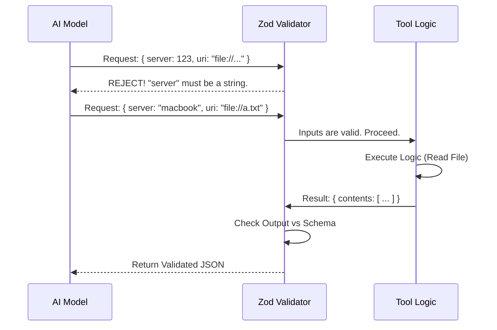

# Chapter 2: Schema Validation

In the previous chapter, [Tool Definition & Configuration](01_tool_definition___configuration.md), we created the "ID Badge" for our `ReadMcpResourceTool`, giving it a name and behavioral rules.

But identifying a tool isn't enough. We need to define exactly **how to talk to it** and **what it will say back**.

## The Motivation

Imagine you are filling out a government form. If a box asks for your "Age" and you write "Blue," the form will be rejected.

In our system, the AI is the one filling out the form. Without strict rules, the AI might try to send a number instead of a server name, or an entire paragraph instead of a URI.

**The Use Case:**
> We need to strictly enforce that the AI provides exactly two pieces of text: a `server` name and a `uri`. We also need to guarantee that our tool returns data in a specific JSON structure so the user interface knows how to display it.

We solve this using **Schema Validation**. This acts as a "Contract." If the inputs don't match the contract, the tool refuses to run, preventing crashes and confusion.

## Key Concepts

### 1. Zod
We use a library called **Zod**. Zod allows us to describe data shapes in code. It acts like a nightclub bouncer—it checks every piece of data trying to enter or leave your tool.

### 2. Input Schema
This defines the **arguments** the AI must provide. For our tool, the AI must provide the target server and the file URI.

### 3. Output Schema
This defines what the tool returns after it runs. This ensures that the rest of the application (like the UI) receives predictable data, whether it's text or a file path.

## Usage: Defining the Schemas

We define these schemas in the same file as our tool (`ReadMcpResourceTool.ts`).

### Step 1: Defining the Input
We use `z.object` to define a container that holds our arguments.

```typescript
// Define what the AI must send us
export const inputSchema = lazySchema(() =>
  z.object({
    // We expect a string for the server name
    server: z.string().describe('The MCP server name'),
    
    // We expect a string for the resource URI
    uri: z.string().describe('The resource URI to read'),
  }),
)
```
**Explanation:**
*   `z.string()`: Tells the system "This must be text."
*   `.describe(...)`: This is crucial! This description is actually sent to the AI. It tells the AI *what* kind of string to put here.

### Step 2: Defining the Output
Next, we define what the tool gives back. We want to return a list of contents.

```typescript
// Define what we return to the system
export const outputSchema = lazySchema(() =>
  z.object({
    contents: z.array(
      z.object({
        uri: z.string().describe('Resource URI'),
        // .optional() means this field might not exist
        mimeType: z.string().optional().describe('Type of content'),
        text: z.string().optional().describe('Text content'),
      }),
    ),
  }),
)
```
**Explanation:**
*   `z.array(...)`: We might read multiple things (though usually just one), so we return a list.
*   `.optional()`: Sometimes a resource is an image, so it won't have `text`. We mark `text` as optional so the validation doesn't fail if it's missing.

### Step 3: Extracting Types
One of the best features of Zod is that it can automatically generate TypeScript types for us.

```typescript
// Create a TypeScript type based on the Zod rules above
type InputSchema = ReturnType<typeof inputSchema>

// If we change the Zod rule, this type updates automatically!
type OutputSchema = ReturnType<typeof outputSchema>

export type Output = z.infer<OutputSchema>
```
**Explanation:** We don't have to manually write an interface like `interface Input { server: string }`. Zod infers it for us. This keeps our TypeScript types and our runtime validation perfectly in sync.

## Under the Hood: The Flow

What happens when the AI tries to use the tool? The system acts as a middleman validator.



### Internal Implementation Details

In `ReadMcpResourceTool.ts`, we don't just write the schemas; we have to "bind" them to the tool definition we created in Chapter 1.

#### 1. Lazy Loading
You might have noticed `lazySchema` in the code above. This is a performance optimization.

```typescript
import { lazySchema } from '../../utils/lazySchema.js'

// We wrap the Zod definition in a function
export const inputSchema = lazySchema(() =>
  z.object({
    // ... rules
  }),
)
```
**Explanation:** If we have 50 tools, we don't want to create 50 complex Zod objects immediately when the app starts. `lazySchema` ensures we only create the validation rules the very first time this specific tool is actually used.

#### 2. Binding to the Tool
Finally, we connect these schemas to our tool configuration object.

```typescript
export const ReadMcpResourceTool = buildTool({
  name: 'ReadMcpResourceTool',
  // ... other config ...

  // Getter functions call the lazy schema
  get inputSchema(): InputSchema {
    return inputSchema()
  },
  
  get outputSchema(): OutputSchema {
    return outputSchema()
  },
  // ...
```
**Explanation:** By using getters (`get`), we ensure that the `buildTool` function receives the correct schema structure required by the system to auto-generate documentation for the AI.

## Conclusion

In this chapter, you learned how to use **Schema Validation** to create a strict contract for your tool.
1.  We used **Zod** to enforce that `server` and `uri` are strings.
2.  We used `.describe()` to give the AI hints about those fields.
3.  We defined a structured **Output Schema** to ensure consistent results.

Now that we have a defined tool (Chapter 1) and strict rules for using it (Chapter 2), we need to teach the AI *when* and *why* to use it.

[Next Chapter: LLM Context & Prompts](03_llm_context___prompts.md)

---

Generated by [Code IQ](https://github.com/adityasoni99/Code-IQ)