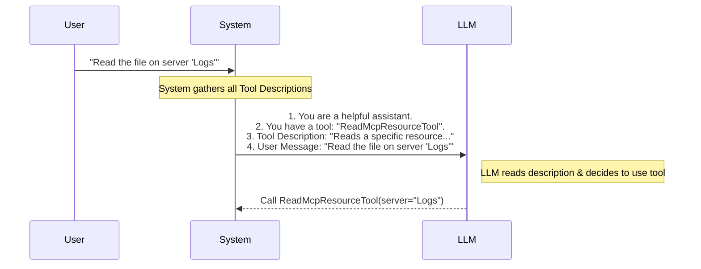

# Chapter 3: LLM Context & Prompts

In the previous chapter, [Schema Validation](02_schema_validation.md), we built a strict "contract" for our tool using Zod. We ensured that if the AI tries to use our tool, it *must* provide valid data (like a string for a URI).

But there is a missing link: **How does the AI know this tool exists?** And even if it knows it exists, how does it know *when* or *how* to use it?

This brings us to **LLM Context & Prompts**.

## The Motivation

Imagine you hire a new assistant. On their first day, you hand them a complicated machine they've never seen before. Without instructions, they won't touch it because they are afraid of breaking it.

The Large Language Model (LLM) is that assistant. Even though we wrote code for the tool, the LLM cannot read our TypeScript files. We need to translate our technical logic into **Natural Language** (English) instructions.

**The Use Case:**
> We need to provide a clear, text-based "Instruction Manual" to the AI so that when a user says "Read that file," the AI understands it should use the `ReadMcpResourceTool` with specific parameters.

## Key Concepts

### 1. The Context Window
The "Context" is the AI's short-term memory. It contains the current conversation history. To teach the AI about our tool, we inject a description of the tool directly into this memory before the AI answers the user.

### 2. The Description vs. The Prompt
We usually split our instructions into two parts:
*   **Description:** A short, one-sentence summary. This helps the AI quickly decide *if* it needs this tool.
*   **Prompt (or Instruction):** A detailed guide. This explains the parameters (`server`, `uri`) and gives usage examples.

### 3. Few-Shot Prompting
This is a fancy term for "giving examples." Instead of just saying "This tool takes a URI," we show an example: `readMcpResource({ uri: "my-file" })`. This is the most effective way to teach an AI.

## Usage: Writing the Manual

In our project, we keep these text instructions in a dedicated file, usually named `prompt.ts`, right next to our tool logic. This keeps our code clean.

### Step 1: The Short Description
First, we define the high-level summary. The AI reads this to categorize the tool.

```typescript
// prompt.ts
export const DESCRIPTION = `
Reads a specific resource from an MCP server.
- server: The name of the MCP server to read from
- uri: The URI of the resource to read
`
```
**Explanation:** This acts like the title and subtitle on a book cover. It tells the AI the "What" (Read a resource) and the "Who" (Server and URI).

### Step 2: The Detailed Instructions (The "Prompt")
Next, we write the full manual. This is where we act as a teacher.

```typescript
// prompt.ts
export const PROMPT = `
Reads a specific resource from an MCP server, identified by server name and resource URI.

Parameters:
- server (required): The name of the MCP server from which to read the resource
- uri (required): The URI of the resource to read
`
```
**Explanation:** Here we explicitly mark fields as `(required)`. This reinforces the Schema Validation we built in Chapter 2, but in plain English so the AI gets it right the first time.

### Step 3: Providing Examples
Within the description or prompt, it is best practice to show an example usage.

```typescript
// prompt.ts (continued)
export const DESCRIPTION = `
...
Usage examples:
- Read a resource from a server: \`readMcpResource({ server: "myserver", uri: "my-resource-uri" })\`
`
```
**Explanation:** By seeing the code format `readMcpResource(...)`, the LLM understands exactly how to structure its internal function call.

## Internal Implementation: Under the Hood

How does the system physically give these strings to the AI?

The application acts as a "Prompt Engineer" behind the scenes. It combines the User's message with our Tool's instructions before sending anything to the AI model.

### The Flow



### Hooking it up in Code

In [Tool Definition & Configuration](01_tool_definition___configuration.md), we saw the `buildTool` function. Now we can see how we plug our text variables into it.

We go back to `ReadMcpResourceTool.ts`:

```typescript
import { DESCRIPTION, PROMPT } from './prompt.js'

export const ReadMcpResourceTool = buildTool({
  name: 'ReadMcpResourceTool',
  
  // 1. Hook up the short description
  async description() { 
    return DESCRIPTION 
  },
  
  // 2. Hook up the detailed prompt
  async prompt() { 
    return PROMPT 
  },
  // ... rest of configuration
```

**Explanation:**
1.  We import the strings from `prompt.ts`.
2.  We pass them into the `buildTool` configuration.
3.  Note that `description` and `prompt` are `async` functions. This allows for advanced use cases where you might want to generate instructions dynamically (e.g., based on the time of day), but for now, we just return our static strings.

## Why this matters

If you skip this chapter or write bad prompts, your tool might technically work (the code is correct), but the AI will never use it.

*   **Bad Prompt:** "Reads stuff." -> The AI will act confused.
*   **Good Prompt:** "Reads a specific resource from an MCP server using a URI." -> The AI knows exactly what to do.

## Conclusion

In this chapter, you learned that an AI tool is two things: **Code** (Logic) and **Language** (Instructions).

1.  We defined a **Description** to tell the AI *what* the tool does.
2.  We defined a **Prompt** with examples to show the AI *how* to use it.
3.  We connected these texts to our tool definition.

Now the AI knows how to ask for a resource. But who is it asking? What is this "MCP Server" we keep mentioning?

We need to understand how our application talks to external servers to actually fetch the file.

[Next Chapter: MCP Client Integration](04_mcp_client_integration.md)

---

Generated by [Code IQ](https://github.com/adityasoni99/Code-IQ)