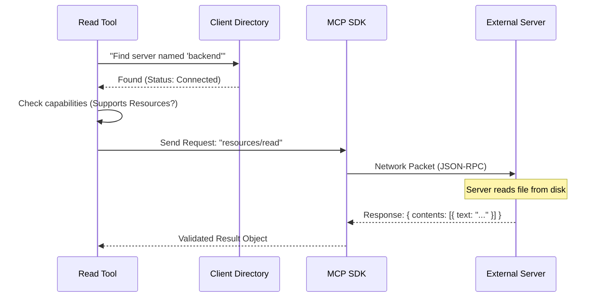

# Chapter 4: MCP Client Integration

In the previous chapter, [LLM Context & Prompts](03_llm_context___prompts.md), we taught the AI how to ask for a resource. We gave it an instruction manual so it knows to ask for a specific `server` name and a `uri`.

Now, the AI has made the request. It has handed us a note saying: *"I want to read the file `config.json` from the server named `backend`."*

But our tool is just code running in a box. It doesn't magically know where the "backend" server is or how to talk to it. We need a dispatcher.

## The Motivation

Imagine you are a receptionist in a large office building. A visitor approaches you and says, "I need to speak to Bob in Accounting."

Your job involves three steps:
1.  **Lookup:** Check the directory. Does "Bob" exist?
2.  **Status Check:** Is Bob actually in the office (connected), or is he on vacation?
3.  **Capability Check:** The visitor wants to discuss taxes. Does Bob handle taxes, or is he just the IT guy?
4.  **Connect:** If everything checks out, you pick up the phone and dial Bob's extension.

**The Use Case:**
> The AI provides a server name (e.g., "my-laptop"). We need to find the active connection for "my-laptop," ensure it allows file reading, and then send the request over the network to get the data.

This process is called **MCP Client Integration**.

## Key Concepts

### 1. The Client List (`mcpClients`)
Our application maintains a list of all active connections. Think of this as the "Phone Directory." When the tool runs, it receives this list so it can look up the requested server.

### 2. Capabilities
Just because we are connected to a server doesn't mean it can do everything.
*   Some servers only offer **Tools** (functions).
*   Some servers only offer **Resources** (files/data).
*   Some offer both.

Before we ask a server to "read a resource," we must check its **Capabilities** to avoid an error.

### 3. The `request` Method
This is the equivalent of dialing the phone. We use a standard command, `resources/read`, which is understood by all MCP-compliant servers.

## Usage: The Dispatch Logic

Let's look at how we implement this inside the `call` function of our tool.

### Step 1: Finding the Server
First, we look up the server name in our list.

```typescript
// input contains the server name the AI asked for
const { server: serverName } = input

// mcpClients is passed in via the context options
const client = mcpClients.find(c => c.name === serverName)

if (!client) {
  // We list available servers to help the AI correct its mistake
  const names = mcpClients.map(c => c.name).join(', ')
  throw new Error(`Server "${serverName}" not found. Available: ${names}`)
}
```
**Explanation:** We search the `mcpClients` array. If the `serverName` doesn't match anything, we throw an error. Notice we act casually helpful by listing the *available* servers in the error message—this often helps the AI self-correct!

### Step 2: Validating Connection & Capabilities
Finding the name isn't enough. We need to ensure the line is open and the server supports our goal.

```typescript
// 1. Check if the connection is active
if (client.type !== 'connected') {
  throw new Error(`Server "${serverName}" is not connected`)
}

// 2. Check if the server supports the 'resources' feature
if (!client.capabilities?.resources) {
  throw new Error(`Server "${serverName}" does not support resources`)
}
```
**Explanation:**
*   `client.type`: If this is "disconnected" or "error", we can't proceed.
*   `client.capabilities`: This is a metadata object the server sent us when we first connected. We explicitly check for `.resources`.

### Step 3: Making the Call
Now that we are sure everything is valid, we send the actual network request.

```typescript
import { ReadResourceResultSchema } from '@modelcontextprotocol/sdk/types.js'

// ... inside the function
const connectedClient = await ensureConnectedClient(client)

// The actual request to the external world
const result = await connectedClient.client.request(
  {
    method: 'resources/read',
    params: { uri: input.uri },
  },
  ReadResourceResultSchema, // Validates the server's response
)
```
**Explanation:**
1.  `ensureConnectedClient`: A helper that gives us the raw SDK client.
2.  `client.request`: We send the method `resources/read` and the `uri`.
3.  `ReadResourceResultSchema`: Just like we validate inputs from the AI, we also validate inputs *from the server*. This ensures the server sends back valid data.

## Under the Hood: The Flow

What happens when that `request` line runs?



### Internal Implementation Details

The `mcpClients` list is provided to the tool via a context object. This is a powerful pattern because it keeps our tool "pure." The tool doesn't manage connections itself; it just uses the ones provided by the main application.

#### The Response Structure
When the external server replies, the SDK validates it against `ReadResourceResultSchema`. The result looks roughly like this:

```typescript
// What 'result' looks like coming from the server
{
  contents: [
    {
      uri: "file:///example/config.json",
      mimeType: "application/json",
      text: "{ \"debug\": true }"
    }
  ]
}
```

However, sometimes the server sends **binary data** (like an image) instead of `text`. This looks different:

```typescript
// What 'result' looks like for an image
{
  contents: [
    {
      uri: "file:///example/image.png",
      mimeType: "image/png",
      blob: "iVBORw0KGgoAAAANSUhEUgAAAAE..." // Base64 encoded string
    }
  ]
}
```

The tool's job is to take this raw result and process it. If it's text, it's easy. But if it's a "blob" (Binary Large Object), we have a problem. We can't just paste a massive string of random characters into the AI's chat window—it would crash the context or confuse the model.

## Conclusion

In this chapter, you learned how to act as a **Dispatcher**.
1.  We used the `mcpClients` list to find the right connection.
2.  We validated that the server is online and capable of reading resources.
3.  We sent a standard `resources/read` request using the SDK.

We have successfully retrieved the data! But now we face that potential problem mentioned above: **What if the file is a 50MB PDF or a PNG image?**

We cannot feed raw binary data directly to the LLM. We need a strategy to save that data to a file and tell the AI *where* it is, rather than showing it *what* it is.

[Next Chapter: Content Persistence Strategy](05_content_persistence_strategy.md)

---

Generated by [Code IQ](https://github.com/adityasoni99/Code-IQ)