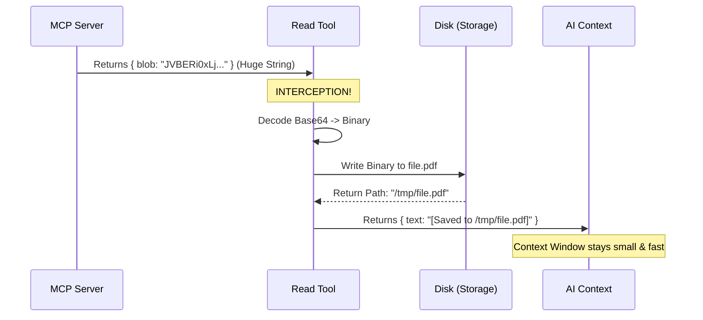

# Chapter 5: Content Persistence Strategy

Welcome to Chapter 5! In the previous chapter, [MCP Client Integration](04_mcp_client_integration.md), we successfully connected to a server and requested a resource.

However, we ended on a cliffhanger: **What happens if the resource is an image, a PDF, or a compiled program?**

## The Motivation

LLMs (Large Language Models) are text processing engines. They have a "Context Window"—a limited amount of memory for the conversation.

If you try to read a small text file, the AI handles it easily. But binary data (like an image) is sent over the network as a **Base64 string**. This is a massive block of random-looking text that encodes the file.

**The Problem:**
> If you feed a 5MB image converted to Base64 text into the AI's chat window, you will instantly fill up its memory. The AI will crash, forget instructions, or become incredibly slow.

**The Solution:**
> Instead of giving the AI the *actual* file data, we save the file to the user's hard drive and give the AI a **Reference** (a file path).

**The Use Case:**
> A user asks: "Analyze this logo.png."
> 1.  The Tool fetches the image data (Base64).
> 2.  The Tool **intercepts** it.
> 3.  The Tool **saves** it to a temporary folder.
> 4.  The Tool tells the AI: "I have downloaded the image to `/tmp/logo.png`."

This is the **Content Persistence Strategy**.

## Key Concepts

### 1. The Blob (Binary Large Object)
When an MCP server sends binary data, it sends it in a field called `blob`. This is the raw data encoded as text.

### 2. Interception & Decoding
We must catch this data *before* it reaches the AI. We decode it from Base64 back into raw binary bytes (0s and 1s).

### 3. Persistence
This simply means "saving to disk." We write the binary bytes to a file so they persist (exist) outside the chat memory.

### 4. The "Reference" Return
We modify the output. We remove the heavy `blob` data and replace it with a lightweight `blobSavedTo` path.

## Usage: Implementing the Strategy

We implement this logic inside the `call` function of our `ReadMcpResourceTool`. We loop through the results received from the server and process them.

### Step 1: Distinguishing Text from Binary
We iterate through the contents. If it is text, we return it immediately.

```typescript
// inside result.contents.map loop...
if ('text' in c) {
  // Pass text directly to the AI
  return { uri: c.uri, mimeType: c.mimeType, text: c.text }
}
```
**Explanation:** If the `text` property exists, our job is done. The AI can read text directly.

### Step 2: Detecting the Blob
If it's not text, we check if it is a valid blob.

```typescript
// Check if 'blob' exists and is a string
if (!('blob' in c) || typeof c.blob !== 'string') {
  // If neither text nor blob, return metadata only
  return { uri: c.uri, mimeType: c.mimeType }
}
```
**Explanation:** This is a safety check. If the server sent empty data, we skip the heavy processing.

### Step 3: Persistence (Saving to Disk)
Here is the core magic. We take the Base64 string and save it.

```typescript
// Generate a unique ID for the file
const persistId = `mcp-resource-${Date.now()}-${i}`

// Helper function to decode and save
const persisted = await persistBinaryContent(
  Buffer.from(c.blob, 'base64'), // Decode Base64 to Binary
  c.mimeType,
  persistId,
)
```
**Explanation:**
1.  `Buffer.from(..., 'base64')`: Transforms the text string back into raw image/file data.
2.  `persistBinaryContent`: A helper utility that handles writing the file to a temp folder.

### Step 4: Formatting the Clean Output
Finally, we return a clean object to the AI.

```typescript
return {
  uri: c.uri,
  mimeType: c.mimeType,
  // The path where we saved it
  blobSavedTo: persisted.filepath, 
  // A friendly message for the AI
  text: `[Resource saved to ${persisted.filepath}]`, 
}
```
**Explanation:** Notice we populate the `text` field with a message *describing* the action. The AI reads this and understands: "Ah, I didn't get the image data, but I know where it is stored."

## Under the Hood: The Flow

Let's visualize how data transforms from a "Network Packet" to a "Local File."



### Internal Implementation Details

You might wonder what `persistBinaryContent` does. While we won't write the file system code here, conceptually it performs these steps:

1.  **Determines Extension:** It looks at the `mimeType` (e.g., `image/png`) to decide if the file should end in `.png` or `.jpg`.
2.  **Safety Check:** It ensures we aren't overwriting critical system files.
3.  **Writing:** It uses Node.js `fs.writeFile` to physically put the bytes on the hard drive.

#### Handling Errors
Sometimes saving a file fails (e.g., disk full). We handle this gracefully:

```typescript
if ('error' in persisted) {
  return {
    uri: c.uri,
    mimeType: c.mimeType,
    text: `Binary content could not be saved: ${persisted.error}`,
  }
}
```
**Explanation:** Instead of crashing the tool, we return a text message explaining the failure. The AI can then report this error to the user.

## Why this matters

Without this strategy, `ReadMcpResourceTool` would only be useful for code files and text documents. By implementing **Persistence**, we make our tool capable of handling:
*   Screenshots
*   PDF Reports
*   Compiled Binaries
*   Audio files

We have turned a text-only tool into a universal file handler, all while keeping our AI lightweight and responsive.

## Conclusion

In this chapter, you learned the **Content Persistence Strategy**:
1.  **Intercept** heavy binary blobs.
2.  **Decode** them from Base64.
3.  **Persist** them to the local disk.
4.  **Reference** them by file path in the result.

Now we have a file path in our result data. But showing a file path like `/tmp/mcp-resource-123.png` to a user isn't very pretty. We want to actually *show* them the image or a nice clickable link in their chat interface.

[Next Chapter: User Interface Rendering](06_user_interface_rendering.md)

---

Generated by [Code IQ](https://github.com/adityasoni99/Code-IQ)