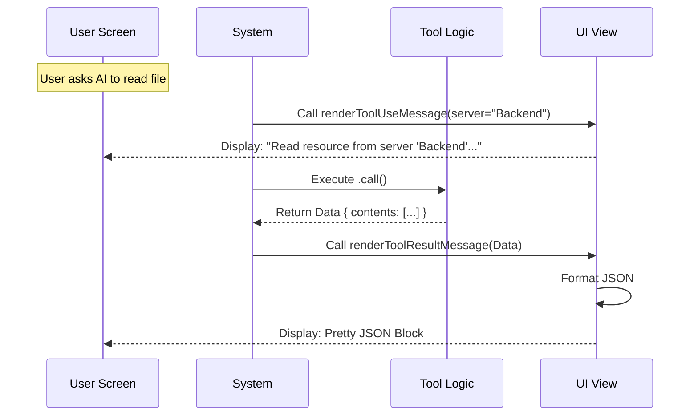

# Chapter 6: User Interface Rendering

Welcome to the final chapter of our tutorial! 

In the previous chapter, [Content Persistence Strategy](05_content_persistence_strategy.md), we learned how to handle complex files (like images or PDFs) by saving them to disk. We successfully retrieved the data, but right now, that data is just sitting inside a computer variable.

The user hasn't seen anything yet.

## The Motivation

Imagine a chef (the Tool) who has cooked a delicious meal (the Data). However, the chef stays in the kitchen. If the waiter doesn't pick up the food and plate it nicely, the customer sits at an empty table.

In software, **User Interface (UI) Rendering** is the waiter. It is the bridge between the code logic and the human eye.

**The Use Case:**
> When the AI decides to "Read a file," the user should see a clean message in their terminal saying: *"Read resource 'config.json' from server 'Backend'."*
>
> When the tool finishes, the user should see the result (the JSON content) formatted neatly, not a jumbled mess of text.

We solve this by creating a **View** layer using **React Components**. This separates the "heavy lifting" (logic) from the "pretty presentation" (UI).

## Key Concepts

### 1. React in the Terminal
You might know React as a tool for building websites. However, we use a special library called **Ink** that allows us to build React components that render text inside a command-line terminal. It lets us use boxes, colors, and layouts just like HTML, but for the console.

### 2. The Input View (`renderToolUseMessage`)
This function defines what the user sees **before** the tool finishes running. It serves as a confirmation: "I am currently doing X with parameters Y."

### 3. The Output View (`renderToolResultMessage`)
This function defines what the user sees **after** the tool finishes. It takes the final data (the `Output` schema we defined in Chapter 2) and formats it to be human-readable.

## Usage: Defining the UI

We write our UI code in a file named `UI.tsx`, typically located in the same folder as our tool logic.

### Step 1: Naming the Tool for the User
First, we provide a simple internal name. This is often used for logging or debugging in the UI.

```typescript
// UI.tsx
export function userFacingName(): string {
  return 'readMcpResource';
}
```
**Explanation:** This is a simple helper string. It acts as a label for the UI system.

### Step 2: Rendering the "Call" (The Input)
When the AI starts the tool, we want to show a summary sentence.

```typescript
// UI.tsx
export function renderToolUseMessage(input) {
  // Safety check: Don't print if data is missing
  if (!input.uri || !input.server) {
    return null;
  }
  
  // A friendly, human-readable sentence
  return `Read resource "${input.uri}" from server "${input.server}"`;
}
```
**Explanation:** 
*   We receive the `input` (the arguments the AI chose).
*   We return a simple string. The system will display this in the chat history, so the user knows exactly what the AI asked for.

### Step 3: Handling Empty Results
Now we need to display the result. First, we handle the edge case where nothing came back.

```typescript
// UI.tsx
export function renderToolResultMessage(output) {
  // Check if content is missing or empty
  if (!output || !output.contents || output.contents.length === 0) {
    return (
      <Box justifyContent="space-between" width="100%">
          <Text dimColor>(No content)</Text>
      </Box>
    );
  }
  // ... (code continues)
```
**Explanation:** 
*   We check if `contents` is empty.
*   We return JSX (React code). `<Box>` acts like a `<div>` in HTML.
*   `<Text dimColor>` makes the text gray/faint, indicating it's not very important.

### Step 4: Formatting the JSON Result
If we do have content, we want to display it. Since our result is structured data, showing it as formatted JSON is usually best.

```typescript
  // ... (inside renderToolResultMessage)

  // Convert the object to a pretty string with indentation
  const formattedOutput = jsonStringify(output, null, 2);

  // Use a pre-built component to display the block
  return <OutputLine content={formattedOutput} verbose={verbose} />;
}
```
**Explanation:**
*   `jsonStringify(..., 2)`: This adds indentation (spaces) so the JSON isn't one long unreadable line.
*   `<OutputLine />`: This is a custom component in our project that handles syntax highlighting and scrolling for long text.

## Under the Hood: The Flow

How does the application know when to call these functions?

The application follows an **MVC (Model-View-Controller)** pattern.
*   **Model:** The Data (Schemas from [Chapter 2](02_schema_validation.md)).
*   **Controller:** The Logic (The `call` function from [Chapter 1](01_tool_definition___configuration.md)).
*   **View:** The Presentation (This `UI.tsx` file).



### Internal Implementation Details

The `UI.tsx` file acts as a plugin. The main application imports this file. When the tool lifecycle events occur (Start, Success, Failure), the application looks for these specific function names (`renderToolUseMessage`, `renderToolResultMessage`).

If these functions didn't exist, the application would likely default to showing the raw, ugly JSON string for everything. By providing `UI.tsx`, we override that default behavior with a "Premium Experience."

#### React Components in Terminal?
You might notice imports like `Box` and `Text` from `../../ink.js`.

```typescript
import { Box, Text } from '../../ink.js';
```

These are wrappers around the **Ink** library.
*   `<Box>`: Handles layout (flexbox). You can set margins, padding, and width.
*   `<Text>`: Handles styling. You can set colors (green, red, dim) and styles (bold, underline).

This allows us to create a command-line interface that feels as polished as a web page.

## Conclusion

Congratulations! You have completed the **ReadMcpResourceTool** tutorial series.

Let's recap what you have built:
1.  **[Tool Definition](01_tool_definition___configuration.md):** You created the identity and safety rules for the tool.
2.  **[Schema Validation](02_schema_validation.md):** You created a strict contract using Zod to ensure valid inputs.
3.  **[LLM Context & Prompts](03_llm_context___prompts.md):** You taught the AI how to use the tool with clear English instructions.
4.  **[MCP Client Integration](04_mcp_client_integration.md):** You connected the tool to external servers to fetch real data.
5.  **[Content Persistence Strategy](05_content_persistence_strategy.md):** You handled complex binary files by saving them to disk.
6.  **[User Interface Rendering](06_user_interface_rendering.md):** You polished the presentation so the user sees a clean, readable interface.

You now possess a fully functional tool that empowers an AI to read files from any connected server, handle the data safely, and present it beautifully. You have mastered the full lifecycle of an MCP Tool!

---

Generated by [Code IQ](https://github.com/adityasoni99/Code-IQ)