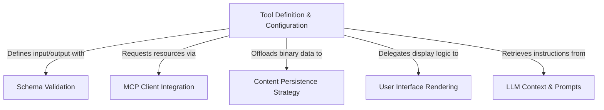

# Tutorial: ReadMcpResourceTool

This project defines a **ReadMcpResourceTool**, a utility that allows an AI assistant to fetch specific resources (like files or data) from connected **MCP servers** by URI. It orchestrates the process of validating inputs, establishing communication with the server, and handling the response. Notably, it includes a strategy to **persist binary data** (blobs) to the local disk to keep the context window clean, while displaying text content and operation summaries directly in the user interface.

## Chapters

1. [Tool Definition & Configuration](01_tool_definition___configuration.md)
2. [Schema Validation](02_schema_validation.md)
3. [LLM Context & Prompts](03_llm_context___prompts.md)
4. [MCP Client Integration](04_mcp_client_integration.md)
5. [Content Persistence Strategy](05_content_persistence_strategy.md)
6. [User Interface Rendering](06_user_interface_rendering.md)

---

Generated by [Code IQ](https://github.com/adityasoni99/Code-IQ)