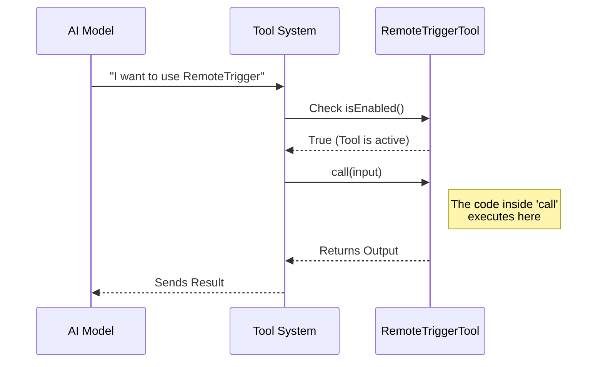

# Chapter 1: Tool Construction

Welcome to the **RemoteTriggerTool** project! In this tutorial, we will learn how to build a tool that allows an AI (like Claude) to talk to a specific API—in this case, a system to manage remote code triggers.

## The Problem: Organizing Chaos

Imagine you have a powerful engine (your code logic), a steering wheel (the input rules), and a dashboard (the output display). If you leave them scattered on the floor, you can't drive anywhere. You need a **Chassis** to bolt them all together into a vehicle.

In our project, **Tool Construction** is that chassis.

We want to create a tool called "RemoteTrigger" that lets the AI list, create, or run scheduled tasks. Without a proper structure, the AI wouldn't know:
1.  What the tool is called.
2.  When it is allowed to run.
3.  How to execute it.

We solve this using a helper called `buildTool`.

## Key Concepts

The `buildTool` function creates a single object (a `ToolDef`) that acts as the blueprint for our tool. It groups four main components:

1.  **Identity:** The name and description (Who am I?).
2.  **Guardrails:** Rules for when the tool is enabled (Am I allowed to run?).
3.  **Interface:** Links to the inputs and outputs (How do we communicate?).
4.  **Behavior:** The actual function to run (What do I do?).

## Building the Tool: Step-by-Step

Let's look at how we construct the `RemoteTriggerTool` in `RemoteTriggerTool.ts`. We will break this large file down into tiny, understandable pieces.

### 1. The Setup
First, we import the builder. Think of this as getting our empty chassis ready.

```typescript
import { buildTool } from '../../Tool.js'
import { REMOTE_TRIGGER_TOOL_NAME } from './prompt.js'

// We start building the tool definition here
export const RemoteTriggerTool = buildTool({
  name: REMOTE_TRIGGER_TOOL_NAME, 
  // ... more properties follow
})
```
*Explanation: We export a new tool object. The `name` is crucial—it's how the AI system identifies this specific tool.*

### 2. Adding Metadata (Search & Description)
The AI needs to know *what* this tool does so it knows when to pick it.

```typescript
  searchHint: 'manage scheduled remote agent triggers',
  
  async description() {
    // Returns a string explaining the tool's purpose
    return 'Manage scheduled remote Claude Code agents...'
  },
  
  async prompt() {
    // Detailed instructions for the AI model
    return 'Call the claude.ai remote-trigger API...'
  },
```
*Explanation: `searchHint` helps the system find this tool quickly. `description` and `prompt` give the AI the context it needs to use the tool effectively.*

### 3. Connecting the Inputs
We need to tell the tool what kind of data it accepts. This is like installing the steering wheel.

```typescript
  get inputSchema(): InputSchema {
    // Links to the validation rules (Zod schema)
    return inputSchema()
  },
  
  get outputSchema(): OutputSchema {
    // Defines what the tool gives back
    return outputSchema()
  },
```
*Explanation: Here we link to schemas that validate data. We will cover the details of `inputSchema` in [Schema Validation](02_schema_validation.md).*

### 4. Adding Logic (The Engine)
Finally, we define the `call` function. This is where the actual work happens when the tool runs.

```typescript
  async call(input: Input, context: ToolUseContext) {
    // 1. Check authentication
    // 2. Prepare API headers
    // 3. specific logic (like 'list' or 'create')
    // 4. Return the result
    return { data: { status: 200, json: '{...}' } }
  },
```
*Explanation: The `call` method receives the validated `input`. This is where we will eventually put our API logic. We will look at how to handle the execution logic in [API Action Dispatcher](04_api_action_dispatcher.md).*

## Under the Hood: The Lifecycle

What actually happens when the AI tries to use this tool? Here is a high-level view of the flow:



### Internal Implementation Details

In `RemoteTriggerTool.ts`, the `buildTool` function wraps our configuration object. It ensures type safety—meaning if we say our tool accepts a "trigger_id", Typescript will force us to handle that ID in our code.

There are also advanced settings like `shouldDefer`:

```typescript
  shouldDefer: true,
  isConcurrencySafe() {
    return true
  },
```

*   **shouldDefer**: This tells the system "This tool might take a while (network request), so show a loading state."
*   **isConcurrencySafe**: This tells the system "It's safe to run this tool at the same time as other tools."

When the tool finishes running, it needs to present the data to the user. This is handled by `renderToolResultMessage`, which we will discuss in [UI Presentation](03_ui_presentation.md).

## Conclusion

We have successfully built the "chassis" of our `RemoteTriggerTool`. We used `buildTool` to combine the name, description, and execution logic into a single, usable unit.

However, a vehicle needs a steering wheel. How do we ensure the AI only sends us valid data (like a correct `action` or `trigger_id`)?

In the next chapter, we will learn how to strictly define these inputs.

[Next: Schema Validation](02_schema_validation.md)

---

Generated by [Code IQ](https://github.com/adityasoni99/Code-IQ)