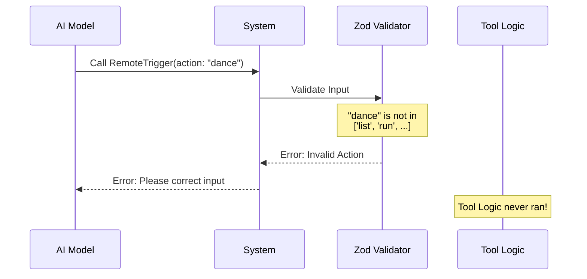
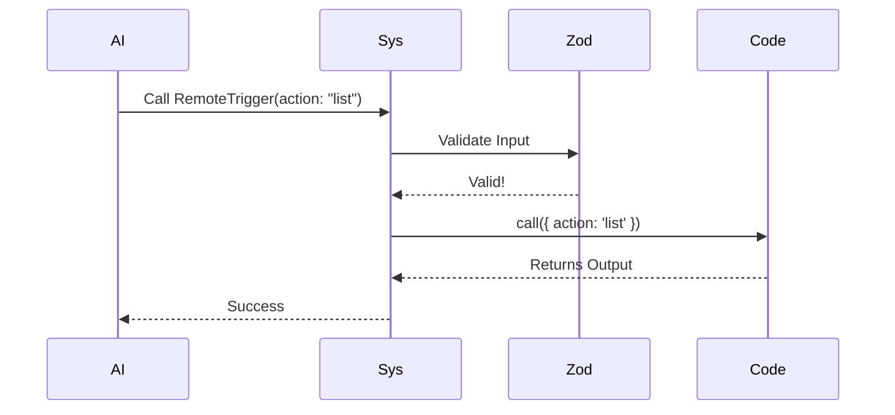

# Chapter 2: Schema Validation

In the previous chapter, [Tool Construction](01_tool_construction.md), we built the chassis of our `RemoteTriggerTool`. We gave it a name and a description, effectively telling the AI, "Here is a car."

However, we haven't told the AI how to drive it yet. If we don't define exactly what inputs we accept, the AI might try to steer with a banana.

## The Problem: The Club Bouncer

Code functions are strict. They expect precise data types (like a specific ID string or a boolean). AI models, on the other hand, are creative and fuzzy. They might say "Run that task please" instead of providing the exact ID needed to run it.

**Schema Validation** acts like a strict bouncer at a club.

1.  **The Guest (AI):** Arrives with data inputs.
2.  **The Bouncer (Schema):** Checks the ID card. "Is your `action` on the guest list? Is your `trigger_id` a string?"
3.  **The Club (Your Code):** If the Bouncer approves, the Guest enters. If not, they are turned away immediately.

This ensures that your internal logic (the `call` function) never crashes due to bad data.

## Key Concept: Zod

To build our bouncer, we use a library called **Zod**. Zod allows us to create blueprints for data. If data doesn't match the blueprint, Zod throws an error before our code even runs.

We define two schemas:
1.  **Input Schema:** What the AI gives us (The Request).
2.  **Output Schema:** What we give back to the AI (The Result).

## Step-by-Step: Defining the Rules

Let's build the validation logic found in `RemoteTriggerTool.ts`.

### 1. Defining the Input Blueprint
We want the AI to be able to perform specific actions: `list`, `get`, `create`, `update`, or `run`.

We wrap our schema in a `lazySchema` helper. This essentially says, "Don't build this rulebook until someone actually asks to use the tool," which helps the application start faster.

```typescript
// Importing Zod (the validator)
import { z } from 'zod/v4'
import { lazySchema } from '../../utils/lazySchema.js'

// Define the input shape
const inputSchema = lazySchema(() =>
  z.strictObject({
    // The strict bouncer: Only these specific words are allowed
    action: z.enum(['list', 'get', 'create', 'update', 'run']),
    
    // ... other fields go here
  }),
)
```
*Explanation: We create a strict object. The `action` field is an `enum` (enumeration), meaning it MUST be one of those five words. If the AI sends "delete", Zod blocks it immediately.*

### 2. Adding Conditional Fields
Some actions need extra info. If you want to `run` a trigger, you need an ID.

```typescript
    // Inside the z.strictObject...
    
    // trigger_id is a string, but it is optional (not needed for 'list')
    trigger_id: z
      .string()
      .regex(/^[\w-]+$/) // Must look like an ID (letters/numbers)
      .optional()
      .describe('Required for get, update, and run'),
```
*Explanation: We mark `trigger_id` as `.optional()`. Why? Because if the action is just `list`, we don't need an ID. However, we add a `.describe()` text. This description is actually sent to the AI, helping it understand when to use this field.*

### 3. Handling Complex Data (JSON Body)
For creating or updating tasks, the AI needs to send details (like the schedule time or script URL).

```typescript
    // Inside the z.strictObject...

    // A record allows any keys with string names
    body: z
      .record(z.string(), z.unknown())
      .optional()
      .describe('JSON body for create and update'),
```
*Explanation: `z.record` basically says "This is a JSON object with keys and values." We treat the values as `unknown` for now, letting the API decide if the specific fields are correct later.*

### 4. Defining the Output Blueprint
After the tool runs, we need to return data to the AI. This schema ensures our code behaves predictably.

```typescript
const outputSchema = lazySchema(() =>
  z.object({
    // The HTTP status code (e.g., 200 for OK, 404 for Not Found)
    status: z.number(),
    
    // The actual data, returned as a text string
    json: z.string(),
  }),
)
```
*Explanation: We standardize the output. No matter what happened in the API, we return a `status` number and a `json` string. This consistency makes it easy for the AI to read the results.*

## Connecting to the Tool

Now that we have our schemas, we link them into the tool definition we started in [Tool Construction](01_tool_construction.md).

```typescript
export const RemoteTriggerTool = buildTool({
  name: REMOTE_TRIGGER_TOOL_NAME,
  
  // Link the Input Bouncer
  get inputSchema(): InputSchema {
    return inputSchema()
  },
  
  // Link the Output Structure
  get outputSchema(): OutputSchema {
    return outputSchema()
  },
  // ... rest of tool definition
})
```
*Explanation: By using `get`, we ensure the schema is fetched fresh when requested. This connects our "Bouncer" to the "Chassis".*

## Under the Hood: The Validation Flow

What happens when the AI tries to use the tool?



If the inputs are valid:



### Type Safety in Implementation

Because we defined these schemas, TypeScript knows exactly what our data looks like. This is a massive help when writing the code.

In `RemoteTriggerTool.ts`:

```typescript
// TypeScript infers types directly from the Zod schema
type InputSchema = ReturnType<typeof inputSchema>
export type Input = z.infer<InputSchema>

async call(input: Input, context: ToolUseContext) {
    // TypeScript knows 'input.action' exists!
    const { action, trigger_id } = input
    
    // It even knows 'action' can only be specific strings
    if (action === 'create') {
        // ...
    }
}
```
*Explanation: `z.infer` translates our validation rules into TypeScript types. If we try to type `input.potato`, our code editor will yell at us because `potato` isn't in the schema.*

## Conclusion

We have now installed the "Steering Wheel" (Input Schema) and the "Dashboard" (Output Schema).
1.  **Input Schema** ensures the AI creates valid requests (`action`, `trigger_id`).
2.  **Output Schema** ensures we return readable data (`status`, `json`).
3.  **Zod** acts as the bouncer, protecting our code from bad data.

Now that the data is validated and our tool runs, it produces a result. But how do we show that result to the human user in a nice way?

[Next: UI Presentation](03_ui_presentation.md)

---

Generated by [Code IQ](https://github.com/adityasoni99/Code-IQ)