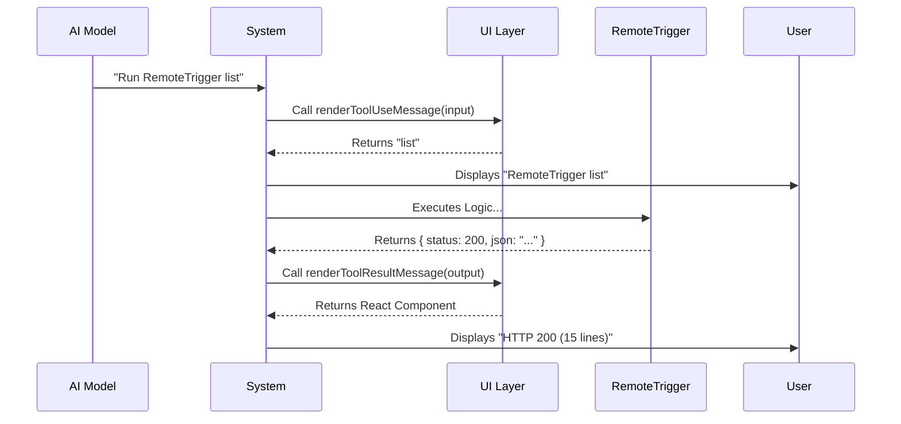

# Chapter 3: UI Presentation

In the previous chapter, [Schema Validation](02_schema_validation.md), we built a strict security guard (Zod) to ensure our tool only receives valid data.

Now we have a working tool that accepts inputs and produces outputs. But there is a problem: **Readability**.

When the tool runs, it might return a JSON object with hundreds of lines of text. If we dump that raw text into the terminal, it looks like "Matrix code"—hard for a human to read and clutters the screen.

## The Problem: The Raw Data Flood

Imagine a calculator. When you type `50 * 50`, the internal processor calculates `2500` in binary code (`100111000100`).
*   **Without UI Presentation:** The calculator shows you the raw binary or internal registers.
*   **With UI Presentation:** The screen shows a nice, clean `2500`.

In the **RemoteTriggerTool**, we want to achieve the same thing. We want to hide the messy details (the huge JSON response) and show a clean summary (e.g., "Success! 20 lines of data received").

## Key Concepts

We handle this using a separate file, typically named `UI.tsx`. We use **React** components to draw text in the terminal.

We need to define two specific visuals:
1.  **Tool Use Message:** What appears *while* the tool is running (e.g., "Checking triggers...").
2.  **Tool Result Message:** What appears *after* the tool finishes (e.g., "HTTP 200 (5 lines)").

## Step-by-Step Implementation

Let's look at `UI.tsx` to see how we format these messages.

### 1. The Setup
We need React and some helper components. Note that we are using React to render text in a command-line interface (CLI), not a web browser.

```tsx
import React from 'react'
import { MessageResponse } from '../../components/MessageResponse.js'
import { Text } from '../../ink.js'
import type { Input, Output } from './RemoteTriggerTool.js'
```
*Explanation: We import `Text` (like a `<span>` or `<p>` tag but for terminals) and our input/output types so TypeScript understands our data.*

### 2. Rendering the "Input" (What is running?)
When the AI decides to run the tool, we want to show the user exactly what command is being executed.

```tsx
export function renderToolUseMessage(input: Partial<Input>): React.ReactNode {
  // Combine the action and the ID (if it exists)
  return `${input.action ?? ''}${input.trigger_id ? ` ${input.trigger_id}` : ''}`
}
```
*Explanation: If the input is `{ action: 'run', trigger_id: 'job-123' }`, this function returns the string `"run job-123"`. This is simple and tells the user exactly what is happening.*

### 3. Rendering the "Output" (What happened?)
This is the most important part. Instead of showing the full JSON content, we summarize it.

First, we calculate how much data we got back:

```tsx
import { countCharInString } from '../../utils/stringUtils.js'

export function renderToolResultMessage(output: Output): React.ReactNode {
  // Count how many lines of text are in the JSON response
  const lines = countCharInString(output.json, '\n') + 1
  
  // ... rendering continues below
```
*Explanation: We check the `output.json` string and count the newlines. This tells us if the result is tiny (1 line) or huge (100 lines).*

### 4. Styling the Result
Now we return the JSX (React syntax) to display the summary.

```tsx
  return (
    <MessageResponse>
      <Text>
        HTTP {output.status} <Text dimColor>({lines} lines)</Text>
      </Text>
    </MessageResponse>
  )
}
```
*Explanation: We display the HTTP status (e.g., 200). We use `<Text dimColor>` to make the line count look subtle (greyed out). The result looks like: `HTTP 200 (15 lines)`.*

## Connecting UI to the Tool

Now that we have our "Face" defined in `UI.tsx`, we need to attach it to the "Body" in `RemoteTriggerTool.ts`.

We go back to our tool definition and import the functions we just wrote.

```typescript
// In RemoteTriggerTool.ts
import { renderToolResultMessage, renderToolUseMessage } from './UI.js'

export const RemoteTriggerTool = buildTool({
  name: REMOTE_TRIGGER_TOOL_NAME,
  // ... other settings ...
  
  // Attach the visual layers here:
  renderToolUseMessage,
  renderToolResultMessage,
})
```
*Explanation: By adding these properties to `buildTool`, the system knows to call these specific functions whenever this tool is used.*

## Under the Hood: The Rendering Flow

How does the system know when to show which message?



1.  **Start:** The system sees the AI wants to use the tool. It immediately calls `renderToolUseMessage` to tell the human user "Hey, I'm doing this action."
2.  **Execution:** The tool runs its logic (fetching data from the API).
3.  **Finish:** The tool returns data. The system passes this data to `renderToolResultMessage`.
4.  **Display:** The simplified React component is drawn to the screen, keeping the terminal tidy.

## Why this matters

Without this abstraction, if you asked the AI to "list all triggers," and the API returned a 50kb JSON file, your terminal would scroll endlessly, burying the conversation history.

By using **UI Presentation**, we keep the user experience clean. The AI still sees the full 50kb of data (so it can understand the triggers), but the *human* only sees a neat summary.

## Conclusion

We have now built:
1.  **The Chassis:** [Tool Construction](01_tool_construction.md)
2.  **The Steering Wheel:** [Schema Validation](02_schema_validation.md)
3.  **The Dashboard:** UI Presentation (This chapter)

Our car looks good and accepts instructions. However, the engine currently doesn't actually go anywhere. In the `call` function, we need to actually talk to the network.

In the next chapter, we will learn how to write the logic that sends requests to the outside world.

[Next: API Action Dispatcher](04_api_action_dispatcher.md)

---

Generated by [Code IQ](https://github.com/adityasoni99/Code-IQ)