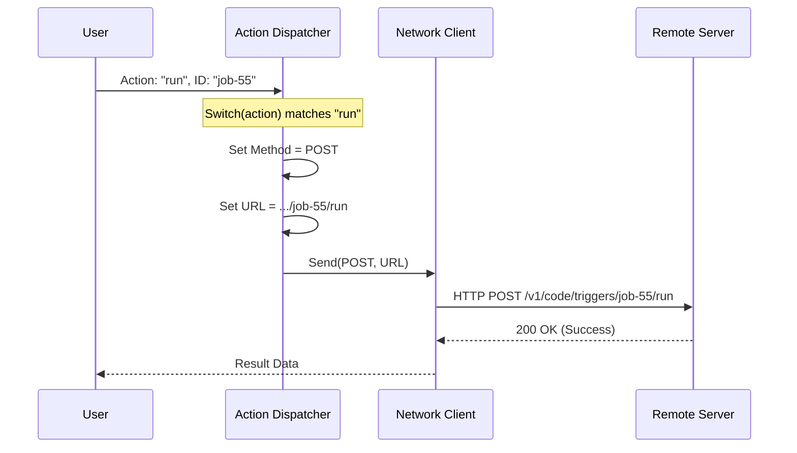

# Chapter 4: API Action Dispatcher

In the previous chapter, [UI Presentation](03_ui_presentation.md), we learned how to make our tool look good in the terminal. We also have a solid structure from [Tool Construction](01_tool_construction.md) and strict rules from [Schema Validation](02_schema_validation.md).

However, if you try to use the tool right now, nothing happens. We have a car with a steering wheel and a dashboard, but the engine is disconnected from the wheels.

## The Problem: Speaking Different Languages

The user (via the AI) speaks in **Actions**: "List triggers", "Run job 123", "Create a task".
The API (the server) speaks in **HTTP Methods and URLs**: `GET /triggers`, `POST /triggers/123/run`.

We need a translator. We need a piece of logic that takes the user's intent and routes it to the correct technical address.

**This is the API Action Dispatcher.**

## Analogy: The Switchboard Operator

Imagine an old-school telephone switchboard.

1.  **The Caller (User):** Picks up the phone and says, "Connect me to Billing."
2.  **The Operator (Dispatcher):** Knows that "Billing" corresponds to physical wire #45.
3.  **The Connection:** The operator plugs the cable into slot #45.

In our code, the `action` input is the "Request", and the `switch` statement is the "Operator."

## Building the Dispatcher

All of this logic happens inside the `call` method of `RemoteTriggerTool.ts`. We are going to build a router that translates our five actions (`list`, `get`, `create`, `update`, `run`) into API calls.

### Step 1: Preparing the Variables

Before we route anything, we prepare empty variables. These will hold the "address" we determine the user is trying to reach.

```typescript
    // Inside the call() method...
    const { action, trigger_id, body } = input
    
    // We will fill these in based on the action
    let method: 'GET' | 'POST'
    let url: string
    let data: unknown
```
*Explanation: We extract the user's input. We also set up `method` (how we send data), `url` (where we send it), and `data` (what we send).*

### Step 2: The "List" and "Get" Routes

If the user wants to read data, we usually use a `GET` request.

```typescript
    switch (action) {
      case 'list':
        method = 'GET'
        // Base URL is .../v1/code/triggers
        url = base 
        break
        
      case 'get':
        // We append the ID to the URL: .../triggers/123
        method = 'GET'
        url = `${base}/${trigger_id}`
        break
```
*Explanation: If the action is `list`, we hit the main URL. If it's `get`, we must attach the specific `trigger_id` to the end of the URL so the API knows which specific item to fetch.*

### Step 3: The "Write" Routes (Create/Update)

If the user wants to change data, we use a `POST` request and include a JSON body.

```typescript
      case 'create':
        method = 'POST'
        url = base
        // Pass the JSON body (defined in Schema Validation)
        data = body 
        break
        
      case 'update':
        method = 'POST'
        url = `${base}/${trigger_id}`
        data = body
        break
```
*Explanation: Here, `data = body` is crucial. This takes the details the user provided (like "schedule this for 5 PM") and puts it into the envelope we are mailing to the API.*

### Step 4: The "Run" Route

This is a special case. We are triggering an action, so we use `POST`, but we don't necessarily need to send new data.

```typescript
      case 'run':
        method = 'POST'
        // The API expects .../triggers/123/run
        url = `${base}/${trigger_id}/run`
        data = {} // Empty data
        break
    }
```
*Explanation: The URL ends in `/run`. This specific endpoint tells the server "Execute this task now."*

### Step 5: Sending the Request

Now that the "Operator" has plugged the wire into the right hole (set the `url` and `method`), we actually make the call.

```typescript
    // We use a library called 'axios' to send the request
    const res = await axios.request({
      method,
      url,
      headers, // We will cover this in the next chapter!
      data,
    })

    return { data: { status: res.status, json: res.data } }
```
*Explanation: We pass our calculated `method` and `url` to Axios. Axios handles the heavy lifting of sending the signal across the internet and waiting for a reply.*

## Under the Hood: The Routing Flow

Let's visualize exactly what happens when a user wants to **Run** a specific trigger.



1.  **Input:** The Dispatcher receives the abstract command.
2.  **Processing:** It constructs the technical requirements (Method and URL).
3.  **Execution:** It hands the package to the Network Client (Axios) to deliver.

### Why separate the logic?

You might wonder, "Why not just write five different functions, one for each action?"

By keeping them in one `call` method with a `switch` statement:
1.  **Shared Setup:** All actions share the same authentication and error handling logic.
2.  **Simplicity:** The Tool Interface (from Chapter 1) only needs to expose *one* entry point.
3.  **Maintainability:** If the base URL changes, we only change it in one place.

## Connecting the pieces

In [Schema Validation](02_schema_validation.md), we defined `trigger_id` as optional.
In this chapter, you can see why.

*   In the `case 'list':` block, we don't check for `trigger_id`.
*   In the `case 'run':` block, we rely on the ID to build the URL (`${base}/${trigger_id}/run`).

This shows how the **Schema** and the **Dispatcher** work together. The Schema allows the data in, and the Dispatcher uses it to build the correct path.

## Conclusion

We have successfully routed the user's high-level commands to specific API endpoints. Our switchboard operator is working perfectly!

However, if you look closely at the code examples above, you might see a variable called `headers`.

```typescript
    headers, // We will cover this in the next chapter!
```

APIs don't just talk to anyone. They need ID badges, secret passwords (Tokens), and context info (Organization UUIDs). Without these, our dispatched requests will be rejected immediately.

In the final chapter, we will learn how to inject these sensitive details securely.

[Next: Secure Context Injection](05_secure_context_injection.md)

---

Generated by [Code IQ](https://github.com/adityasoni99/Code-IQ)