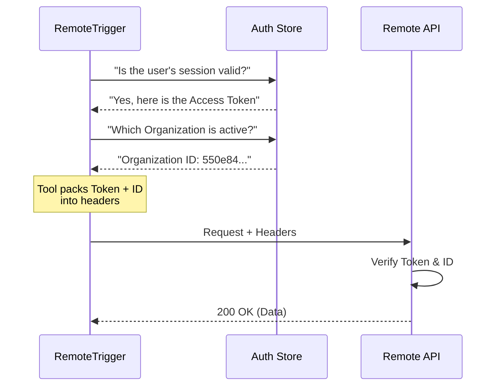

# Chapter 5: Secure Context Injection

Welcome to the final chapter of our **RemoteTriggerTool** tutorial!

In the previous chapter, [API Action Dispatcher](04_api_action_dispatcher.md), we built the logic to route commands like "run" or "list" to specific URL addresses.

However, if you tried to run the tool now, you would hit a brick wall. The API would respond with `401 Unauthorized`. Why? Because we haven't proven who we are.

## The Problem: The VIP Club

Imagine a high-security VIP club. You can't just walk up to the bar and order a drink; you need to show your membership badge.

If we asked the user to type their secret API key every time they wanted to list triggers, it would be annoying and unsafe. They might accidentally paste it into a chat window or lose it.

**Secure Context Injection** is our solution. It acts like an automatic badge scanner.
1.  The user logs in once securely.
2.  When the tool runs, it silently retrieves the badge (Token) and the club location (Organization ID) from the system's internal safe.
3.  It "injects" these credentials into the request headers automatically.

## Key Concepts

We need to gather three specific pieces of information before we can make a call:

1.  **OAuth Token:** The digital ID card that proves "I am User X."
2.  **Organization UUID:** The specific workspace ID that proves "I am working for Company Y."
3.  **HTTP Headers:** The envelope metadata where we stick these labels.

## Step-by-Step Implementation

Let's look at the top of the `call` function in `RemoteTriggerTool.ts` to see how we gather these credentials.

### 1. Retrieving the Badge (OAuth Token)

First, we ensure the user is logged in. We access the internal authentication system to get the current token.

```typescript
import {
  checkAndRefreshOAuthTokenIfNeeded,
  getClaudeAIOAuthTokens,
} from '../../utils/auth.js'

// Inside the call() method...
await checkAndRefreshOAuthTokenIfNeeded()
const accessToken = getClaudeAIOAuthTokens()?.accessToken
```
*Explanation: `checkAndRefresh...` makes sure the token hasn't expired. If it has, it refreshes it automatically. Then we grab the `accessToken` string.*

### 2. Validating the Badge
If the user isn't logged in, we stop immediately. We don't want to send a request that we know will fail.

```typescript
if (!accessToken) {
  throw new Error(
    'Not authenticated. Run /login and try again.',
  )
}
```
*Explanation: This acts as a gatekeeper. If there is no badge, the tool throws an error and tells the user how to fix it (`/login`).*

### 3. Finding the Workspace (Org UUID)
A user might belong to multiple organizations. We need to know which one they are currently acting in.

```typescript
import { getOrganizationUUID } from '../../services/oauth/client.js'

const orgUUID = await getOrganizationUUID()

if (!orgUUID) {
  throw new Error('Unable to resolve organization UUID.')
}
```
*Explanation: `getOrganizationUUID` fetches the ID of the currently active workspace. We need this because the API needs to know which list of triggers to show us.*

### 4. Injecting into Headers (The Envelope)
Now we pack everything into the `headers` object. This is what we attach to our outgoing message.

```typescript
const headers = {
  Authorization: `Bearer ${accessToken}`,
  'Content-Type': 'application/json',
  'anthropic-version': '2023-06-01',
  'anthropic-beta': 'ccr-triggers-2026-01-30',
  'x-organization-uuid': orgUUID,
}
```
*Explanation:*
*   **Authorization:** "Here is my ID card."
*   **x-organization-uuid:** "I am entering this specific building."
*   **anthropic-beta:** "I am allowed to use this specific experimental feature."

### 5. Using the Headers
Finally, we pass these headers to our network client (Axios), which we set up in [API Action Dispatcher](04_api_action_dispatcher.md).

```typescript
const res = await axios.request({
  method, // determined in Chapter 4
  url,    // determined in Chapter 4
  headers, // <--- Injected here!
  data,
})
```
*Explanation: The dispatcher handles *where* to go (URL), but the `headers` handle *access rights* to get in.*

## Under the Hood: The Security Flow

What happens in the split second before the network request is sent?



1.  **Check:** The tool asks the internal system for credentials.
2.  **Pack:** The tool combines the user's intent (Action) with the user's identity (Context).
3.  **Send:** The API receives a fully authorized request without the user ever seeing a password prompt.

### Internal Implementation Details

The beauty of this system is that `RemoteTriggerTool.ts` doesn't need to know *how* to log in a user or *how* to refresh a token. It imports these capabilities from `../../utils/auth.js`.

This separation of concerns means:
*   **Security is centralized:** If we change how login works, we update `auth.js`, and all tools update automatically.
*   **Tools are simple:** The tool just asks for the token; it doesn't manage the token's lifecycle.

## Tutorial Conclusion

Congratulations! You have successfully built the **RemoteTriggerTool** from scratch.

Let's review our journey:

1.  **[Tool Construction](01_tool_construction.md):** We built the chassis and defined the tool's identity.
2.  **[Schema Validation](02_schema_validation.md):** We added a strict security guard to reject bad inputs.
3.  **[UI Presentation](03_ui_presentation.md):** We created a clean dashboard to display results to the user.
4.  **[API Action Dispatcher](04_api_action_dispatcher.md):** We built the switchboard to route commands to URLs.
5.  **Secure Context Injection (This Chapter):** We added the automatic badge system to handle authentication.

You now have a fully functional tool that allows an AI to securely manage remote triggers, complete with input validation, error handling, and a polished user interface.

Happy coding!

---

Generated by [Code IQ](https://github.com/adityasoni99/Code-IQ)