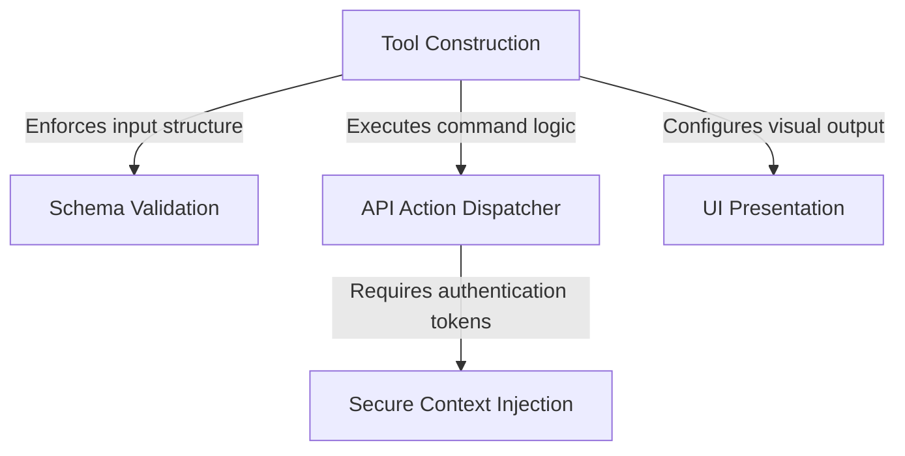

# Tutorial: RemoteTriggerTool

This project creates a specialized utility allowing the AI to **manage remote code agents** (triggers) on the Claude platform. It acts as a secure bridge that automatically handles sensitive *authentication tokens* behind the scenes, ensuring they are never exposed to the user. The tool strictly validates commands to ensure reliability and presents the results in a friendly, **readable format**.

## Chapters

1. [Tool Construction](01_tool_construction.md)
2. [Schema Validation](02_schema_validation.md)
3. [UI Presentation](03_ui_presentation.md)
4. [API Action Dispatcher](04_api_action_dispatcher.md)
5. [Secure Context Injection](05_secure_context_injection.md)

---

Generated by [Code IQ](https://github.com/adityasoni99/Code-IQ)