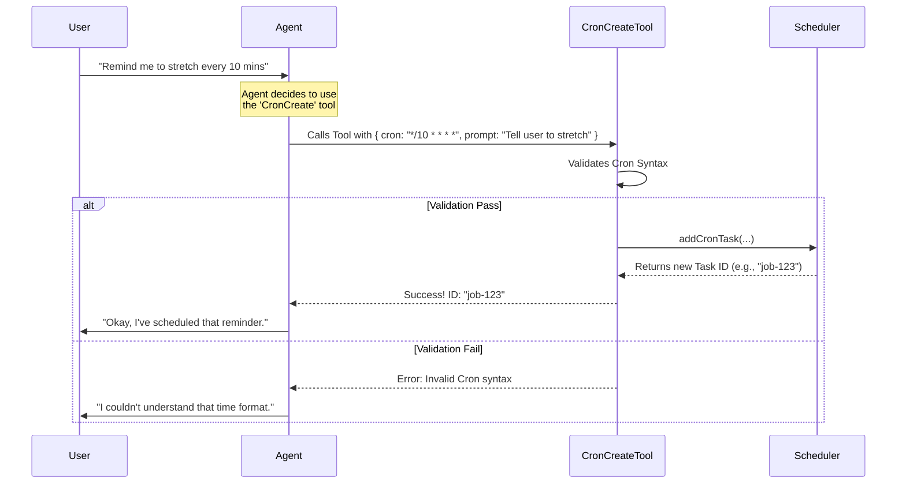

# Chapter 1: Cron Tool Suite

Welcome to the **ScheduleCronTool** project! 

In this first chapter, we are going to explore the core "skills" that allow an AI agent to handle time. 

### The Motivation
By default, an AI agent is **reactive**. It sits and waits for you to type a message. If you don't type anything, the AI does nothing.

But what if you want the AI to be **proactive**?
*   **Use Case:** You want the AI to remind you to "Drink water" every hour.
*   **Problem:** The AI doesn't have an internal clock or an alarm system.
*   **Solution:** We need to install a "Tool Suite"—a set of specific functions the AI can call to interact with a scheduling system.

We call this the **Cron Tool Suite**.

---

## What is a Tool Suite?

Think of the AI agent as a smart assistant with a utility belt. By default, the belt is empty. We are going to add three gadgets (Tools) to this belt:

1.  **CronCreate:** The ability to set a new alarm/task.
2.  **CronList:** The ability to look at all currently set alarms.
3.  **CronDelete:** The ability to cancel an alarm.

Let's look at how the Agent uses these tools to solve our use case.

### 1. The Creator: `CronCreateTool`

This is the most important tool. When you tell the agent "Remind me to drink water every hour," the agent's brain decides to call this tool.

To use a tool, the agent must provide specific **Input**. We define this input using a "Schema" (a set of rules).

#### The Input "Rules" (Schema)
The agent must provide two main things:
1.  **Cron Expression:** A special code representing time (e.g., `0 * * * *` means "at minute 0 of every hour").
2.  **Prompt:** What the agent should do or say when the time comes.

Here is a simplified look at the code defining these rules:

```typescript
// CronCreateTool.ts
const inputSchema = lazySchema(() =>
  z.strictObject({
    // The time code (e.g. "*/5 * * * *")
    cron: z.string().describe('Standard 5-field cron expression...'),
    
    // What to do when the timer fires
    prompt: z.string().describe('The prompt to enqueue at each fire time.'),
  }),
)
```
*Explanation: We use a library called `zod` (`z`) to strictly define that the input must contain a `cron` string and a `prompt` string.*

#### The Implementation
When the agent calls this tool, we execute specific logic to save the task.

```typescript
// CronCreateTool.ts
async call({ cron, prompt, recurring = true, durable = false }) {
  // 1. Add the task to our scheduling system
  const id = await addCronTask(cron, prompt, recurring, durable)

  // 2. Turn on the scheduler loop so it starts checking time
  setScheduledTasksEnabled(true)

  // 3. Return the ID so the agent knows it worked
  return { data: { id, humanSchedule: cronToHuman(cron) } }
}
```
*Explanation: The tool takes the inputs, saves them via `addCronTask` (which writes to a list), and ensures the system is "awake" (`setScheduledTasksEnabled`).*

---

### 2. The Inspector: `CronListTool`

Sometimes the user asks, "What reminders do I have set?" The agent needs a way to check its notebook.

#### Implementation
This tool is very simple. It requires no input and simply returns the list of active jobs.

```typescript
// CronListTool.ts
async call() {
  // 1. Fetch all tasks from storage
  const allTasks = await listAllCronTasks()
  
  // 2. Filter tasks (agents only see their own tasks)
  const ctx = getTeammateContext()
  const tasks = ctx ? allTasks.filter(t => t.agentId === ctx.agentId) : allTasks

  // 3. Return the list
  return { data: { jobs: tasks } }
}
```
*Explanation: We act as a gatekeeper. If the agent is a "teammate" (a sub-agent), they only see their own reminders. The main agent sees everything.*

---

### 3. The Eraser: `CronDeleteTool`

Finally, if the user says "Stop reminding me about water," the agent needs to remove the task.

#### The Input
The agent must provide the specific `id` of the job to delete.

```typescript
// CronDeleteTool.ts
const inputSchema = lazySchema(() =>
  z.strictObject({
    id: z.string().describe('Job ID returned by CronCreate.'),
  }),
)
```

#### Validation Logic
Before deleting, we must check if the ID actually exists. We don't want the agent hallucinating IDs!

```typescript
// CronDeleteTool.ts - inside validateInput
async validateInput(input): Promise<ValidationResult> {
  const tasks = await listAllCronTasks()
  const task = tasks.find(t => t.id === input.id)
  
  if (!task) {
    // If ID is not found, tell the agent "Error"
    return { result: false, message: `No scheduled job with id '${input.id}'` }
  }
  return { result: true }
}
```
*Explanation: We explicitly check if the task exists before trying to delete it. This prevents errors down the line.*

---

## How It All Works Together

Here is what happens under the hood when you ask the agent to schedule a task.



### Safety Features
You might notice the code snippet `isKairosCronEnabled()` in the files. This is a "Feature Gate."

```typescript
// CronCreateTool.ts
isEnabled() {
  return isKairosCronEnabled()
}
```
This ensures that if we want to disable the scheduling capabilities globally (perhaps for maintenance or security), we can switch them off in one place, and the tools vanish from the agent's utility belt. We will discuss configuration in [Feature Gating & Configuration](05_feature_gating___configuration.md).

---

## Summary

In this chapter, we built the foundation of our time-based agent. We learned:
1.  **Tool Definitions:** How to wrap code into "skills" the AI can understand.
2.  **Input Schemas:** How to force the AI to give us structured data (like `cron` strings).
3.  **Validation:** How to prevent the AI from trying to delete non-existent jobs or creating impossible dates.

However, creating the tool is only half the battle. Once the timer fires, the agent needs to know *what* to say. The prompt stored in `CronCreateTool` isn't just static text—it can be dynamic.

In the next chapter, we will learn how the system constructs the message that wakes the agent up.

[Next Chapter: Dynamic Prompt Construction](02_dynamic_prompt_construction.md)

---

Generated by [Code IQ](https://github.com/adityasoni99/Code-IQ)