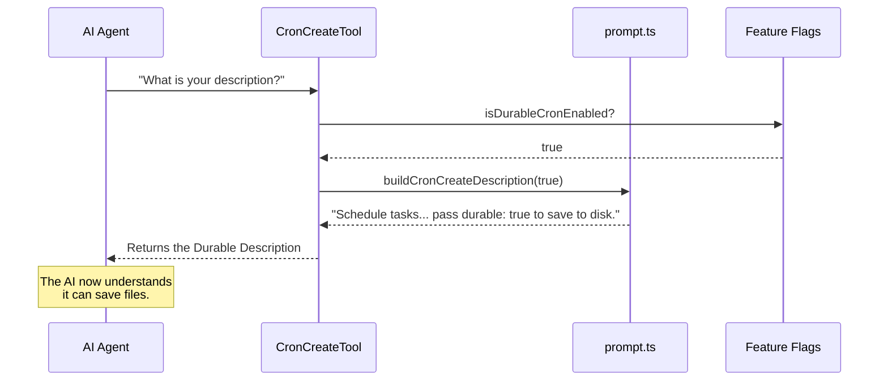

# Chapter 2: Dynamic Prompt Construction

Welcome back! In the previous chapter, [Cron Tool Suite](01_cron_tool_suite.md), we gave our AI agent a utility belt containing three tools: Creator, Inspector, and Eraser.

However, giving the AI a tool isn't enough. We also have to give it an **instruction manual** (a description) so it knows *how* and *when* to use that tool.

### The Motivation
Usually, when you write code for an AI tool, the description is a static string of text:
`"Use this tool to add two numbers together."`

But our Scheduling System is special. It changes behavior based on the environment:
1.  **Scenario A (Session Only):** The user is in a temporary mode. If they restart the computer, all alarms vanish.
2.  **Scenario B (Durable):** The user has "persistence" enabled. Alarms are saved to a file on the hard drive and survive restarts.

**The Problem:**
If we write a static description like *"This tool saves alarms forever,"* but the system is in **Scenario A**, the AI will lie to the user. It will promise safety, but the alarm will disappear when the window closes.

**The Solution:**
We need **Dynamic Prompt Construction**. Instead of a static string, we write a **function** that builds the text instructions based on the current system status.

---

## 1. The Prompt Builder Concept

Think of this like a digital restaurant menu.
*   **Static Menu:** Printed on paper. If you run out of steak, the menu still says "Steak," and customers get angry when they can't order it.
*   **Dynamic Menu:** A digital screen. The kitchen checks the inventory. If `steak_count > 0`, it shows "Steak." If `steak_count == 0`, the item disappears from the screen automatically.

We are building a "Digital Screen" for our AI.

### The "Switch": `durableEnabled`
Before we build the text, we need to know the state of the kitchen (the system). We use a helper function called `isDurableCronEnabled()`.

```typescript
// prompt.ts
export function isDurableCronEnabled(): boolean {
  // Checks a feature flag (configuration) to see if 
  // we are allowed to write to the hard drive.
  return getFeatureValue('tengu_kairos_cron_durable', true)
}
```
*Explanation: This function returns `true` if we can save files to disk, and `false` if we are stuck in memory.*

---

## 2. Building the Description

Now that we know the state, let's write the function that generates the tool's short description. This is the first thing the AI sees.

We want to change the definition of `CronCreateTool` depending on that boolean switch.

```typescript
// prompt.ts
export function buildCronCreateDescription(durableEnabled: boolean): string {
  if (durableEnabled) {
    // If true, tell the AI it has the power of persistence
    return 'Schedule a prompt... Pass durable: true to persist to disk.'
  } else {
    // If false, warn the AI it is limited
    return 'Schedule a prompt... within this Claude session only.'
  }
}
```
*Explanation: We use a simple `if/else` (or ternary operator) to return completely different sentences. The AI never sees the code; it only sees the final sentence string.*

---

## 3. Building the "Big" Prompt

The description is just a one-line summary. The **Prompt** is the detailed manual (the inputs, the rules, the warnings). This is often a long block of text.

We can assemble this text like LEGO bricks.

### Step 1: Create the Variable Section
First, we generate the specific paragraph about durability.

```typescript
// prompt.ts - inside buildCronCreatePrompt
const durabilitySection = durableEnabled
  ? `## Durability
     Pass durable: true to write to .claude/scheduled_tasks.json. 
     Use this for "remind me every day" tasks.`
  : `## Session-only
     Jobs live only in this session. Nothing is written to disk.`
```

### Step 2: Inject into the Main Template
Now we insert that section into the main text using string interpolation (`${variable}`).

```typescript
// prompt.ts
export function buildCronCreatePrompt(durableEnabled: boolean): string {
  // ... (define durabilitySection from above)

  return `
    Schedule a prompt to be enqueued at a future time.
    
    ${durabilitySection}  <-- We inject the dynamic rule here!

    ## Runtime behavior
    Returns a job ID you can pass to CronDelete.
  `
}
```
*Explanation: By injecting `${durabilitySection}`, the final manual is customized perfectly for the current environment.*

---

## 4. Connecting to the Tool

In [Cron Tool Suite](01_cron_tool_suite.md), we looked at `CronCreateTool.ts`. You might have noticed the `description` and `prompt` fields weren't simple strings—they were functions.

Here is how the Tool connects to the Builder we just wrote:

```typescript
// CronCreateTool.ts
export const CronCreateTool = buildTool({
  name: 'CronCreate',
  
  // instead of a string "...", we use an async function
  async description() {
    // 1. Check the switch
    const canPersist = isDurableCronEnabled()
    
    // 2. Build the text dynamically
    return buildCronCreateDescription(canPersist)
  },

  // Same logic for the detailed prompt
  async prompt() {
    return buildCronCreatePrompt(isDurableCronEnabled())
  }
})
```

### The Sequence Diagram

Here is what happens when the AI agent starts up or refreshes its tool list.



If `isDurableCronEnabled` returned `false`, the Builder would return the "Session-only" text, and the AI would understand it *cannot* save files.

---

## 5. Why This Matters for the User

This abstraction creates a seamless user experience.

**Without Dynamic Prompts:**
> **User:** "Remind me to call Mom every Sunday."
> **AI (Confused):** "I have scheduled that. Note: I am not sure if this saves to disk."
> *(System restarts, alarm is lost, user is unhappy)*

**With Dynamic Prompts (Durable Mode):**
> **User:** "Remind me to call Mom every Sunday."
> **AI (Confident):** "I've scheduled a recurring reminder. I set `durable: true` so this will persist even if you restart me."

**With Dynamic Prompts (Session Mode):**
> **User:** "Remind me to call Mom every Sunday."
> **AI (Honest):** "I can schedule that for this session, but please note that **I currently cannot save tasks to disk**. This reminder will be lost if you close me. Is that okay?"

The dynamic prompt allows the AI to manage user expectations accurately.

---

## Summary

In this chapter, we learned:
1.  **Static vs. Dynamic:** Why static instructions are dangerous when system capabilities change.
2.  **Prompt Builders:** How to use functions to construct instructions like LEGO bricks.
3.  **Injection:** How to inject specific rules (like `durabilitySection`) into the main instruction manual.

Now that the AI knows *whether* it can save tasks to disk, we need to ensure the system actually *does* save them when asked.

In the next chapter, we will look at the logic that handles writing these tasks to the hard drive.

[Next Chapter: Durability & Persistence Logic](03_durability___persistence_logic.md)

---

Generated by [Code IQ](https://github.com/adityasoni99/Code-IQ)