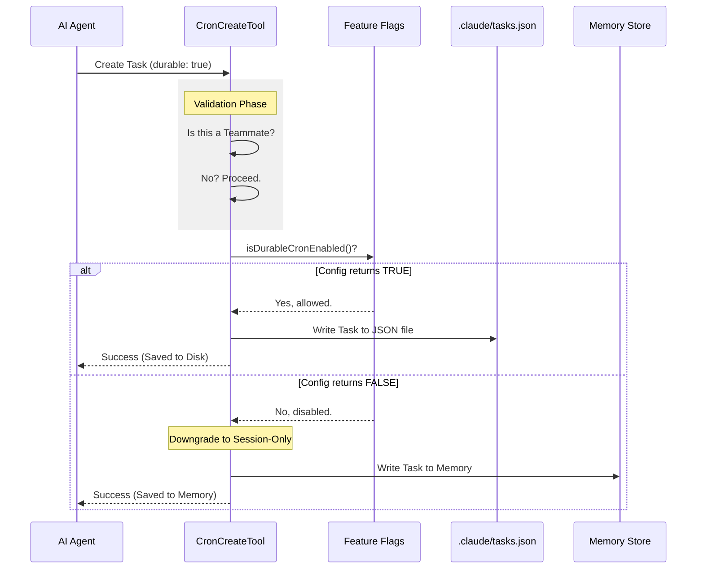

# Chapter 3: Durability & Persistence Logic

Welcome back! 

In [Chapter 2: Dynamic Prompt Construction](02_dynamic_prompt_construction.md), we taught the AI how to explain its capabilities. It can now tell the user: *"I can save this forever"* or *"I can only save this for now."*

But words are cheap. Now we have to make sure the code actually behaves that way.

In this chapter, we will explore the logic that decides whether a task is written to a permanent file on your hard drive or just kept loosely in the computer's memory (RAM).

---

## The Motivation: Whiteboard vs. Notebook

To understand **Durability**, imagine you are in a meeting room.

1.  **Session-Only (The Whiteboard):**
    You write a reminder on the whiteboard: *"Order pizza in 20 minutes."*
    *   **Pros:** Fast, easy.
    *   **Cons:** If you leave the room and turn off the lights (restart the application), the whiteboard is wiped clean. The reminder is lost.

2.  **Durable (The Notebook):**
    You write a reminder in a physical notebook: *"Staff meeting every Monday at 9 AM."*
    *   **Pros:** Permanent. You can leave the room, go home, come back next week, and the note is still there.
    *   **Cons:** Requires a physical object (a file on disk).

**The Use Case:**
*   If a user says *"Remind me in 5 minutes to check the oven,"* we use the **Whiteboard** (Session-only). It's temporary.
*   If a user says *"Remind me every morning to stretch,"* we must use the **Notebook** (Durable). We can't afford to lose this just because the computer restarted.

---

## 1. The Decision Switch

How does the AI choose? It uses a specific input field called `durable`.

When we defined our tool in [Cron Tool Suite](01_cron_tool_suite.md), we included this boolean (true/false) flag in the input rules.

```typescript
// CronCreateTool.ts
durable: semanticBoolean(z.boolean().optional()).describe(
  'true = persist to .claude/scheduled_tasks.json... false = in-memory only'
),
```

When the AI calls the tool, it explicitly chooses a path:
*   `durable: false` -> **Memory** (Default)
*   `durable: true` -> **Disk** (.json file)

---

## 2. Implementing the Logic

Let's look at what happens inside the `CronCreateTool` when it runs.

### Step A: The Safety Check (Teammates)

In our system, "Teammates" are temporary sub-agents helping you with a specific task. Because they are temporary, they are **not allowed** to leave permanent marks on your hard drive.

Before we schedule anything, we check who is asking:

```typescript
// CronCreateTool.ts
async validateInput(input): Promise<ValidationResult> {
  // ... other checks ...

  // Check if the user is a "Teammate" trying to be durable
  if (input.durable && getTeammateContext()) {
    return {
      result: false,
      message: 'durable crons are not supported for teammates',
    }
  }
  return { result: true }
}
```
*Explanation: If a sub-agent tries to set `durable: true`, we stop them immediately. They can only use the Whiteboard.*

### Step B: The "Master Switch" Logic

Even if the AI *wants* to be durable, and the user *isn't* a teammate, we still check one last thing: **Is the durability feature actually enabled?**

We might have disabled file writing for security reasons or because we are in a restricted environment.

```typescript
// CronCreateTool.ts - inside call()
async call({ cron, prompt, recurring, durable = false }) {
  
  // Logic: User wants durable AND the system allows durable
  const effectiveDurable = durable && isDurableCronEnabled()

  // Pass this final decision to the storage system
  const id = await addCronTask(
    cron, 
    prompt, 
    recurring, 
    effectiveDurable, // <--- The final decision
    getTeammateContext()?.agentId,
  )
  
  // ...
}
```

This `effectiveDurable` variable is the source of truth.
*   If `durable` is `true` but the system switch `isDurableCronEnabled()` is `false`, the task effectively becomes **Session-Only**.

---

## 3. Visualizing the Flow

Here is the decision tree the code follows every time a task is created.



---

## 4. The Storage Destination

While the low-level file writing code is handled in a utility helper (`addCronTask`), it's important to know *where* this data goes.

### The Durable Path
If `effectiveDurable` is **true**, the task is appended to a JSON file located at:
`/.claude/scheduled_tasks.json`

This file is loaded every time the application starts. This is how the agent "remembers" tasks from last week.

### The Session Path
If `effectiveDurable` is **false**, the task is pushed into a JavaScript Array variable. When you close the application, that variable is destroyed (garbage collected), and the task vanishes.

---

## 5. Informing the User (Feedback)

Finally, after we save the task, we need to tell the AI (and the user) what actually happened. Remember, we might have "downgraded" their request from Durable to Session-only if the feature was disabled.

We use the `effectiveDurable` result to generate the success message.

```typescript
// CronCreateTool.ts
mapToolResultToToolResultBlockParam(output) {
  const where = output.durable
    ? 'Persisted to .claude/scheduled_tasks.json'
    : 'Session-only (not written to disk)'

  return {
    type: 'tool_result',
    content: `Scheduled job ${output.id}. ${where}.`
  }
}
```

**Why is this important?**
If the AI thinks it saved a permanent reminder, but the system forced it to be temporary, this message lets the AI correct itself: *"I scheduled that, but please note it is currently session-only because persistence is disabled."*

---

## Summary

In this chapter, we learned:
1.  **The Difference:** Session-only (Whiteboard) vs. Durable (Notebook).
2.  **Safety Logic:** Why "Teammates" (sub-agents) are forbidden from writing to disk.
3.  **Effective Durability:** How we combine the AI's intent with the System's global configuration (`isDurableCronEnabled`) to make the final decision.

We have covered the **Tools** (Chapter 1), the **Prompts** (Chapter 2), and the **Persistence Logic** (Chapter 3).

The final piece of the puzzle is the **User Interface**. How does the user actually *see* that a tool is running? It's not just text in a console—we can render beautiful UI components.

[Next Chapter: Tool UI Rendering](04_tool_ui_rendering.md)

---

Generated by [Code IQ](https://github.com/adityasoni99/Code-IQ)