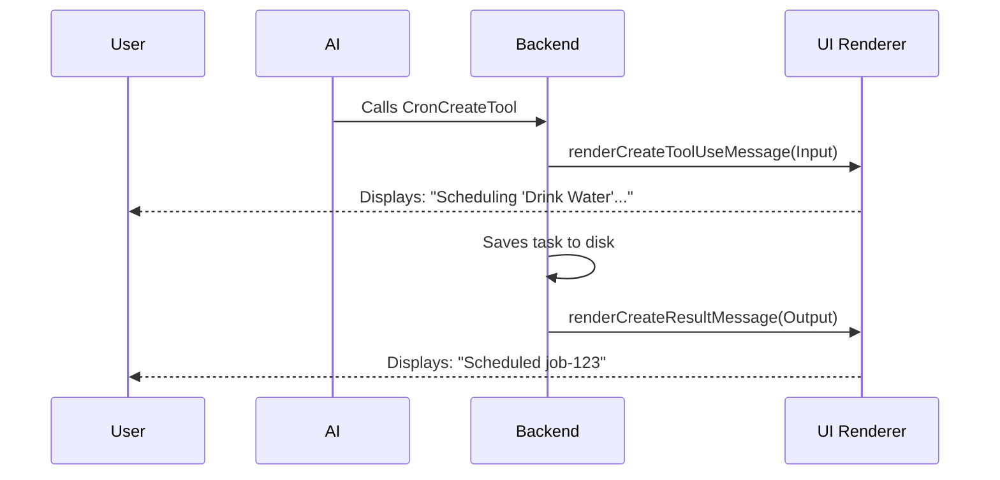

# Chapter 4: Tool UI Rendering

Welcome to Chapter 4!

In the previous chapter, [Durability & Persistence Logic](03_durability___persistence_logic.md), we taught our system how to save tasks to the hard drive so they survive a system restart.

Now we have a working backend:
1.  **Tools** to schedule tasks.
2.  **Prompts** to explain how they work.
3.  **Persistence** to save them.

However, there is one problem left: **Presentation**.
When the AI schedules a task, it exchanges raw data (JSON) with the system. While computers love JSON, humans prefer clean, readable text.

In this chapter, we will build the **UI Layer** using React components to make our tool interactions look beautiful in the chat interface.

---

## The Motivation: Raw Data vs. Human Summary

Imagine the AI decides to schedule a reminder. Without a UI layer, the conversation log might look like a database dump:

> **AI:** "I will schedule that."
> **System Output:** `{"id": "job-99", "cron": "*/5 * * * *", "nextRun": 1715000, "durable": true, "agentId": "default"}`

This is clutter. The user doesn't care about internal timestamps or agent IDs. They just want to know: **"Did it work?"**

We want the output to look like this:
> **System Output:** Scheduled **job-99** (every 5 mins)

To achieve this, we use **Tool UI Rendering**. We separate the *logic* (backend) from the *visuals* (frontend).

---

## 1. The Rendering Architecture

Our system uses a specialized library called **Ink** (React for CLIs) to render messages.

For every tool, there are two distinct moments where we can show a UI:
1.  **Tool Use (Input):** When the AI *starts* the action (e.g., "I am attempting to schedule...").
2.  **Tool Result (Output):** When the action *finishes* (e.g., "Success! Here is the ID").

We define a specific function for each of these moments.



---

## 2. Rendering the Input (Tool Use)

Let's look at `UI.tsx`. This file contains all our visual components.

When the AI calls `CronCreateTool`, it sends a `cron` string and a `prompt`. We want to show a compact summary of this intent.

```typescript
// UI.tsx
export function renderCreateToolUseMessage(input: Partial<{
  cron: string;
  prompt: string;
}>): React.ReactNode {
  // We combine the time code and the prompt text
  return `${input.cron ?? ''}${input.prompt ? `: ${truncate(input.prompt, 60, true)}` : ''}`;
}
```

**Explanation:**
1.  We take the input arguments (`cron` and `prompt`).
2.  We use a helper `truncate` to cut off very long prompts (so the UI doesn't get flooded).
3.  We return a simple string: `*/5 * * * *: Drink water...`

---

## 3. Rendering the Result (Output)

The result is more interesting. We want to use bold text for the ID and dim colors for secondary info.

We use `<Text>` components (similar to HTML `<span>` or `<div>`) to style the output.

```typescript
// UI.tsx
export function renderCreateResultMessage(output: CreateOutput): React.ReactNode {
  return (
    <MessageResponse>
      <Text>
        Scheduled <Text bold>{output.id}</Text>{' '}
        <Text dimColor>({output.humanSchedule})</Text>
      </Text>
    </MessageResponse>
  );
}
```

**Explanation:**
*   `<MessageResponse>`: A wrapper container for tool results.
*   `<Text bold>`: Makes the Job ID pop out visually.
*   `<Text dimColor>`: Makes the human-readable schedule (e.g., "every 5 minutes") subtle, so it doesn't distract.

**Result on Screen:**
Scheduled **job-123** (every 5 mins)

---

## 4. Handling Lists (Loops in UI)

The `CronListTool` is a bit more complex. It returns an array of jobs. We need to loop through them to display a list.

If the list is empty, we show a friendly "No jobs" message.

```typescript
// UI.tsx
export function renderListResultMessage(output: ListOutput): React.ReactNode {
  if (output.jobs.length === 0) {
    return (
      <MessageResponse>
        <Text dimColor>No scheduled jobs</Text>
      </MessageResponse>
    );
  }
  // ... (see next block for the loop)
```

If there are jobs, we use the JavaScript `.map()` function to create a `<Text>` component for every job found.

```typescript
  // ... inside renderListResultMessage
  return (
    <MessageResponse>
      {output.jobs.map(j => (
        <Text key={j.id}>
          <Text bold>{j.id}</Text> <Text dimColor>{j.humanSchedule}</Text>
        </Text>
      ))}
    </MessageResponse>
  );
}
```

**Result on Screen:**
**job-123** every 5 mins
**job-456** every Monday

---

## 5. Wiring it Up

We have created the functions in `UI.tsx`, but `CronCreateTool` doesn't know they exist yet. We have to connect them in the tool definition.

This is done at the very bottom of `CronCreateTool.ts`.

```typescript
// CronCreateTool.ts
export const CronCreateTool = buildTool({
  name: CRON_CREATE_TOOL_NAME,
  // ... inputs and logic ...
  
  // CONNECT THE UI HERE:
  renderToolUseMessage: renderCreateToolUseMessage,
  renderToolResultMessage: renderCreateResultMessage,

} satisfies ToolDef<InputSchema, CreateOutput>)
```

**How it works:**
The `buildTool` function takes our rendering functions as configuration. When the system runs the tool, it automatically looks for these properties. If found, it uses our React components instead of the raw JSON.

---

## 6. Visual Summary

Here is the complete transformation of data into UI.

```mermaid
graph LR
    A[Raw Data] --> B{UI Renderer}
    B --> C[Visual Output]

    subgraph "Raw Data (Backend)"
    D1[id: "job-1"]
    D2[cron: "* * * * *"]
    end

    subgraph "Visual Output (Frontend)"
    E1[Scheduled **job-1**]
    E2[(every minute)]
    end

    D1 --> B
    D2 --> B
    B --> E1
    B --> E2
```

---

## Summary

In this chapter, we learned:
1.  **Separation of Concerns:** The backend handles *logic* (saving files), while the frontend handles *presentation* (React components).
2.  **Input vs. Output:** We render meaningful summaries for both the *attempt* to use a tool and the *result* of that tool.
3.  **Styling:** We use components like `<Text bold>` and `<Text dimColor>` to guide the user's eye to important information like Job IDs.

We now have a fully functional, persistent, and beautiful scheduling system!

However, what if we want to turn this entire system OFF for certain users? Or what if we want to change the file path where tasks are saved without changing the code?

In the final chapter, we will learn how to manage these settings using **Feature Gates**.

[Next Chapter: Feature Gating & Configuration](05_feature_gating___configuration.md)

---

Generated by [Code IQ](https://github.com/adityasoni99/Code-IQ)