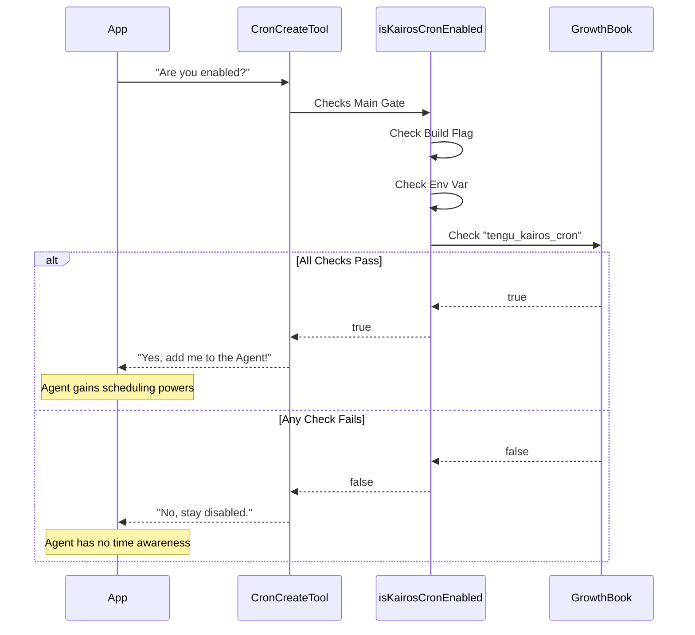

# Chapter 5: Feature Gating & Configuration

Welcome to the final chapter of our **ScheduleCronTool** series!

In the previous chapter, [Tool UI Rendering](04_tool_ui_rendering.md), we made our tools look beautiful with React components. We now have a system that can schedule tasks, save them to the hard drive, and display nice status updates.

But there is one major question left: **Safety and Control.**

### The Motivation
Imagine you release this cool scheduling feature to 1,000 users.
*   **Scenario A:** You discover a critical bug where the scheduler deletes the wrong files.
*   **Scenario B:** You want to offer "Durable Persistence" only to paid users, while free users get "Session Only."

You cannot simply "delete" the code from 1,000 computers instantly. You need a **Remote Control**.

We call this **Feature Gating**. It acts like a master circuit breaker. If we flip the switch, the scheduling tools completely disappear from the AI's utility belt, or their behavior changes instantly.

---

## 1. The Three Layers of Control

Our configuration system isn't just one switch; it is a security checkpoint with three gates. A user must pass all three to use the scheduler.

### Gate 1: The Build-Time Flag (The Blueprint)
This is the most fundamental switch. It happens when the application is being compiled (built).

If `feature('AGENT_TRIGGERS')` is false, the code for the scheduler is literally removed from the application to save space. It's like building a house but leaving the "Guest Room" off the blueprints entirely.

```typescript
// prompt.ts
import { feature } from 'bun:bundle'

const hasBlueprint = feature('AGENT_TRIGGERS') 
// If false, the code inside is "dead" and removed.
```

### Gate 2: The Environment Variable (The Local Override)
Sometimes a developer or a system administrator wants to forcibly disable the feature on their specific machine, regardless of what the remote server says.

We look for a specific text setting in the computer's environment: `CLAUDE_CODE_DISABLE_CRON`.

```typescript
// prompt.ts
import { isEnvTruthy } from '../../utils/envUtils.js'

// Returns true if the user manually disabled it locally
const isLocallyDisabled = isEnvTruthy(process.env.CLAUDE_CODE_DISABLE_CRON)
```

### Gate 3: The Runtime Flag (The Remote Control)
This is the most powerful tool for us. We use a system called **GrowthBook**. It allows us to toggle features on or off for all users (or specific groups) instantly via a remote server, without them needing to update their app.

```typescript
// prompt.ts
import { getFeatureValue_CACHED_WITH_REFRESH } from '../../services'

// Checks the remote server. Refreshes every 5 minutes.
const isRemoteEnabled = getFeatureValue_CACHED_WITH_REFRESH(
  'tengu_kairos_cron', // The ID of the flag
  true                 // The default value (if offline)
)
```

---

## 2. The Unified Gate: `isKairosCronEnabled`

We combine these three layers into one master function. This function dictates whether the **Cron Tool Suite** exists at all.

If this function returns `false`:
1.  The `CronCreate`, `CronList`, and `CronDelete` tools are hidden.
2.  The background loop that checks for time stops running.

Here is the implementation:

```typescript
// prompt.ts
export function isKairosCronEnabled(): boolean {
  // 1. Check Blueprint (Build flag)
  if (!feature('AGENT_TRIGGERS')) return false

  // 2. Check Local Override (Env var)
  if (isEnvTruthy(process.env.CLAUDE_CODE_DISABLE_CRON)) return false

  // 3. Check Remote Control (GrowthBook)
  return getFeatureValue_CACHED_WITH_REFRESH(
    'tengu_kairos_cron', 
    true, 
    5 * 60 * 1000 // Refresh cache every 5 mins
  )
}
```

*Explanation: It is an "AND" relationship. The blueprint must exist AND the local override must be off AND the remote server must say "Go".*

---

## 3. The Feature Gate: `isDurableCronEnabled`

As we learned in [Durability & Persistence Logic](03_durability___persistence_logic.md), we have two modes: **Session-Only** (RAM) and **Durable** (Disk).

We might want the scheduler to be active for everyone (Session-Only), but disable writing to disk for security reasons. For this, we have a **secondary gate**.

```typescript
// prompt.ts
export function isDurableCronEnabled(): boolean {
  // A specific flag just for the "Write to Disk" capability
  return getFeatureValue_CACHED_WITH_REFRESH(
    'tengu_kairos_cron_durable',
    true, // Defaults to true
    5 * 60 * 1000
  )
}
```

This gate is checked inside the `CronCreateTool` logic we wrote in Chapter 3.

---

## 4. How the Flow Works

Let's visualize the decision process when the application starts up and decides which tools to give the AI agent.



---

## 5. Applying the Gate to the Tool

Finally, we need to make sure our tools actually *use* this logic. We do this in the `isEnabled()` method of the tool definition.

This is a lazy check. The tool isn't added to the agent until this returns true.

```typescript
// CronCreateTool.ts
export const CronCreateTool = buildTool({
  name: CRON_CREATE_TOOL_NAME,
  
  // The system calls this before showing the tool to the AI
  isEnabled() {
    return isKairosCronEnabled()
  },

  // ... rest of the tool definition
})
```

By adding these 3 lines, we ensure that if we flip the switch on our remote server, the tool vanishes from the AI's context globally within 5 minutes (the cache refresh time).

---

## Conclusion & Project Summary

Congratulations! You have completed the **ScheduleCronTool** tutorial series.

Let's review what we have built together:

1.  **[Cron Tool Suite](01_cron_tool_suite.md):** We created the core functions (`Create`, `List`, `Delete`) that act as the AI's hands.
2.  **[Dynamic Prompt Construction](02_dynamic_prompt_construction.md):** We taught the AI to read the instruction manual dynamically, so it knows if it can save files or not.
3.  **[Durability & Persistence Logic](03_durability___persistence_logic.md):** We built the brain that decides whether to write tasks to the hard drive or keep them in RAM.
4.  **[Tool UI Rendering](04_tool_ui_rendering.md):** We added a presentation layer so users see beautiful summaries instead of raw data.
5.  **Feature Gating (This Chapter):** We added a safety switch to control the entire system remotely.

You now understand how to build a complex, production-grade tool for an AI agent. It isn't just about writing a function; it's about handling user expectations, managing system state, rendering UI, and ensuring safety through configuration.

Thank you for following along!

---

Generated by [Code IQ](https://github.com/adityasoni99/Code-IQ)