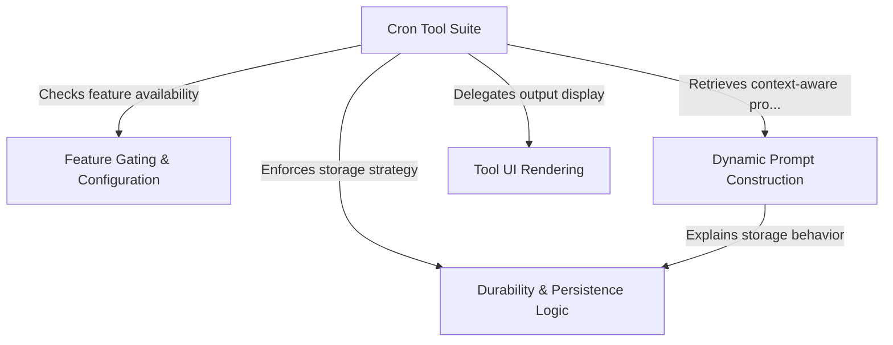

# Tutorial: ScheduleCronTool

This project provides a **scheduling capability** for an AI agent, enabling it to create, list, and delete time-based tasks using standard *cron syntax*. It intelligently distinguishes between **session-only** tasks (in-memory) and **durable** tasks (persisted to disk), dynamically adjusting its behavior, prompts, and UI feedback based on feature flags and environment configuration.

## Chapters

1. [Cron Tool Suite](01_cron_tool_suite.md)
2. [Dynamic Prompt Construction](02_dynamic_prompt_construction.md)
3. [Durability & Persistence Logic](03_durability___persistence_logic.md)
4. [Tool UI Rendering](04_tool_ui_rendering.md)
5. [Feature Gating & Configuration](05_feature_gating___configuration.md)

---

Generated by [Code IQ](https://github.com/adityasoni99/Code-IQ)