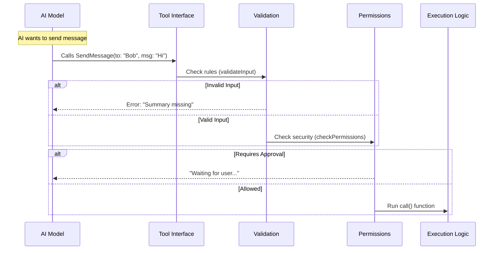

# Chapter 1: Tool Definition & Interface

Welcome to the first chapter of the **SendMessageTool** tutorial!

In the world of AI agents, communication is usually between a **User** and an **AI**. But what happens when an AI needs to talk to *another* AI to ask for help or delegate a task?

They need a standard way to "pass a note."

In this chapter, we will build the foundation: the **Tool Definition**. This is like creating a formal application form that the AI must fill out to send a letter. It ensures the AI provides exactly who the recipient is and what the message says before we try to deliver it.

### The Use Case
Imagine your AI is a **Team Lead**. It has a complex coding task. It wants to ask a **Researcher** agent to find documentation.

To do this, the Team Lead needs a tool called `SendMessage`. The interface requires:
1.  **To:** "Researcher"
2.  **Message:** "Find the docs for React 19."
3.  **Summary:** "React docs task"

Let's see how we define this "Form" in code.

---

## 1. The Input Schema (The Form)

The most important part of a tool definition is the **Input Schema**. This uses a library called `zod` to define the shape of the data. Think of it as the fields on a physical form.

Here is the simplified schema for our tool:

```typescript
// Define what the AI must provide to use this tool
const inputSchema = lazySchema(() =>
  z.object({
    // Field 1: Who is this for?
    to: z.string().describe('Recipient: teammate name, or "*" for broadcast'),

    // Field 2: A short preview for the UI
    summary: z.string().optional().describe('A 5-10 word summary'),

    // Field 3: The actual content
    message: z.union([
      z.string().describe('Plain text message content'),
      StructuredMessage(), // Advanced: for protocols (covered later)
    ]),
  }),
)
```

**Explanation:**
*   `to`: The destination address. It's a string (text).
*   `summary`: A short title. This helps humans reading the logs understand what's happening quickly.
*   `message`: The main content. Usually just a text string.

---

## 2. The Prompt (The Manual)

Defining the fields isn't enough; we have to tell the AI *how* to use them. This is done via the **Prompt**.

The prompt is like the instruction manual printed on the back of the form. It explains best practices, such as using `*` to send a message to everyone.

```typescript
// From prompt.ts
export function getPrompt(): string {
  return `
# SendMessage

Send a message to another agent.

\`\`\`json
{"to": "researcher", "summary": "assign task", "message": "start task #1"}
\`\`\`

| \`to\` | Description |
|---|---|
| \`"researcher"\` | Teammate by name |
| \`"*"\` | Broadcast to all teammates |
`.trim()
}
```

**Explanation:**
*   We provide a concrete JSON example.
*   We explicitly list valid values for the `to` field.
*   This text is fed into the AI's system prompt so it knows this tool exists.

---

## 3. Permissions (The Bouncer)

Before a message is actually sent, we need a security checkpoint. This is the **Permissions** layer.

For standard messages between teammates, we usually allow it. But if the AI tries to send a message to a totally different computer (a "Bridge"), we might want to ask the human user for permission first.

```typescript
// Inside SendMessageTool definition
async checkPermissions(input, _context) {
  // If sending to a remote bridge (cross-machine)
  if (feature('UDS_INBOX') && parseAddress(input.to).scheme === 'bridge') {
    return {
      behavior: 'ask', // Stop! Ask the human.
      message: `Send message to Remote Control session ${input.to}?`,
    }
  }
  
  // Otherwise, go ahead.
  return { behavior: 'allow', updatedInput: input }
},
```

**Explanation:**
*   `behavior: 'ask'`: Pauses execution and shows a generic "Allow/Reject" popup to the user.
*   `behavior: 'allow'`: Proceeds automatically without bothering the user.

---

## 4. Validation (The Clerk)

Even if the permissions are clear, the data might be messy. The **Validation** step ensures the form is filled out *correctly* before processing.

For example, we don't want to send a message with an empty recipient name, or a text message without a summary.

```typescript
async validateInput(input, _context) {
  // Rule: Recipient name cannot be empty
  if (input.to.trim().length === 0) {
    return { result: false, message: 'to must not be empty' }
  }

  // Rule: String messages MUST have a summary
  if (typeof input.message === 'string') {
    if (!input.summary || input.summary.trim().length === 0) {
      return { result: false, message: 'summary is required' }
    }
  }
  
  return { result: true }
},
```

**Explanation:**
*   If `validateInput` returns `false`, the tool rejects the request immediately.
*   The AI receives the `message` error and will usually try again with corrected inputs.

---

## 5. Putting it all together: `buildTool`

We wrap all these pieces (Schema, Prompt, Permissions, Validation) into a single object using `buildTool`. This creates the final interface that the system interacts with.

```typescript
export const SendMessageTool = buildTool({
  name: 'SendMessage', 
  
  // 1. Connect the Schema
  get inputSchema() { return inputSchema() },

  // 2. Connect the Prompt/Docs
  async prompt() { return getPrompt() },

  // 3. Connect Permissions & Validation
  checkPermissions,
  validateInput,

  // 4. The Action (Covered in later chapters)
  async call(input, context) { 
    // Logic to actually send the message goes here
  }
})
```

---

## Visualizing the Flow

Before we look at *how* the message travels (which is complex!), let's visualize the **Tool Interface** flow we just built. This happens strictly to decide **"Is this a valid request?"**



1.  The **AI** fills the form.
2.  **Validation** checks for missing fields (like a missing summary).
3.  **Permissions** checks if the operation is safe.
4.  Only if both pass does the code enter the `call()` function (the **Execution** phase).

---

## Conclusion

We have successfully defined the **Interface** for our tool. We've established:
1.  **What** data is required (Schema).
2.  **How** the AI learns to use it (Prompt).
3.  **Who** is allowed to send what (Permissions).

However, currently, our tool is just a form. It doesn't actually *know* who the other agents are or how to find them.

In the next chapter, we will learn about the **Teammates**—the agents on the receiving end of these messages.

[Next Chapter: Swarm Communication (Teammates)](02_swarm_communication__teammates_.md)

---

Generated by [Code IQ](https://github.com/adityasoni99/Code-IQ)