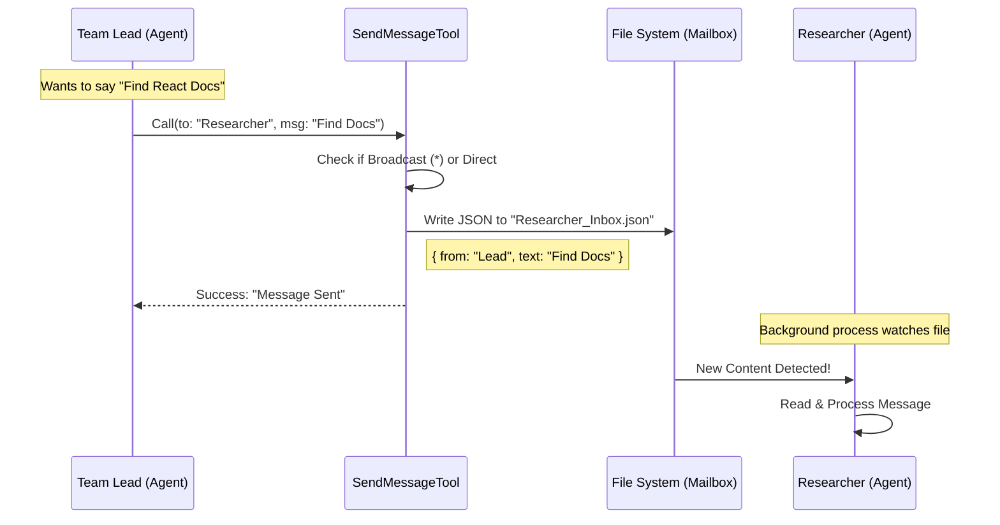

# Chapter 2: Swarm Communication (Teammates)

Welcome back! In [Chapter 1: Tool Definition & Interface](01_tool_definition___interface.md), we built the "application form" for our message tool. We defined *what* a message looks like (Recipient, Summary, Content).

But once the AI fills out that form, how does the message actually travel from one agent to another?

In this chapter, we explore **Swarm Communication**.

## The Problem: Agents are Isolated
Imagine two AI agents running on your computer. One is the **Team Lead** (managing the plan) and one is a **Researcher** (looking up docs).

Usually, these are two separate processes. They don't share memory. The Team Lead cannot just "think" something and have the Researcher know it. They are like two people working in different rooms with the doors closed.

## The Solution: The Inter-Office Mail System
To solve this, we use the **File System**. Since both agents are on the same computer, they can both access the hard drive.

We implement a protocol called **Swarm**. It works exactly like a physical office mail system:
1.  Every agent has a "Mailbox" (a specific file or folder).
2.  To talk to "Researcher", you write a JSON note into the Researcher's file.
3.  The Researcher watches that file and reads new entries.

---

## 1. Sending a Direct Message

Let's look at the code that handles a standard message (one-to-one). This is the function `handleMessage`.

It takes the content, packages it with a timestamp and the sender's name, and drops it in the recipient's "tray."

```typescript
// Inside SendMessageTool.ts
async function handleMessage(recipientName, content, summary, context) {
  const senderName = getAgentName() || 'Team Lead'
  const teamName = getTeamName(context.getAppState())

  // The core action: Write to the file system
  await writeToMailbox(recipientName, {
      from: senderName,
      text: content,
      summary: summary,
      timestamp: new Date().toISOString(),
    }, teamName)

  return { data: { success: true, message: `Sent to ${recipientName}` } }
}
```

**What's happening here?**
1.  **Identify Sender:** We figure out who *we* are (`senderName`).
2.  **Identify Team:** We find out which "office" we are working in (`teamName`).
3.  **writeToMailbox:** This is a helper that appends the JSON data to the recipient's mailbox file.

---

## 2. Broadcasting (The "Reply All")

Sometimes, the Team Lead needs to tell *everyone* something (e.g., "The project goals have changed"). This is a **Broadcast**.

In our tool interface, the AI selects this by setting `to: "*"`.

Under the hood, we can't just write to a magic "*" file. We have to manually copy the letter to every single team member.

```typescript
async function handleBroadcast(content, summary, context) {
  // 1. Get the Roster (the Team File)
  const teamName = getTeamName(context.getAppState())
  const teamFile = await readTeamFileAsync(teamName)

  // 2. Loop through every member
  for (const member of teamFile.members) {
    // Don't send mail to yourself!
    if (member.name === getAgentName()) continue 
    
    // 3. Drop a copy in their tray
    await writeToMailbox(member.name, {
        text: content,
        summary: summary, 
        /* ... timestamp/sender ... */
      }, teamName)
  }
  
  return { data: { success: true, message: 'Broadcast complete' } }
}
```

**Key Concept:**
The "Team File" acts like an employee roster. We read it to find out who exists, then we loop through that list to deliver the message one by one.

---

## 3. The Execution Logic

Now we connect these functions to the main `call()` method we teased in Chapter 1. This acts as the switchboard operator.

```typescript
// Inside the tool's call() method
async call(input, context) {
  // Scenario A: Broadcasting to everyone
  if (input.to === '*') {
    return handleBroadcast(input.message, input.summary, context)
  }

  // Scenario B: Direct message to a specific teammate
  return handleMessage(input.to, input.message, input.summary, context)
}
```

**Simple, right?**
If the destination is `*`, run the loop. Otherwise, just write to that specific person.

*(Note: The actual code has more checks for "Structured Messages" and "Bridges", which we will cover in later chapters).*

---

## Visualizing the "Physical" Flow

Let's look at a diagram of what happens when **Team Lead** sends a message to **Researcher**.



1.  The **Tool** does the work of writing to the disk.
2.  The **File System** acts as the transport layer.
3.  The **Researcher** picks it up (this happens in the Researcher's own event loop).

---

## Why this approach?

Using files for "Swarm" communication is great for beginners and robust for local development because:
1.  **Simplicity:** You can literally open the folder on your computer and *see* the messages as text files.
2.  **Persistence:** If an agent crashes and restarts, the message is still in the file waiting for them.
3.  **No Network:** It doesn't require setting up complex ports or web servers.

---

## Conclusion

We now have a working "Post Office."
1.  We can send notes to specific people (`handleMessage`).
2.  We can photocopy notes for everyone (`handleBroadcast`).
3.  We use the file system as our delivery trucks.

However, so far we are just sending plain text strings like "Hello." What if we need to send a formal request, like **"Please approve this plan"** or **"Shut down now"**? Plain text is too messy for strictly controlled commands.

In the next chapter, we will introduce **Structured Coordination Protocols** to handle these complex interactions.

[Next Chapter: Structured Coordination Protocols](03_structured_coordination_protocols.md)

---

Generated by [Code IQ](https://github.com/adityasoni99/Code-IQ)