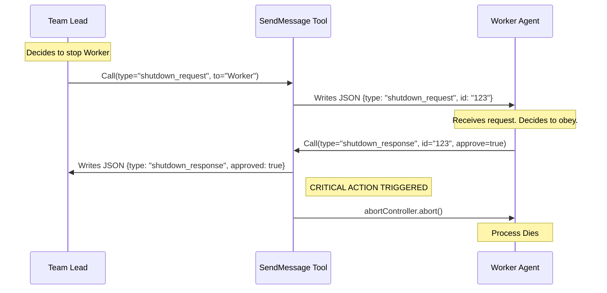

# Chapter 3: Structured Coordination Protocols

Welcome back! 

In [Chapter 2: Swarm Communication (Teammates)](02_swarm_communication__teammates_.md), we built a "Post Office" that lets agents send notes to each other. We can successfully send strings like `"Hello, can you find that file?"` or `"Here is the data."`

But sometimes, a casual note isn't enough.

## The Problem: Casual Chat vs. Formal Orders
Imagine a **Team Lead** agent wants a **Worker** agent to stop working immediately.

If the Lead sends a text: `"Please stop now,"` the Worker might interpret that as "Stop writing code, but keep the window open," or "Pause for 5 minutes." Text is ambiguous.

For high-stakes operations—like killing a process or approving a project plan—we need something stricter than text. We need **Structured Coordination Protocols**.

Think of this as the difference between a **casual email** and a **legal contract**. A legal contract has a specific format, requires a signature, and has binding consequences.

---

## 1. The Strict Schema (The Legal Forms)

In Chapter 1, we defined our input schema. You might remember seeing a `StructuredMessage` section. Now we will uncover what that is.

Instead of a simple string, we use a `discriminatedUnion` in our code. This effectively creates "Types of Forms."

```typescript
// From SendMessageTool.ts
const StructuredMessage = lazySchema(() =>
  z.discriminatedUnion('type', [
    // Form A: Requesting a shutdown
    z.object({
      type: z.literal('shutdown_request'),
      reason: z.string().optional(),
    }),
    
    // Form B: Responding to a shutdown
    z.object({
      type: z.literal('shutdown_response'),
      request_id: z.string(),
      approve: z.boolean(), // Checkbox: Yes or No
    }),
  ]),
)
```

**Why is this better?**
1.  **Type Safety:** The AI *cannot* hallucinate a "maybe" option. It must be `true` or `false`.
2.  **Routing:** Our code looks at the `type` field ("shutdown_request") and knows exactly which function to run.

---

## 2. The Shutdown Protocol

Let's walk through the most critical protocol: **Shutdown**.

When an agent needs to be turned off, we don't just pull the plug. We ask nicely, wait for them to finish saving their work, and let *them* turn off the lights.

### Step A: The Request
The Team Lead fills out the `shutdown_request` form.

```typescript
// Inside handleShutdownRequest
async function handleShutdownRequest(targetName, reason, context) {
  // 1. Generate a unique ID for this specific ticket
  const requestId = generateRequestId('shutdown', targetName)

  // 2. Create the formal JSON object
  const shutdownMessage = {
    type: 'shutdown_request',
    requestId: requestId,
    from: 'Team Lead',
    reason: reason,
  }

  // 3. Mail it (using the system we built in Chapter 2)
  await writeToMailbox(targetName, { 
    text: JSON.stringify(shutdownMessage) 
  }, /*...*/)
}
```

**Explanation:**
The key here is `requestId`. This ID tracks this specific "legal case." When the worker replies, they must quote this ID so we know which request they are approving.

---

### Step B: The Approval (and Consequences)
The Worker receives the message. They decide to approve it. They call the `SendMessage` tool back with a `shutdown_response`.

This triggers a serious chain of events in our tool:

```typescript
// Inside handleShutdownApproval
async function handleShutdownApproval(requestId, context) {
  // 1. Send the "I Approve" confirmation letter back to Team Lead
  await writeToMailbox(TEAM_LEAD_NAME, {
      type: 'shutdown_response',
      requestId: requestId,
      approved: true
  }, /*...*/)

  // 2. THE CONSEQUENCE: Kill the process
  // If we are a sub-process, we use an AbortController
  const task = findMyTask(context)
  if (task?.abortController) {
    task.abortController.abort() // <--- The agent kills itself here
  }
}
```

**Key Concept:**
This is the power of a protocol. A standard chat message `"Okay, bye"` creates a log entry. A protocol message `shutdown_response` actually executes code that terminates the software process.

---

## 3. The Switchboard (Routing Logic)

How does the tool know whether to send a text or process a shutdown? We upgrade the `call()` method we wrote in Chapter 2.

It now acts like a switchboard operator:

```typescript
// Inside call()
async call(input, context) {
  // 1. Is it just a plain text string?
  if (typeof input.message === 'string') {
    return handleMessage(input.to, input.message, /*...*/)
  }

  // 2. It's an Object! Check the 'type' field.
  switch (input.message.type) {
    case 'shutdown_request':
      return handleShutdownRequest(input.to, input.message.reason, context)

    case 'shutdown_response':
      if (input.message.approve) {
        return handleShutdownApproval(input.message.request_id, context)
      } else {
        return handleShutdownRejection(/*...*/)
      }
      
    case 'plan_approval_response':
       return handlePlanApproval(/*...*/)
  }
}
```

**Explanation:**
*   If the message is a string, use the logic from **Chapter 2**.
*   If the message is an object, check the `type`.
*   If `type` is `shutdown_response` **AND** `approve` is true, run the kill switch logic.

---

## 4. Plan Approval Protocol

The `shutdown` protocol isn't the only one. We also have **Plan Approval**.

*   **Scenario:** A worker writes a coding plan. The Team Lead must "Sign off" on it before code is written.
*   **Protocol:**
    1.  Worker sends plan (Text).
    2.  Lead sends `plan_approval_response` (Protocol).
    3.  If `approve: true`, the worker inherits permission to execute commands.
    4.  If `approve: false`, the worker is forced to revise.

This prevents the AI from "going rogue" and executing a bad plan without checking in.

---

## Visualizing the Protocol Flow

Let's see the **Shutdown** sequence in action. Notice how the "Tool" acts as the enforcer.



1.  **Lead** initiates the formal request.
2.  **Worker** formally signs the response.
3.  **Tool** sees the signature and pulls the plug.

---

## Conclusion

We have evolved our communication system significantly.
1.  **Chapter 1:** We defined the interface (The Form).
2.  **Chapter 2:** We built the mail delivery system (Text Messages).
3.  **Chapter 3:** We created **Protocols** (Legal Contracts) to handle critical lifecycle events like shutdowns and approvals.

Now our agents can talk *and* control each other. But there's a hidden complexity we haven't touched yet.

When the Team Lead sends a message, does it show up as "Team Lead" or "User"? How does the system know who is talking? How do we color-code messages in the terminal?

In the next chapter, we will dig into the logic that ensures the right label gets attached to every packet.

[Next Chapter: Message Routing Logic](04_message_routing_logic.md)

---

Generated by [Code IQ](https://github.com/adityasoni99/Code-IQ)