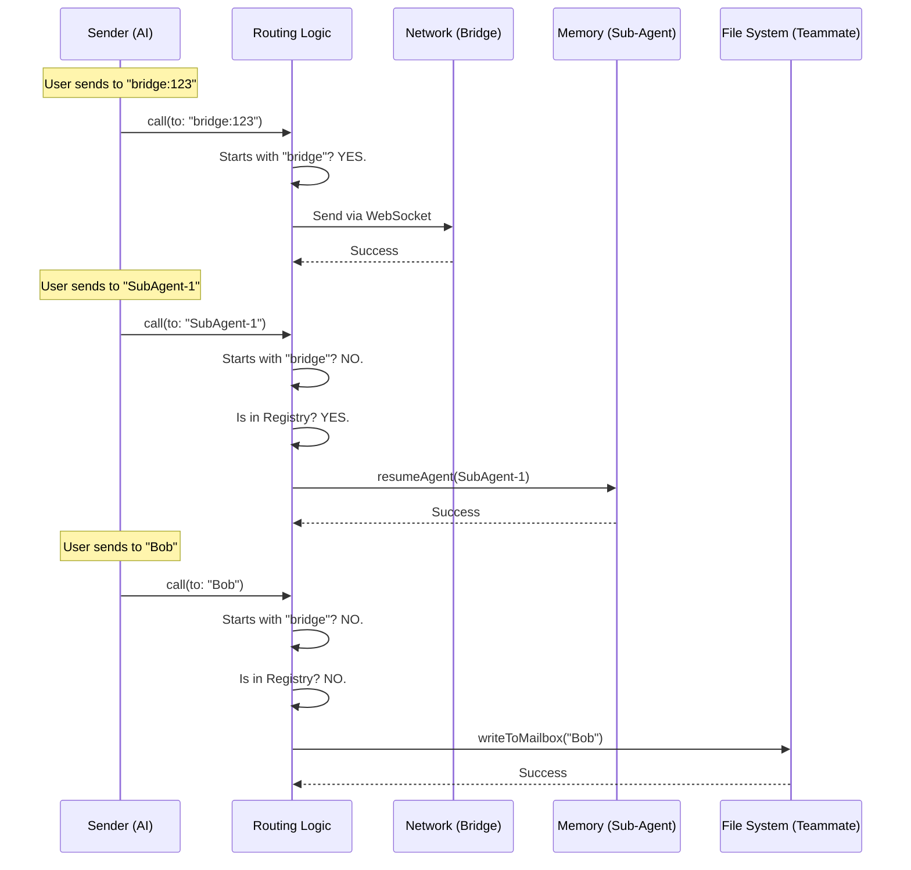

# Chapter 4: Message Routing Logic

Welcome back!

In [Chapter 3: Structured Coordination Protocols](03_structured_coordination_protocols.md), we learned how to send strict, legal-contract style messages (like Shutdown Requests) instead of just casual chats.

But we glossed over a major detail. We assumed every recipient was a "Teammate" sharing a file system.

**What if the recipient isn't a file?**
What if the recipient is a sub-process running in memory?
What if the recipient is on a completely different computer connected via the internet?

This is where **Message Routing Logic** comes in.

---

## The Concept: The Sorting Facility

Imagine a major Post Office sorting facility.
1.  You drop a letter in the slot.
2.  The letter travels down a conveyor belt.
3.  A scanner reads the address.

**The Routing Logic** is that scanner. It decides:
*   **Is this for a neighbor?** Put it on the local truck (File System).
*   **Is this for a department in this building?** Send it via pneumatic tube (In-Memory Sub-agent).
*   **Is this for another country?** Put it on a plane (Network Bridge).

The sender (the AI) doesn't care *how* it gets there. It just writes the name. The tool handles the logistics.

---

## 1. The Decision Tree

The heart of our routing logic lives at the very top of the `call()` function in `SendMessageTool.ts`. It acts as a series of `if/else` checks, prioritized by specific needs.

Here is the high-level logic flow:

1.  **Check Protocol:** Is this a "Remote Bridge" address? (e.g., `bridge:123`)
2.  **Check Local Sockets:** Is this a "UDS" address? (e.g., `uds:socket`)
3.  **Check Sub-Agents:** Is this a child process we spawned? (e.g., `coder-agent`)
4.  **Fallback:** If none of the above, assume it is a Swarm Teammate (File System).

Let's break these down one by one.

---

## 2. Priority 1: Cross-Boundary Transport

We will cover the technical details of this in [Chapter 5: Cross-Boundary Transport (Bridge/UDS)](05_cross_boundary_transport__bridge_uds_.md), but the *routing decision* happens here.

If the address starts with `bridge:` or `uds:`, we immediately divert the message to the network handlers.

```typescript
// Inside call() method
if (feature('UDS_INBOX') && typeof input.message === 'string') {
  const addr = parseAddress(input.to)
  
  // 1. Remote Bridge (Different Computer)
  if (addr.scheme === 'bridge') {
    return postInterClaudeMessage(addr.target, input.message)
  }

  // 2. Local Socket (Different Terminal Window)
  if (addr.scheme === 'uds') {
    return sendToUdsSocket(addr.target, input.message)
  }
}
```

**Explanation:**
*   We use a helper `parseAddress` to split `bridge:123` into scheme (`bridge`) and target (`123`).
*   If a scheme is detected, we skip the file system entirely.

---

## 3. Priority 2: In-Memory Sub-Agents

This is a new concept for this chapter. Sometimes, an agent doesn't just talk to a peer; it spawns a **Child Agent** to do a specific job (like "Fix this bug").

These children don't always have a "Mailbox File." They are processes running in the computer's RAM. To talk to them, we might need to "wake them up" (resume).

```typescript
// Inside call() method
// 1. Look up the name in our internal registry
const appState = context.getAppState()
const agentId = appState.agentNameRegistry.get(input.to)

if (agentId) {
  // 2. Check if the task is currently running
  const task = appState.tasks[agentId]
  
  if (task.status === 'running') {
    // If running, just queue the message
    queuePendingMessage(agentId, input.message, /*...*/)
    return { data: { success: true, message: 'Message queued' } }
  }
  
  // 3. If stopped, WAKE IT UP!
  return resumeAgentBackground({ agentId, prompt: input.message, /*...*/ })
}
```

**Why is this special?**
With a file system teammate, if they are asleep, you just leave a file. They read it when they wake up.
With a sub-agent, **sending the message IS the wake-up call.** The routing logic actively restarts the process.

---

## 4. Priority 3: Swarm Teammates (The Default)

If the address isn't a bridge, and it isn't a sub-agent in our memory, the logic assumes it is a standard teammate sharing the file system.

This brings us back to the code we wrote in [Chapter 2: Swarm Communication (Teammates)](02_swarm_communication__teammates_.md).

```typescript
// Inside call() method - The Fallback

// If nothing else matched...
if (typeof input.message === 'string') {
  
  // Is it a broadcast?
  if (input.to === '*') {
    return handleBroadcast(input.message, input.summary, context)
  }

  // Standard File System Delivery
  return handleMessage(input.to, input.message, input.summary, context)
}
```

**Explanation:**
This is the "catch-all." Most messages will fall into this bucket.

---

## 5. Visualizing the Decision Flow

Let's watch a message travel through the logic to understand how the destination is chosen.



---

## 6. Handling Structured Protocols

In [Chapter 3](03_structured_coordination_protocols.md), we introduced `shutdown_request`.

Our routing logic has a strict rule: **Complex Protocols cannot go over the bridge.**

Why? Because safely serializing a "Shutdown Command" across the internet to a different machine is risky and complex. We currently enforce that protocols (like Shutdown) only happen locally.

```typescript
// Inside validateInput()
if (feature('UDS_INBOX') && parseAddress(input.to).scheme === 'bridge') {
  
  // If the message is NOT a string (it's an object/protocol)
  if (typeof input.message !== 'string') {
    return { 
      result: false, 
      message: 'structured messages cannot be sent cross-session' 
    }
  }
}
```

**The Logic:**
*   Text messages (`string`) -> Allowed everywhere.
*   Protocols (`object`) -> Allowed only for Local Swarm/Sub-agents.

---

## Conclusion

We have successfully built the "Brain" of our tool. It intelligently routes messages based on:
1.  **Prefixes:** (`bridge:`, `uds:`) for remote/socket transport.
2.  **Registry:** (`agentNameRegistry`) for in-process sub-agents.
3.  **Default:** File system for standard teammates.

This abstraction allows the AI to simply say `to: "SubAgent-1"` or `to: "Bob"` without needing to know the complex implementation details of *how* the message gets delivered.

However, we keep mentioning "The Bridge" and sending messages to other computers. How does that actually work? How do two totally separate machines talk to each other safely?

In the next chapter, we will open the hood on the network layer.

[Next Chapter: Cross-Boundary Transport (Bridge/UDS)](05_cross_boundary_transport__bridge_uds_.md)

---

Generated by [Code IQ](https://github.com/adityasoni99/Code-IQ)