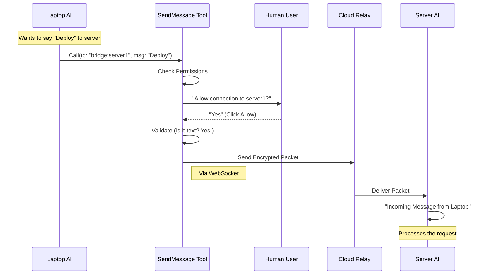

# Chapter 5: Cross-Boundary Transport (Bridge/UDS)

Welcome back! 

In [Chapter 4: Message Routing Logic](04_message_routing_logic.md), we built the "Sorting Facility" that decides where a message goes. We handled local teammates (via files) and sub-agents (via memory).

But what happens when the recipient isn't "in the building"?

In this chapter, we explore **Cross-Boundary Transport**. This is how an agent sends a message to a completely different terminal window or even a different computer entirely.

---

## The Problem: Breaking Out of the Box

Up until now, our agents have been like people in a locked room passing notes. They share a file system, so they can just leave files for each other.

**But imagine this use case:**
You have an agent running on your **Laptop**. You have another agent running on a **Cloud Server**. You want the Laptop Agent to tell the Cloud Agent: *"Deploy the website."*

They don't share a hard drive. Leaving a file on the laptop won't help the server. We need a "wire" to connect them.

## The Solution: Two Types of Wires

We support two types of "Long-Distance" calling:

1.  **UDS (Unix Domain Sockets):**
    *   **Analogy:** An intercom system between two rooms in the same building.
    *   **Use Case:** You have two terminal windows open on your Mac. One is coding, one is running tests.
    *   **How it works:** It uses a special file that acts like a pipe. Data flows instantly.

2.  **Bridge (Remote Relay):**
    *   **Analogy:** A satellite phone call to another country.
    *   **Use Case:** Your laptop talking to a remote server.
    *   **How it works:** The message is encrypted, sent to an internet relay server (Anthropic's backend), and pushed down to the other machine.

---

## 1. Addressing the Recipient

How does the AI know how to dial these numbers? It uses a specific address format.

Usually, the AI finds these addresses using a tool called `ListPeers` (which discovers active sessions), but for `SendMessage`, we just need to know the format:

*   **UDS Address:** `uds:/tmp/sock_file_123`
*   **Bridge Address:** `bridge:session_01AbCd...`

When the AI types this into the `to` field, our tool knows exactly what to do.

---

## 2. Safety First: The Permission Check

Sending data over the internet to a remote session is risky. We don't want an AI accidentally sending sensitive code to the wrong server.

Therefore, **Bridge messages require explicit human permission.**

Here is the code inside `checkPermissions` that enforces this:

```typescript
// Inside checkPermissions
async checkPermissions(input, _context) {
  // Check if the address scheme is "bridge"
  if (parseAddress(input.to).scheme === 'bridge') {
    return {
      behavior: 'ask', // STOP! Ask the human.
      message: `Send message to Remote Control session ${input.to}?`,
      
      // Security note: We force this check even in "Auto-Mode"
      decisionReason: { 
        type: 'safetyCheck', 
        reason: 'Cross-machine bridge message requires explicit user consent' 
      }
    }
  }
  // ... allow other types ...
}
```

**Explanation:**
*   We parse the address. If it starts with `bridge:`, we return `behavior: 'ask'`.
*   This pops up a dialog: *"Allow SendMessage to bridge:session_xyz?"*
*   If the user clicks "No", the message is never sent.

---

## 3. The Constraint: Text Only

In [Chapter 3: Structured Coordination Protocols](03_structured_coordination_protocols.md), we learned about complex JSON objects for shutdowns and approvals.

**We cannot send those over the bridge.**

Why? Because coordinating state (like killing a process) across different computers is extremely complex and error-prone. We keep it simple: **Text Only**.

```typescript
// Inside validateInput
if (parseAddress(input.to).scheme === 'bridge') {
  
  // Rule: Message MUST be a string
  if (typeof input.message !== 'string') {
    return {
      result: false,
      message: 'structured messages cannot be sent cross-session — only plain text',
    }
  }
}
```

**What happens:**
If the AI tries to send a "Shutdown Request" to a remote server, the tool rejects it immediately with an error. The AI must send a polite text asking the remote agent to shut *itself* down instead.

---

## 4. Sending via UDS (The Intercom)

If the address starts with `uds:`, we use a local socket client.

```typescript
// Inside call() - UDS logic
if (addr.scheme === 'uds') {
  // Import the socket client
  const { sendToUdsSocket } = require('../../utils/udsClient.js')
  
  try {
    // Push the data into the pipe
    await sendToUdsSocket(addr.target, input.message)
    
    return { data: { success: true, message: `Sent to ${input.to}` } }
  } catch (e) {
    return { data: { success: false, message: `Failed: ${e.message}` } }
  }
}
```

**Explanation:**
*   `addr.target` is the file path (e.g., `/tmp/mysocket`).
*   The function connects to that file and streams the text data.
*   It's fast and doesn't require internet.

---

## 5. Sending via Bridge (The Satellite)

If the address starts with `bridge:`, we use the internet relay.

```typescript
// Inside call() - Bridge logic
if (addr.scheme === 'bridge') {
  // Check if we are still connected
  if (!getReplBridgeHandle()) {
     return { data: { success: false, message: 'Remote disconnected' } }
  }

  // Import the bridge handler
  const { postInterClaudeMessage } = require('../../bridge/peerSessions.js')
  
  // Send the payload to the cloud
  const result = await postInterClaudeMessage(addr.target, input.message)
  
  return { 
    data: { 
      success: result.ok, 
      message: result.ok ? 'Message Sent' : 'Failed' 
    } 
  }
}
```

**Explanation:**
1.  **Check Connection:** Bridges can drop. We check `getReplBridgeHandle()` to ensure we are online.
2.  **Post Message:** We hand the message to the internal system that manages the WebSocket connection to Anthropic.

---

## Visualizing the Bridge Flow

Let's look at the journey of a message from your Laptop to a Server.



1.  **Safety Stop:** The tool pauses at the User step.
2.  **Validation:** It ensures no complex protocols are sneaking through.
3.  **Transport:** It hands off to the network layer.

---

## Conclusion

We have now completed the functional core of the **SendMessageTool**.

1.  **Interface:** We defined the form.
2.  **Swarm:** We handled local files.
3.  **Protocols:** We handled complex commands.
4.  **Routing:** We built the logic to choose paths.
5.  **Transport:** We connected to the outside world via Bridge and UDS.

The tool works! But there is one final piece of the puzzle. When the tool finishes, it returns a result to the AI. But how do we show this result to the **Human User** in a way that looks nice in the terminal?

In the final chapter, we will learn how to create beautiful, color-coded output.

[Next Chapter: User Interface Presentation](06_user_interface_presentation.md)

---

Generated by [Code IQ](https://github.com/adityasoni99/Code-IQ)