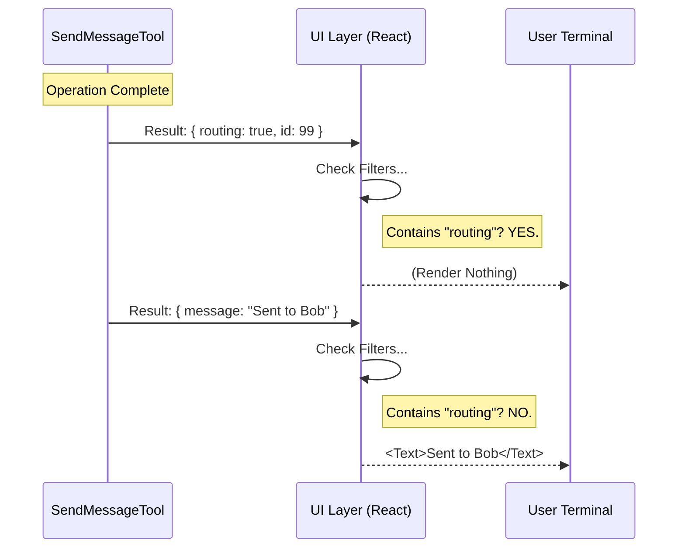

# Chapter 6: User Interface Presentation

Welcome to the final chapter of the **SendMessageTool** tutorial!

In [Chapter 5: Cross-Boundary Transport (Bridge/UDS)](05_cross_boundary_transport__bridge_uds_.md), we successfully connected our agent to the outside world. We can now send messages to local teammates, sub-processes, and even remote servers.

But there is a problem: **The Noise.**

When a message travels across a bridge, the system generates a lot of technical "receipts." The logs might look like this:

```json
{"routing": true, "target": "session_123", "status": "sent", "id": "msg_99"}
```

If the human user sees thousands of these JSON blobs scrolling by, they will miss the important stuff (like the actual message content).

In this chapter, we will build the **User Interface (UI) Presentation**.

---

## The Concept: Front of House vs. Kitchen

Think of your CLI tool like a **Restaurant**.

*   **The Backend (Kitchen):** This is the messy part we built in Chapters 1-5. It deals with routing codes, timestamps, protocol IDs, and error handling. It's chaotic and necessary.
*   **The UI (Front of House):** This is the waiter. The waiter doesn't bring the customer a greasy ticket with "Table 4, Order #99, extra sauce" written on it. They bring a clean plate.

Our UI layer exists to **hide the kitchen chaos** and present a clean "plate" to the human user.

---

## 1. Using React in the Terminal

It might surprise you, but we use **React** to build our Command Line Interface (CLI). We use a library called `Ink`.

This allows us to create visual components (like `<Text>` or `<Box>`) just like building a website, but the output renders as text in your terminal window.

We have two main jobs in `UI.tsx`:
1.  **Input Presentation:** How do we display what the AI *is sending*?
2.  **Output Presentation:** How do we display what the tool *returned*?

---

## 2. Input Presentation (The "Order")

When the AI calls `SendMessage`, it fills out a large JSON object. Most of the time, we don't need to do anything special—the system default display is fine.

However, for specific **Protocols** (like the Plan Approval we built in [Chapter 3](03_structured_coordination_protocols.md)), we want to show a nice summary.

Here is how we translate a raw JSON object into a human-readable sentence.

```typescript
// From UI.tsx
export function renderToolUseMessage(input) {
  // If the message is just text, show nothing special.
  if (typeof input.message !== 'object') return null;

  // If it is a "Plan Approval" protocol...
  if (input.message.type === 'plan_approval_response') {
    // Return a nice formatted string
    return input.message.approve 
      ? `approve plan from: ${input.to}` 
      : `reject plan from: ${input.to}`;
  }
  
  return null;
}
```

**What happens here?**
*   **Input:** `{"to": "Bob", "message": {"type": "plan_approval_response", "approve": true}}`
*   **UI Output:** `"approve plan from: Bob"`

The user doesn't need to see the raw JSON structure. They just need to know: "Oh, the AI approved Bob's plan."

---

## 3. Output Presentation (The "Receipt")

This is the most important part: **The Silencer.**

When the `SendMessage` tool finishes, it returns a result. Often, this result is purely for the AI's internal logic (like "Message Queued" or "Routing Success"). The human doesn't care.

We use `renderToolResultMessage` to filter out this noise.

```typescript
// From UI.tsx
export function renderToolResultMessage(content) {
  // Parse the output string back into an object
  const result = typeof content === 'string' 
    ? jsonParse(content) 
    : content;

  // FILTER 1: Hide internal routing info
  if ('routing' in result && result.routing) {
    return null; // Don't show anything!
  }

  // ... (more filters below)
```

**Explanation:**
If the result contains `routing: true`, we return `null`. In React, returning `null` means **"render nothing."** The log line simply disappears from the user's screen.

---

## 4. Cleaning Protocol Noise

Similarly, we often have technical IDs that are useful for the code but useless for the human.

```typescript
  // FILTER 2: Hide technical IDs
  if ('request_id' in result && 'target' in result) {
    return null; // Hide it.
  }

  // If it passed the filters, show the actual message!
  return (
    <MessageResponse>
      <Text dimColor>{result.message}</Text>
    </MessageResponse>
  );
}
```

**The Result:**
*   **Raw Data:** `{"request_id": "123", "target": "Bob", "status": "ok"}` -> **Hidden.**
*   **Raw Data:** `{"success": true, "message": "Sent to Bob"}` -> **Displayed:** "Sent to Bob" (in a dimmed color).

---

## Visualizing the UI Filter

Let's look at the flow of data. The "Tool" produces the raw ingredients, but the "UI" decides what gets plated.



---

## 5. Why `dimColor`?

You noticed `<Text dimColor>` in the code.

In a CLI, bright white text usually demands attention (like an error or a question). "Background" information—like a confirmation that a message was sent—should be subtle.

By dimming the text, we respect the user's attention. We say: *"This happened, but you don't need to stop what you're doing to look at it."*

---

## Tutorial Conclusion

Congratulations! You have built the entire **SendMessageTool** ecosystem.

Let's recap your journey:
1.  **[Chapter 1](01_tool_definition___interface.md):** You created the **Form** (Schema) to define what a message is.
2.  **[Chapter 2](02_swarm_communication__teammates_.md):** You built the **Mailbox** system to write files to teammates.
3.  **[Chapter 3](03_structured_coordination_protocols.md):** You designed **Protocols** for strict commands like Shutdowns.
4.  **[Chapter 4](04_message_routing_logic.md):** You wrote the **Router** to sort local vs. remote mail.
5.  **[Chapter 5](05_cross_boundary_transport__bridge_uds_.md):** You built the **Bridge** to talk across the internet.
6.  **Chapter 6 (You are here):** You built the **UI** to make it look clean for the human.

You now possess a fully functional tool that allows AI agents to coordinate complex tasks, across multiple computers, while keeping the human user informed but not overwhelmed.

**This concludes the SendMessageTool tutorial.**

---

Generated by [Code IQ](https://github.com/adityasoni99/Code-IQ)