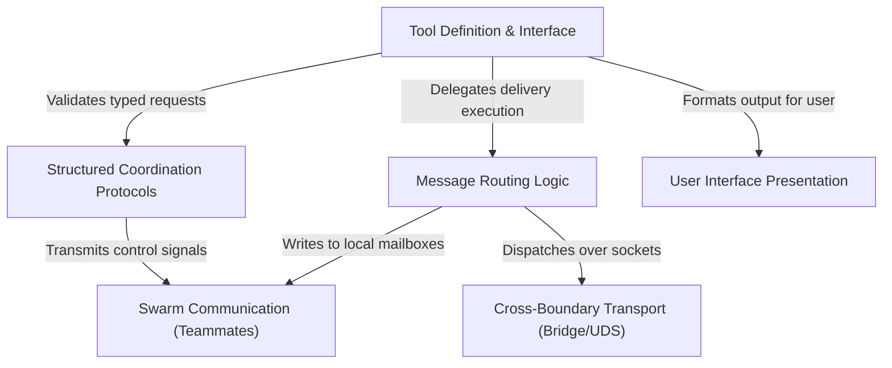

# Tutorial: SendMessageTool

The `SendMessageTool` serves as the communication backbone for the AI agent, enabling it to exchange messages with **teammates**, the **team lead**, or even **remote sessions**. It intelligently handles routing—distinguishing between local file-based *swarm mailboxes* and network-based *cross-boundary transport*—and enforces strict **coordination protocols** for high-stakes actions like shutting down agents or approving plans.

## Chapters

1. [Tool Definition & Interface](01_tool_definition___interface.md)
2. [Swarm Communication (Teammates)](02_swarm_communication__teammates_.md)
3. [Structured Coordination Protocols](03_structured_coordination_protocols.md)
4. [Message Routing Logic](04_message_routing_logic.md)
5. [Cross-Boundary Transport (Bridge/UDS)](05_cross_boundary_transport__bridge_uds_.md)
6. [User Interface Presentation](06_user_interface_presentation.md)

---

Generated by [Code IQ](https://github.com/adityasoni99/Code-IQ)