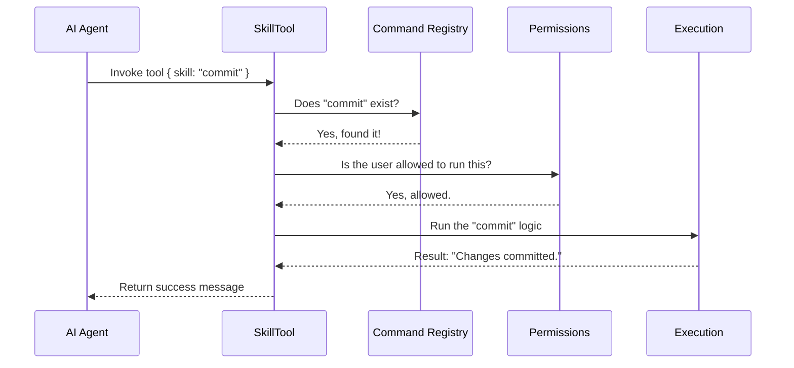

# Chapter 1: The SkillTool Interface

Welcome to the **SkillTool** project tutorial! In this first chapter, we are going to explore the core mechanism that powers our AI agent's ability to "do things."

## The Universal Remote Control

Imagine you have a TV, a sound system, a DVD player, and smart lights. You *could* have 10 different remotes on your coffee table, each with 50 buttons. That is confusing and hard to manage.

Alternatively, you could have **one Universal Remote**.
*   It has a screen where you type what you want to control (e.g., "Lights").
*   It has a button to send the signal.
*   The remote handles the complex work of figuring out which device to talk to.

**`SkillTool` is that Universal Remote for the AI.**

### The Problem
An advanced AI agent might have access to hundreds of "skills"—commands like `git commit`, `read file`, `run test`, or `deploy`.
If we tried to teach the AI exactly how to execute every single one of those commands individually, the AI's "brain" (context window) would get overwhelmed.

### The Solution
Instead of teaching the AI 100 different tools, we give it **one** tool called `SkillTool`.
The AI only needs to know:
1.  **What** skill it wants to use (the name).
2.  **Any arguments** needed (like a commit message).

## Central Use Case: "Reviewing Code"

Let's look at a simple scenario. You want the AI to review a Pull Request.

**Without SkillTool:**
The AI would need a specific function definition for `review_pr_tool`.

**With SkillTool:**
The AI simply uses the generic `Skill` tool and passes `"review-pr"` as the target.

### Example Input
Here is what the AI actually sends when it wants to use a skill:

```json
{
  "skill": "review-pr",
  "args": "123"
}
```

### Example Output
The `SkillTool` receives this, finds the code for "review-pr", runs it, and tells the AI:

```json
{
  "success": true,
  "commandName": "review-pr",
  "status": "inline"
}
```

## Key Concept: The Input Schema

For the AI to understand how to use this "Universal Remote," we must define a **Schema**. This acts like the instruction manual for the AI.

In `SkillTool.ts`, we define exactly what inputs the tool accepts. It's surprisingly simple!

```typescript
// From SkillTool.ts
export const inputSchema = lazySchema(() =>
  z.object({
    skill: z
      .string()
      .describe('The skill name. E.g., "commit", "review-pr", or "pdf"'),
    args: z.string().optional().describe('Optional arguments for the skill'),
  }),
)
```

**Explanation:**
1.  **`skill`**: A mandatory text string. This is the channel number on our remote.
2.  **`args`**: An optional text string. These are extra details (like which file to edit).
3.  **`z.object`**: We use a library called Zod to ensure the data is formatted correctly.

## How It Works: The Flow

What happens when the AI actually presses the button? Here is the sequence of events:



## Implementation Deep Dive

Let's look at how this is built in the code. We will look at simplified snippets from `SkillTool.ts`.

### 1. Defining the Tool
First, we tell the system that this file describes a Tool.

```typescript
// From SkillTool.ts
export const SkillTool: Tool<InputSchema, Output, Progress> = buildTool({
  name: SKILL_TOOL_NAME, // Usually just "Skill"
  searchHint: 'invoke a slash-command skill',
  
  // We link the schema we defined earlier
  get inputSchema(): InputSchema {
    return inputSchema()
  },
  // ...
})
```
*   **`buildTool`**: A helper that wraps our logic into a standard tool format.
*   **`name`**: The AI sees this name. It's defined as `'Skill'` in `constants.ts`.

### 2. Validating the Input
Before we run anything, we must check if the skill actually exists. The AI might hallucinate a skill named `"make-coffee"`.

```typescript
// From SkillTool.ts (inside validateInput)
async validateInput({ skill }, context): Promise<ValidationResult> {
  const trimmed = skill.trim()
  
  // 1. Get all known commands
  const commands = await getAllCommands(context)

  // 2. Check if the requested skill exists in the list
  const foundCommand = findCommand(trimmed, commands)
  
  if (!foundCommand) {
    return { result: false, message: `Unknown skill: ${trimmed}` }
  }
  return { result: true }
}
```
*   **`getAllCommands`**: Fetches the list of all capabilities the system currently has.
*   **`findCommand`**: Searches that list for the specific string the AI sent.

### 3. Checking Safety
We don't want the AI running dangerous commands without checking. We'll cover this deeply in [Permission & Safety Layer](04_permission___safety_layer.md), but here is where the check happens.

```typescript
// From SkillTool.ts (inside checkPermissions)
async checkPermissions({ skill }, context): Promise<PermissionDecision> {
  // Check if there are rules blocking this skill
  const denyRules = getRuleByContentsForTool(..., 'deny')
  
  if (denyRules.size > 0) {
    return { behavior: 'deny', message: 'Blocked by rule' }
  }
  
  // If no specific rules, ask the user (or auto-allow safe ones)
  return { behavior: 'ask', message: `Execute skill: ${skill}` }
}
```

### 4. Execution (The `call` function)
Finally, if validation passes and permissions are granted, we run the logic.

```typescript
// From SkillTool.ts (inside call)
async call({ skill, args }, context, ...): Promise<ToolResult<Output>> {
  const commandName = skill.trim()

  // 1. Process the slash command logic
  const processedCommand = await processPromptSlashCommand(
    commandName,
    args || '',
    commands, 
    context
  )

  // 2. Return the result to the AI
  return {
    data: { success: true, commandName },
    newMessages: processedCommand.messages 
  }
}
```
*   **`processPromptSlashCommand`**: This is the engine. It converts the skill name (e.g., "commit") into the actual prompts or code actions required.
*   **`newMessages`**: The result of the skill (e.g., the output of the git command) is returned as a message to the AI.

## Handling Complexity

Sometimes a skill is too complex to run in a single step. For example, a skill might need to run its own mini-agent to solve a problem.
`SkillTool` handles this via **Forking**.

```typescript
// From SkillTool.ts
if (command?.type === 'prompt' && command.context === 'fork') {
  return executeForkedSkill(command, ...)
}
```
If a command is marked as `fork`, `SkillTool` creates a sub-agent to handle it. We will discuss this advanced topic in [Forked Execution Strategy](05_forked_execution_strategy.md).

## Conclusion

The **SkillTool Interface** is the gateway between the AI and the system's capabilities. It simplifies the world for the AI by providing a single point of entry ("The Universal Remote") to invoke any command by name.

However, once a skill is invoked, how do we show the AI (and the human user) what is happening? How does the AI know if the command worked?

To find out, let's move on to the next chapter:
[Skill User Interface (UI)](02_skill_user_interface__ui_.md)

---

Generated by [Code IQ](https://github.com/adityasoni99/Code-IQ)