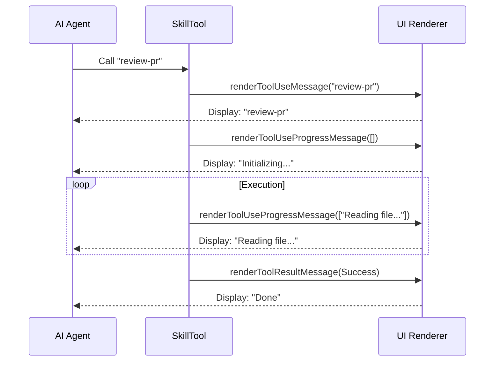

# Chapter 2: Skill User Interface (UI)

Welcome to Chapter 2!

In the previous chapter, [The SkillTool Interface](01_the_skilltool_interface.md), we built the "Universal Remote" that allows our AI to trigger commands by name.

But imagine pressing a button on a remote and... nothing happens. No light blinks, no sound plays. You wouldn't know if the TV is broken or if it's just "thinking."

This is where the **Skill User Interface (UI)** comes in.

## The Digital Display

The **Skill User Interface** is the visual feedback layer of our agent. It creates the "digital display" for our tools.

### The Washing Machine Analogy
Think of `SkillTool` like a modern washing machine.
1.  **The Mechanics (Chapter 1):** The motor, the water pump, and the drum spinning are the actual code execution. This is complex and messy.
2.  **The Display (Chapter 2):** You don't open the lid to check if the clothes are wet. You look at the digital screen.
    *   It says "Sensing Load..." (Initializing)
    *   It shows a progress bar: "Rinsing..." (Execution)
    *   It beeps and lights up green: "Cycle Complete" (Result)

The **Skill UI** provides this screen so the user knows exactly what the AI is doing without having to read raw logs.

## Central Use Case: "Reviewing Code"

Let's stick with our **"Reviewing Code"** scenario. The AI has decided to run the `review-pr` skill. This process might take 30 seconds.

**Without UI:**
The terminal freezes. The user thinks, "Did it crash?"

**With UI:**
The terminal updates in real-time:
1.  **Start:** `Skill: review-pr`
2.  **Progress:** `Initializing...`
3.  **Update:** `Reading src/main.ts...`
4.  **Finish:** `Done`

## Key Concept: React in the Terminal

Our project uses a library called **Ink** to render React components inside the command line. The `SkillTool` doesn't just run logic; it returns React components to visualize that logic.

The UI handles four specific states:
1.  **Invocation:** "What skill is being called?"
2.  **Initialization:** "Starting up..."
3.  **Progress:** Streaming logs or sub-steps.
4.  **Result:** Success, Failure, or Rejection.

## Implementation Walkthrough

Before looking at the code, let's trace the flow of data when the UI updates.



## Code Deep Dive

All the visualization logic lives in `UI.tsx`. Let's break down the functions used in the diagram above.

### 1. Showing the Name (`renderToolUseMessage`)
When the AI first invokes the tool, we want to see *what* it is trying to do.

```typescript
// From UI.tsx
export function renderToolUseMessage({ skill }: Partial<Input>) {
  if (!skill) {
    return null;
  }
  // Simply return the name of the skill to be displayed
  return skill;
}
```
**Explanation:** This is the equivalent of the channel number appearing on your TV screen. It confirms the command was received.

### 2. Handling the "Wait" (`renderToolUseProgressMessage`)
This is the most complex part. Skills might take time, or they might spawn "Sub-Agents" (mini-helpers) to do work. The UI needs to show this activity.

**State A: Just starting**
If there are no progress messages yet, show that we are initializing.

```typescript
// From UI.tsx
if (!progressMessages.length) {
  return (
    <MessageResponse height={1}>
      <Text dimColor>Initializing…</Text>
    </MessageResponse>
  );
}
```

**State B: Running**
If the skill is running, we might get hundreds of log lines. We can't show them all! We only show the last few to keep the display clean.

```typescript
// From UI.tsx
const MAX_PROGRESS_MESSAGES_TO_SHOW = 3;

// ... inside the function
const displayedMessages = verbose
  ? progressMessages
  : progressMessages.slice(-MAX_PROGRESS_MESSAGES_TO_SHOW);
```
**Explanation:** This acts like a "ticker tape." Old messages scroll off the screen, keeping the UI focused on what is happening *right now*.

### 3. Visualizing Sub-Agents
If a skill is complex (like "Write a whole app"), it might use a [Forked Execution Strategy](05_forked_execution_strategy.md). This creates a sub-agent. The UI wraps these in a `SubAgentProvider` to organize them visually.

```typescript
// From UI.tsx
return (
  <MessageResponse>
    <Box flexDirection="column">
      <SubAgentProvider>
        {displayedMessages.map(msg => (
           // Render the sub-agent's output here
           <MessageComponent message={msg.data.message} ... />
        ))}
      </SubAgentProvider>
    </Box>
  </MessageResponse>
);
```

### 4. The Finish Line (`renderToolResultMessage`)
Finally, the machine goes "Ding!" We show the result.

```typescript
// From UI.tsx
export function renderToolResultMessage(output: Output): React.ReactNode {
  // If it was a complex sub-agent (forked), just say "Done"
  if ('status' in output && output.status === 'forked') {
    return (
      <MessageResponse height={1}>
        <Text><Byline>Done</Byline></Text>
      </MessageResponse>
    );
  }

  // Otherwise, show details (like "Successfully loaded skill")
  const parts: string[] = ['Successfully loaded skill'];
  // ... add more details to 'parts' ...
  
  return <Text><Byline>{parts}</Byline></Text>;
}
```

### 5. Handling Disasters
If the washing machine floods (an error occurs), we need a specific red light.

```typescript
// From UI.tsx
export function renderToolUseErrorMessage(result, { verbose }) {
  return (
    <>
      {/* Show the history of what happened before the crash */}
      {renderToolUseProgressMessage(...)}
      
      {/* Show the actual error message in red */}
      <FallbackToolUseErrorMessage result={result} verbose={verbose} />
    </>
  );
}
```

## Summary

The **Skill User Interface** transforms the `SkillTool` from a black box into a transparent, interactive experience.
1.  It tells us **what** skill started.
2.  It reassures us with "Initializing..." that it hasn't crashed.
3.  It visualizes the **progress** of the work.
4.  It confirms **completion**.

Now that we have a Universal Remote (Chapter 1) and a Screen to see what's happening (Chapter 2), we need to figure out how the AI decides *what* to type into the remote. How does it know to write a specific code update?

To understand that, we need to look at how we build prompts dynamically.

**Next Chapter:** [Dynamic Prompt Construction & Budgeting](03_dynamic_prompt_construction___budgeting.md)

---

Generated by [Code IQ](https://github.com/adityasoni99/Code-IQ)