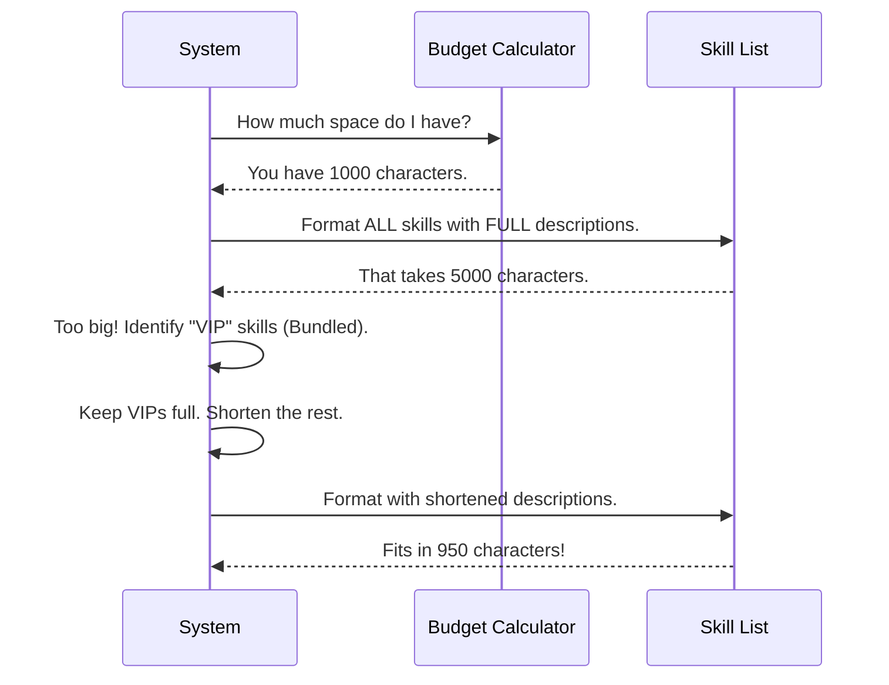

# Chapter 3: Dynamic Prompt Construction & Budgeting

Welcome to Chapter 3!

In the previous chapters, we built the **Universal Remote** ([The SkillTool Interface](01_the_skilltool_interface.md)) and gave it a **Screen** ([Skill User Interface (UI)](02_skill_user_interface__ui_.md)).

Now we face a logistical problem. Imagine our Universal Remote has a "Menu" button that lists every single channel (skill) available.
*   If you have 5 channels, the list is short.
*   If you have 5,000 channels, the list is huge.

If we send a 50-page list of skills to the AI every time we speak to it, we fill up its "Context Window" (its short-term memory). The AI will be so busy reading the menu that it forgets what you actually asked it to do!

This chapter explains **Dynamic Prompt Construction & Budgeting**: how we automatically resize the menu to fit the available memory.

## The Problem: The "Restaurant Menu" Analogy

Think of the list of skills like printing a menu for a restaurant.

1.  **The Paper Size (Context Budget):** This is how much memory we are allowed to use.
2.  **The Dishes (Skills):** The tools available (e.g., `git`, `read-file`, `browser`).

**Scenario A: Large Paper (High Budget)**
We have plenty of space. We list every dish with a mouth-watering paragraph describing the ingredients.
*   *Result:* The AI understands the nuances of every tool perfectly.

**Scenario B: Tiny Paper (Low Budget)**
We have a strict limit. If we keep the long descriptions, the text falls off the page.
*   *Solution:* We dynamically rewrite the menu. We cut the descriptions. If it's still too tight, we list **only the names**.

## Central Use Case: Fitting "Review Code"

Let's say we have 50 skills installed. One of them is `review-pr`.

**Full Description:**
> `review-pr`: Analyzing a GitHub Pull Request by fetching the diff, summarizing changes, and checking for bugs, then posting comments.

**Truncated Description (Budget Mode):**
> `review-pr`: Analyzing a GitHub Pull Request...

**Name Only (Extreme Budget Mode):**
> `review-pr`

Our system must automatically decide which version to show the AI based on how much "memory budget" is left.

## Key Concept: The Token Budget

We don't want the tool definitions to take over the conversation. In `SkillTool`, we set a strict rule:

**The Skill List gets ~1% of the total memory.**

If the context window is 200,000 tokens, we allocate roughly 2,000 tokens for the skill list. The code in `prompt.ts` handles this calculation.

## Implementation Walkthrough

How does the code actually squeeze the text? Here is the flow:



## Code Deep Dive

Let's look at `prompt.ts` to see how this logic is written.

### 1. Setting the Budget
First, we define how much space we are willing to "spend" on the menu.

```typescript
// From prompt.ts
export const SKILL_BUDGET_CONTEXT_PERCENT = 0.01 // 1%
export const CHARS_PER_TOKEN = 4

export function getCharBudget(contextWindowTokens?: number): number {
  if (contextWindowTokens) {
    // e.g., 200,000 * 4 * 0.01 = 8,000 characters
    return Math.floor(
      contextWindowTokens * CHARS_PER_TOKEN * SKILL_BUDGET_CONTEXT_PERCENT,
    )
  }
  return 8_000 // Default fallback
}
```
**Explanation:** We take the total size of the AI's memory (`contextWindowTokens`) and calculate 1% of it in characters.

### 2. The Logic: Try to Fit Everything
The function `formatCommandsWithinBudget` is the brain of this operation. First, it tries the "Best Case Scenario."

```typescript
// From prompt.ts (Simplified)
export function formatCommandsWithinBudget(commands, contextWindowTokens) {
  const budget = getCharBudget(contextWindowTokens)

  // 1. Create full descriptions for everyone
  const fullEntries = commands.map(cmd => 
    `- ${cmd.name}: ${cmd.description}`
  )

  // 2. Measure total length
  const fullTotal = fullEntries.join('\n').length

  // 3. If it fits, we are done!
  if (fullTotal <= budget) {
    return fullEntries.join('\n')
  }
  
  // ... otherwise, we need to compress ...
}
```

### 3. The Compression Strategy
If the full menu doesn't fit, we have to make cuts. However, we treat "Bundled" (Built-in) skills as VIPs. They keep their full descriptions. Everyone else (Plugin skills) gets squeezed.

```typescript
// From prompt.ts (Simplified logic)
// Calculate how much space the VIPs (Bundled skills) take
const bundledChars = calculateBundledSize(commands)
const remainingBudget = budget - bundledChars

// Divide remaining space among the other skills
const availableForDescs = remainingBudget - namesOverhead
const maxDescLen = Math.floor(availableForDescs / restCommands.length)

// If we have literally no space left, just show names
if (maxDescLen < 20) {
  return commands.map(cmd => `- ${cmd.name}`).join('\n')
}
```
**Explanation:** This acts like a fair pie-cutter. After the VIPs eat their fill, the remaining pie (budget) is divided equally among the rest of the skills.

### 4. Applying the Truncation
Finally, we apply the calculated limit to the text strings.

```typescript
// From prompt.ts
return commands
  .map((cmd, i) => {
    // VIPs get the full string
    if (isBundled(cmd)) return fullEntries[i].full
    
    // Others get chopped
    return `- ${cmd.name}: ${truncate(cmd.description, maxDescLen)}`
  })
  .join('\n')
```
**Explanation:** The `truncate` helper function cuts the string and adds "..." if it's too long.

### 5. The Instruction Prompt
Once we have the list (the menu), we need to attach the instructions (the welcome sign). This tells the AI *how* to order from the menu.

```typescript
// From prompt.ts
export const getPrompt = memoize(async () => {
  return `
Execute a skill within the main conversation.
When users ask you to perform tasks, check if any available skills match.

How to invoke:
- Use this tool with the skill name and optional arguments
- Examples:
  - skill: "pdf"
  - skill: "commit", args: "-m 'Fix bug'"
`
})
```
**Explanation:** This static text is combined with the dynamic list we generated above to form the final System Prompt.

## Why This Matters

By using **Dynamic Prompt Construction**:

1.  **Scalability:** We can install 100 plugins without crashing the AI. The descriptions just get shorter.
2.  **Focus:** The AI keeps most of its "brain" available for your actual code and conversation, not just reading tool definitions.
3.  **Prioritization:** Core tools (VIPs) always retain high fidelity, ensuring the most important functions work reliably.

## Conclusion

We now have a system that:
1.  Listens for commands (Interface).
2.  Shows us what it's doing (UI).
3.  Explains available tools to the AI without overwhelming it (Dynamic Prompting).

But wait... just because a skill is *listed* on the menu, should the AI be allowed to order it? What if the AI tries to run `delete-database` or `publish-secrets`?

We need a security guard.

**Next Chapter:** [Permission & Safety Layer](04_permission___safety_layer.md)

---

Generated by [Code IQ](https://github.com/adityasoni99/Code-IQ)