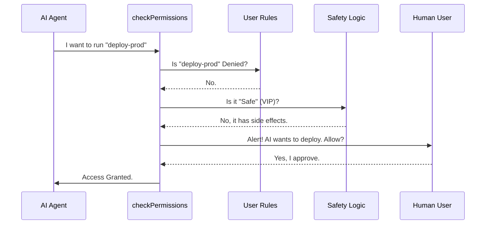

# Chapter 4: Permission & Safety Layer

Welcome to Chapter 4!

In the previous chapter, [Dynamic Prompt Construction & Budgeting](03_dynamic_prompt_construction___budgeting.md), we learned how to present a "Menu" of skills to the AI without running out of memory.

Now, imagine the AI looks at that menu and orders **"Delete All Files."**

Just because a skill is *available* doesn't mean the AI should be allowed to run it immediately. We need a security system. In `SkillTool`, this system is the **Permission & Safety Layer**.

## The Nightclub Analogy

The easiest way to understand this layer is to imagine a **Nightclub Bouncer**.

1.  **The Club:** Your computer/environment.
2.  **The Guests:** The skills the AI wants to run.
3.  **The Bouncer:** The `checkPermissions` function.
4.  **The Manager:** You (the User).

When a guest (Skill) arrives at the door, the Bouncer follows a strict protocol:

1.  **The Blacklist (Deny Rules):** Is this person banned? If yes, kick them out immediately.
2.  **The VIP List (Allowlists):** Is this person famous and trusted? If yes, let them walk right in.
3.  **The ID Check (Ask User):** If they aren't banned but aren't VIP, stop them and ask the Manager (You) for approval.

## Central Use Case: "Reviewing Code" vs. "Deploying"

Let's look at two scenarios:

1.  **Safe Scenario:** The AI wants to run `read-file` to look at code. This is harmless. We want this on the **VIP List** so the AI can work fast without bothering us.
2.  **Sensitive Scenario:** The AI wants to run `deploy-to-production`. This is risky. We want the Bouncer to **Ask the Manager** before opening the door.

## High-Level Flow

Here is how `SkillTool` makes that decision:



## Implementation Deep Dive

Let's explore the code in `SkillTool.ts` to see how this Bouncer logic is built.

### 1. The Entry Point (`checkPermissions`)
Every tool in our system has a `checkPermissions` function. This is the first line of defense.

```typescript
// From SkillTool.ts
async checkPermissions({ skill }, context): Promise<PermissionDecision> {
  const commandName = skill.trim()
  const appState = context.getAppState()
  
  // ... logic follows ...
}
```
**Explanation:** The function receives the skill name (e.g., "deploy") and the current application state.

### 2. Checking the Blacklist (Deny Rules)
First, we check if the user has explicitly forbidden this skill.

```typescript
// From SkillTool.ts (inside checkPermissions)
const denyRules = getRuleByContentsForTool(
  permissionContext,
  SkillTool as Tool,
  'deny',
)

for (const [ruleContent, rule] of denyRules.entries()) {
  if (ruleMatches(ruleContent)) {
    return { behavior: 'deny', message: 'Blocked by rule' }
  }
}
```
**Explanation:** We look up any "deny" rules created by the user. If the skill matches (e.g., the user blocked `deploy:*`), we return `deny` immediately. The AI is told "No."

### 3. The VIP List (Auto-Allow)
If the skill isn't banned, we check if it is inherently "Safe."
In `SkillTool`, we don't just list safe *names*. We check the **properties** of the command.

```typescript
// From SkillTool.ts
if (
  commandObj?.type === 'prompt' &&
  skillHasOnlySafeProperties(commandObj)
) {
  return { behavior: 'allow', updatedInput: { skill, args } }
}
```
**Explanation:** If the command is a simple prompt and passes the `skillHasOnlySafeProperties` test, it gets VIP status (`behavior: 'allow'`). It runs instantly without user interaction.

### 4. Defining "Safe"
What makes a command safe? We use an allowlist of properties called `SAFE_SKILL_PROPERTIES`.

```typescript
// From SkillTool.ts
const SAFE_SKILL_PROPERTIES = new Set([
  'name',
  'description',
  'model',
  'effort',
  'argNames',
  // ... other harmless properties ...
])
```
**Explanation:** This list defines the "Safe Zone." Properties like `name` or `description` don't change your computer state.

### 5. Inspecting the Command
Here is the logic that enforces the VIP list. It checks if the command has any "weird" or "dangerous" properties *not* on the list.

```typescript
// From SkillTool.ts
function skillHasOnlySafeProperties(command: Command): boolean {
  for (const key of Object.keys(command)) {
    // If key is in the safe list, it's fine
    if (SAFE_SKILL_PROPERTIES.has(key)) continue
    
    // If it has a property NOT in the list (e.g. 'requiresNetwork'),
    // it is NOT safe.
    return false
  }
  return true
}
```
**Explanation:**
*   If a skill has a property like `executeShellCommand: true` (which is **not** in `SAFE_SKILL_PROPERTIES`), the function returns `false`.
*   The skill loses VIP status and must ask for permission.

### 6. Asking the Manager (Fallback)
If the skill wasn't denied, but also isn't "Safe," we default to asking the user.

```typescript
// From SkillTool.ts
return {
  behavior: 'ask',
  message: `Execute skill: ${commandName}`,
  suggestions: [
    { type: 'addRules', behavior: 'allow', ... } // Suggest "Always Allow"
  ]
}
```
**Explanation:**
1.  **`behavior: 'ask'`**: This triggers a popup in the UI asking the user to Yes/No the action.
2.  **`suggestions`**: We proactively offer the user a button to "Always Allow" this skill in the future, adding it to their personal Allow Rules.

## Summary

The **Permission & Safety Layer** ensures that the "Universal Remote" we built in Chapter 1 doesn't become a dangerous weapon.

1.  **Deny Rules** stop bad actions instantly.
2.  **Safe Property Checks** let harmless actions (VIPs) run automatically, keeping the experience smooth.
3.  **Ask Permissions** keep the human in the loop for anything risky.

Now that we know the skill is allowed to run, what happens if the skill is incredibly complex? What if the skill needs to write code, run tests, and fix errors all by itself?

For that, we need to create a **sub-agent**.

**Next Chapter:** [Forked Execution Strategy](05_forked_execution_strategy.md)

---

Generated by [Code IQ](https://github.com/adityasoni99/Code-IQ)