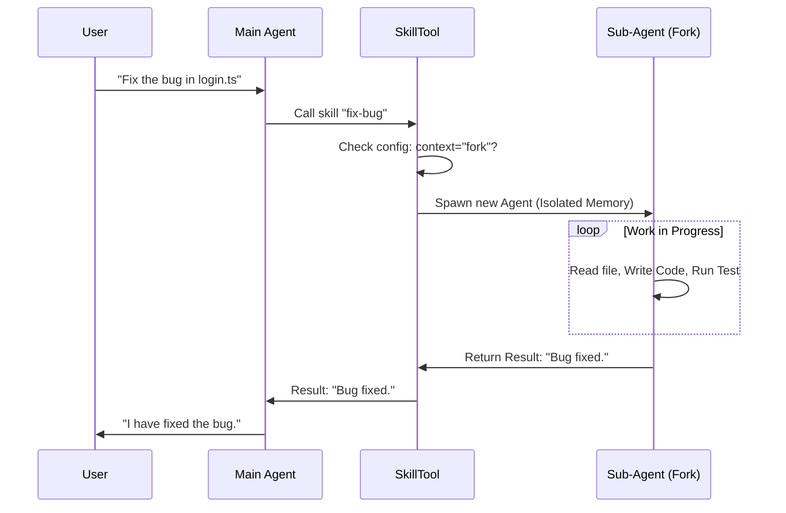

# Chapter 5: Forked Execution Strategy

Welcome to Chapter 5!

In the previous chapter, [Permission & Safety Layer](04_permission___safety_layer.md), we established a security guard to decide *if* a skill is allowed to run.

Now we face a different challenge: **Information Overload.**

Some skills are messy. Imagine asking the AI to "Write a full web application." That process involves creating files, reading errors, fixing bugs, and running tests. If all that "thinking" happens in the main conversation, your chat history becomes cluttered with hundreds of lines of logs. The AI eventually runs out of memory (Context Window) and forgets what you originally asked!

This brings us to the **Forked Execution Strategy**.

## The Concept: The Contractor Analogy

To understand Forked Execution, imagine you are working at a desk.

**Without Forking:**
You want to build a chair. You bring all the wood, saws, and glue onto your desk. You build it right there. Now your desk is covered in sawdust, you can't find your pen, and you have no room to work on anything else.

**With Forking:**
You want to build a chair. You hire a **Contractor**. You send them to a separate **Workshop**.
1.  They go away to the workshop.
2.  They make a mess, saw the wood, and glue it together.
3.  They clean up the mess *in the workshop*.
4.  They return to your desk and simply hand you the finished chair.

Your desk remains clean.

## Central Use Case: "Complex Refactoring"

Let's say you ask the AI: *"Refactor the authentication module."*

This is a heavy task.
1.  **Main Agent:** Receives the command.
2.  **Fork:** It spawns a temporary "Sub-Agent" (The Contractor).
3.  **Sub-Agent:** Reads 15 files, tries 3 different code changes, runs tests, fixes a typo. (This consumes 5,000 tokens of memory).
4.  **Return:** The Sub-Agent finishes and disappears.
5.  **Main Agent:** Receives one simple message: *"Refactoring complete. Tests passed."*

The Main Agent's memory stays fresh because it never saw the 5,000 tokens of "messy work."

## The Architecture

How does `SkillTool` handle this handoff?



## Implementation Deep Dive

Let's look at `SkillTool.ts` to see how we implement this "Workshop."

### 1. Identifying a Forked Skill
When a skill is defined, it has a property called `context`. If this is set to `'fork'`, `SkillTool` knows not to run it at the desk.

```typescript
// From SkillTool.ts (inside call function)
// Check if skill should run as a forked sub-agent
if (command?.type === 'prompt' && command.context === 'fork') {
  return executeForkedSkill(
    command,
    commandName,
    args,
    context,
    // ... params ...
  )
}
```
**Explanation:** This is the traffic controller. If the command says "fork," we route it to `executeForkedSkill`.

### 2. Spawning the Sub-Agent (`executeForkedSkill`)
This function creates the "Workshop." It generates a new Agent ID and prepares a fresh environment.

```typescript
// From SkillTool.ts (inside executeForkedSkill)
async function executeForkedSkill(command, ...): Promise<ToolResult<Output>> {
  const agentId = createAgentId() // New Identity
  
  // Prepare the specific prompt for the sub-agent
  const { baseAgent, promptMessages } = await prepareForkedCommandContext(
    command, 
    args || '', 
    context
  )
  
  // ... execution logic follows ...
}
```
**Explanation:** `createAgentId()` ensures this new agent is distinct from the main one. `prepareForkedCommandContext` loads the specific instructions for the skill (e.g., "You are an expert bug fixer...").

### 3. The Execution Loop
Now we run the Sub-Agent using `runAgent`. This is the same engine that powers the main agent, but it's running in a loop *inside* our tool.

```typescript
// From SkillTool.ts
const agentMessages: Message[] = []

// Run the sub-agent
for await (const message of runAgent({
  agentDefinition,
  promptMessages,
  override: { agentId }, // Use the temporary ID
  // ... other context ...
})) {
  agentMessages.push(message)
  // ... logic to show progress on UI ...
}
```
**Explanation:**
*   We use `for await` because the agent generates a stream of events (thoughts, tool calls, outputs).
*   We capture these messages into `agentMessages` so the sub-agent has its own short-term memory.

### 4. Reporting Progress (Connecting to UI)
Remember [Chapter 2: Skill User Interface (UI)](02_skill_user_interface__ui_.md)? We need to show the user that the "Contractor" is working, even though the "Desk" is quiet.

```typescript
// From SkillTool.ts
if (hasToolContent && onProgress) {
  onProgress({
    toolUseID: `skill_${parentMessage.message.id}`,
    data: {
      type: 'skill_progress',
      agentId, // Tie progress to the sub-agent
      message: m,
    },
  })
}
```
**Explanation:** This pipes the logs from the "Workshop" (Sub-Agent) to the User's screen, appearing inside the nested box we saw in the UI chapter.

### 5. Cleaning Up and Returning
Once the Sub-Agent finishes, we throw away its history (`agentMessages`) and just return the final result.

```typescript
// From SkillTool.ts
const resultText = extractResultText(
  agentMessages,
  'Skill execution completed',
)

// The sub-agent is destroyed (memory released)
return {
  data: {
    success: true,
    status: 'forked', // Tells the UI this was a fork
    result: resultText,
  },
}
```
**Explanation:** The massive list of `agentMessages` (the sawdust) is discarded. Only `resultText` (the finished chair) is returned to the Main Agent.

## Summary

The **Forked Execution Strategy** is a powerful way to manage complexity.

1.  **Isolation:** Messy tasks don't pollute the main conversation history.
2.  **Focus:** The Sub-Agent only knows about the specific task, making it more focused.
3.  **Safety:** If the Sub-Agent gets confused, it doesn't break the main agent's state.

We have built a system that can run commands (Ch 1), display them (Ch 2), manage prompts (Ch 3), check permissions (Ch 4), and now handle complex tasks in isolation (Ch 5).

But so far, we've assumed all these skills are already installed on your machine. What if you need a skill that lives in the cloud? What if your team shares skills remotely?

**Next Chapter:** [Remote Skill Loading](06_remote_skill_loading.md)

---

Generated by [Code IQ](https://github.com/adityasoni99/Code-IQ)