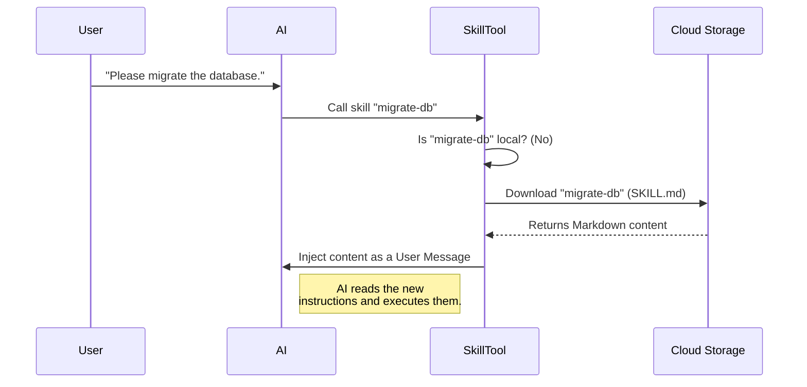

# Chapter 6: Remote Skill Loading

Welcome to Chapter 6! This is the final chapter of our beginner's guide to `SkillTool`.

In the previous chapter, [Forked Execution Strategy](05_forked_execution_strategy.md), we learned how to let the AI spawn "Sub-Agents" to handle messy, complex tasks in a separate workshop.

But throughout this entire tutorial, we have assumed one thing: **The skills are already installed on your computer.**

What if the skill you need isn't there? What if your team shares thousands of skills, and you can't possibly download them all?

This chapter introduces **Remote Skill Loading**: the ability to fetch skills from the cloud on demand.

## The "Streaming" Analogy

To understand Remote Skill Loading, think about **movies**.

1.  **Local Skills (DVDs):** You own the physical disc. It sits on your shelf. You can watch it anytime, but your shelf space is limited. If you want to watch a new movie, you have to go to the store and buy it.
2.  **Remote Skills (Streaming):** You don't own the file. When you want to watch a movie, you select it from the cloud. It streams to your TV instantly. You don't need shelf space, and you have access to a library of thousands of titles.

**Remote Skill Loading** allows `SkillTool` to act like a streaming service. instead of executing a command that lives on your hard drive, it downloads the instructions (`SKILL.md`) from the internet and "streams" them into the AI's brain.

## Central Use Case: "The One-Time Migration"

Imagine a scenario: **"Migrating a Legacy Database."**

This is a task you might do once a year.
*   **Without Remote Loading:** You have to find the migration script, install it, configure it, run it, and then delete it to save space.
*   **With Remote Loading:** You simply tell the AI: "Run the database migration." The AI looks up the "Migration Skill" in the cloud, downloads the instructions, performs the task, and moves on. You never had to install anything.

## Key Concept: Injection vs. Execution

Local skills usually trigger **code** (like running a Python script).
Remote skills usually inject **instructions** (Markdown files).

When you load a remote skill, the tool doesn't just run a script in the background. It takes the text of the skill (e.g., "Here is how to migrate the database...") and pretends the **User** typed it into the chat.

It is like the user saying: *"I don't know how to do this, but here is a manual I found on the internet. Please read it and follow the steps."*

## The Flow

Here is how the system handles a request for a skill that isn't on your computer.



## Implementation Deep Dive

Let's look at `SkillTool.ts` to see how we implement this "Streaming" capability.

### 1. Identifying a Remote Skill
First, we need to distinguish between a local command and a remote one. In our system, remote skills are often "Discovered" first (a process where the AI gets a list of available cloud skills).

When the AI tries to use a skill, we check if it is a known remote "slug" (ID).

```typescript
// From SkillTool.ts (inside validateInput)
if (feature('EXPERIMENTAL_SKILL_SEARCH')) {
  // Check if this name corresponds to a remote skill
  const slug = remoteSkillModules.stripCanonicalPrefix(commandName)
  
  if (slug !== null) {
    // It is a remote skill!
    return { result: true }
  }
}
```
**Explanation:** If the name matches a remote pattern, we validate it immediately. We don't check our local hard drive folder.

### 2. Auto-Approving Permissions
Remember [Chapter 4: Permission & Safety Layer](04_permission___safety_layer.md)? Usually, we are very strict about permissions.
However, "Canonical" remote skills are curated by the team. They are considered safe and trusted (like movies on a kid-friendly streaming platform). We often **Auto-Allow** them.

```typescript
// From SkillTool.ts (inside checkPermissions)
const slug = remoteSkillModules.stripCanonicalPrefix(commandName)

if (slug !== null) {
  // It's a trusted remote skill. Auto-approve.
  return {
    behavior: 'allow',
    updatedInput: { skill, args },
    decisionReason: undefined,
  }
}
```
**Explanation:** The "Bouncer" sees the VIP badge (the remote slug) and lets the skill through without asking the user.

### 3. The Execution Logic
When `call()` is triggered, we divert the traffic. If it's a remote skill, we don't look for a local script. We go to the downloader.

```typescript
// From SkillTool.ts (inside call)
if (feature('EXPERIMENTAL_SKILL_SEARCH')) {
  const slug = remoteSkillModules.stripCanonicalPrefix(commandName)
  
  if (slug !== null) {
    // Stop here and handle the download
    return executeRemoteSkill(slug, commandName, parentMessage, context)
  }
}
```

### 4. Downloading the Content (`executeRemoteSkill`)
This is the equivalent of hitting "Play" on the movie. We fetch the file from the URL.

```typescript
// From SkillTool.ts
async function executeRemoteSkill(slug, ...) {
  // 1. Get the URL from our discovery list
  const meta = getDiscoveredRemoteSkill(slug)
  
  // 2. Download the file (or load from cache)
  const loadResult = await loadRemoteSkill(slug, meta.url)
  
  // 3. Extract the text content
  const { content } = parseFrontmatter(loadResult.content, ...)
  
  // ... logic continues ...
}
```
**Explanation:** `loadRemoteSkill` handles the heavy lifting of HTTP requests or Cloud Bucket fetching. It returns the raw text of the `SKILL.md` file.

### 5. Injecting the Instructions
Finally, we have the text. We simply feed it back into the conversation.

```typescript
// From SkillTool.ts
// Create a "Meta" User Message containing the skill instructions
const newMessages = tagMessagesWithToolUseID(
  [createUserMessage({ content: finalContent, isMeta: true })],
  toolUseID,
)

return {
  data: { success: true, commandName, status: 'inline' },
  newMessages, // This is sent to the AI
}
```
**Explanation:**
*   **`createUserMessage`**: We create a fake message from the user.
*   **`finalContent`**: This is the manual we downloaded.
*   **`newMessages`**: The AI receives this. To the AI, it looks like you just pasted a helpful guide into the chat. The AI reads it and immediately starts following the instructions.

## Why This Matters

By adding **Remote Skill Loading**, we have completed the `SkillTool` ecosystem:

1.  **Interface (Ch 1):** We have a standard way to call tools.
2.  **UI (Ch 2):** We can see what's happening.
3.  **Prompting (Ch 3):** We manage memory efficiently.
4.  **Safety (Ch 4):** We trust but verify.
5.  **Forking (Ch 5):** We handle complex local tasks cleanly.
6.  **Remote (Ch 6):** We have access to an infinite library of tools without installation.

## Conclusion

Congratulations! You have completed the **SkillTool** tutorial series.

You now understand how an advanced AI Agent interacts with the world. It isn't magic; it's a series of carefully designed systems—Universal Remotes, Digital Screens, Budget Managers, Bouncers, Contractors, and Streaming Services.

Together, these abstractions allow the AI to be powerful, safe, and incredibly versatile.

Thank you for reading!

---

Generated by [Code IQ](https://github.com/adityasoni99/Code-IQ)