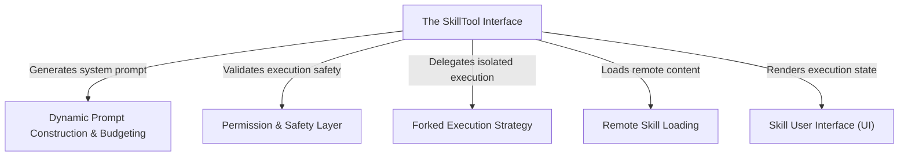

# Tutorial: SkillTool

The **SkillTool** project serves as a "universal remote" that enables an AI agent to discover and execute specialized **skills** (represented as slash commands). It manages complexity by isolating heavy tasks in temporary **sub-agents** (forked execution) and ensures safety through a robust permission system. Additionally, it optimizes the context window by dynamically budgeting the prompt size for available skills and supports loading *remote* skills from the cloud on demand.

## Chapters

1. [The SkillTool Interface](01_the_skilltool_interface.md)
2. [Skill User Interface (UI)](02_skill_user_interface__ui_.md)
3. [Dynamic Prompt Construction & Budgeting](03_dynamic_prompt_construction___budgeting.md)
4. [Permission & Safety Layer](04_permission___safety_layer.md)
5. [Forked Execution Strategy](05_forked_execution_strategy.md)
6. [Remote Skill Loading](06_remote_skill_loading.md)

---

Generated by [Code IQ](https://github.com/adityasoni99/Code-IQ)