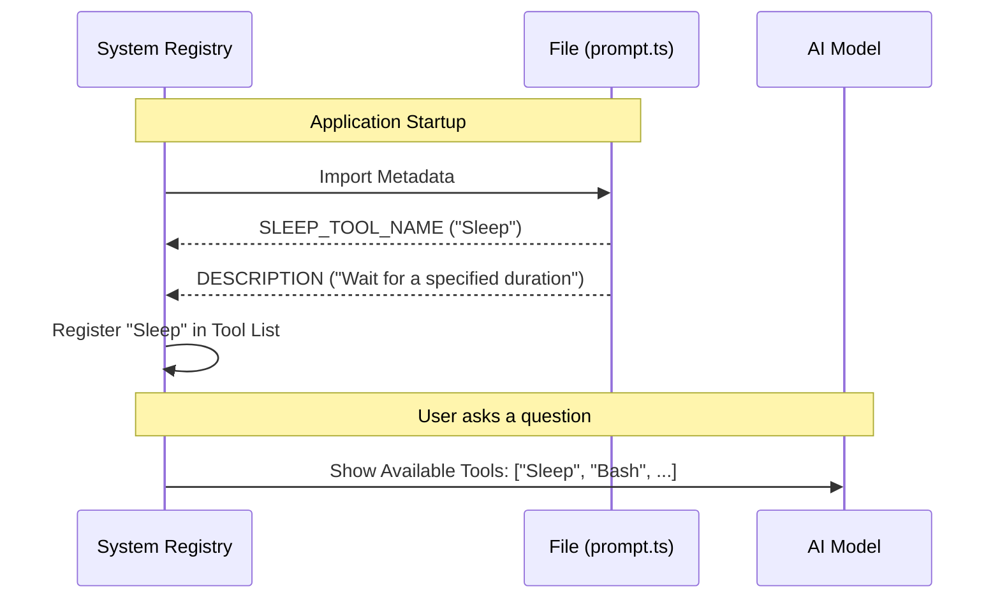

# Chapter 1: Tool Registration Metadata

Welcome to the first chapter of building `SleepTool`!

Before we can teach our tool **how** to work, we first need to tell the system **who** the tool is.

### The Motivation: The ID Badge Problem
Imagine walking into a large office building. You might have amazing skills—maybe you are a master chef or a brilliant mathematician. However, if you don't have an **ID Badge** with your name and job title, security won't let you in, and no one will know to call you when they need a meal or a calculation.

In our software, the "System" is the security guard, and the "AI" is the manager looking for workers.

**Tool Registration Metadata** is simply creating that ID Badge. It solves the problem of **discoverability**. It provides the essential labels—Name and Role—that allow the larger system to list the tool in a menu so the AI knows it is available to use.

---

### Key Concept: The Exports
We define this metadata in a file called `prompt.ts`. We use specific constants that act as the interface identifiers.

#### 1. The Tool Name
The name is the unique identifier. It's how the AI refers to this specific tool in its internal logic. It needs to be short, unique, and capitalized.

```typescript
// In prompt.ts

// This is the unique ID for our tool
export const SLEEP_TOOL_NAME = 'Sleep'
```

**Explanation:**
By writing `export`, we are telling the code: "Make this value public so other files can see it." We name our tool `'Sleep'`.

#### 2. The Description
The name tells us *who* it is, but the description tells us *what* it does. This is a one-sentence summary. It appears in the "menu" of tools provided to the AI.

```typescript
// In prompt.ts

// A short summary for the system's tool list
export const DESCRIPTION = 'Wait for a specified duration'
```

**Explanation:**
This string isn't the full set of instructions (we cover those in [Tool Behavior Definition](02_tool_behavior_definition.md)). This is just the "elevator pitch" so the system can quickly categorize the tool.

---

### How It Works: The Registration Flow
When you start the application, the system needs to "onboard" all available tools. Here is what happens under the hood when the metadata is read.



1.  **System Startup:** The main application scans the folder.
2.  **Importing:** It opens `prompt.ts`.
3.  **Reading Metadata:** It looks specifically for `SLEEP_TOOL_NAME` and `DESCRIPTION`.
4.  **Registration:** It creates an entry in its memory. Now, when the AI asks "What can I do?", the system can reply: "You can use the **Sleep** tool to **Wait for a specified duration**."

---

### Internal Implementation Details
While our code in `prompt.ts` is simple, it connects to a larger architecture.

The file `prompt.ts` serves as the **Single Source of Truth**. Instead of typing the string "Sleep" in multiple places (which leads to typos and bugs), we define it once here.

You might notice other imports in the file, such as `TICK_TAG`:

```typescript
import { TICK_TAG } from '../../constants/xml.js'

// ... exports ...
```

This import is a helper we will use later for [Periodic Heartbeat Handling](04_periodic_heartbeat_handling.md). For now, just know that `prompt.ts` is the central hub where we define the tool's identity.

**Example Input/Output:**
If we were to run a script that checks this file:

*   **Input:** Load module `prompt.ts`.
*   **Output:** An object containing `{ SLEEP_TOOL_NAME: 'Sleep', DESCRIPTION: 'Wait...' }`.

The system takes this output and builds the UI or API definition for the AI.

---

### Conclusion
You have successfully created the "ID Badge" for your tool!
*   We defined `SLEEP_TOOL_NAME` so the system knows the tool's name.
*   We defined `DESCRIPTION` so the system knows the tool's role.

However, an ID badge doesn't tell the AI **how** to use the tool or the nuances of its personality. For that, we need to write the detailed prompt instructions.

[Next Chapter: Tool Behavior Definition](02_tool_behavior_definition.md)

---

Generated by [Code IQ](https://github.com/adityasoni99/Code-IQ)