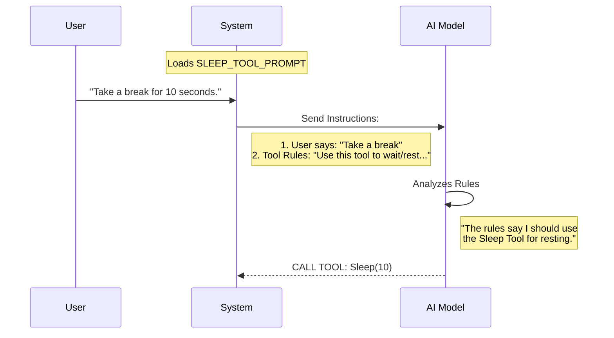

# Chapter 2: Tool Behavior Definition

Welcome back! In the previous chapter, [Tool Registration Metadata](01_tool_registration_metadata.md), we created the "ID Badge" for our tool. We gave it a name (`Sleep`) and a short description so the system knows it exists.

However, an ID badge doesn't tell the worker *how* to do their job.

### The Motivation: The "Sentry" Problem
Imagine you hire a security guard (a Sentry). You give them a badge and put them at the front gate. You tell them their job is "Wait and Guard."

Without specific instructions, they might:
1. Fall asleep completely (shut down).
2. Ignore the radio when headquarters calls.
3. Panic because they don't know when their shift ends.

To fix this, you give them **Standing Orders**—a specific script that defines their behavior.

In `SleepTool`, the **Tool Behavior Definition** is that set of standing orders. It tells the AI: "When I ask you to sleep, I don't mean 'turn off.' I mean 'wait for a duration, but keep your ears open for new commands.'"

---

### Key Concept: The Prompt Instructions
We define these instructions in the same file as before: `prompt.ts`. We use a constant called `SLEEP_TOOL_PROMPT`.

This text is injected into the AI's brain (its "Context Window") whenever the tool is available. Let's break down the rules we are giving the AI.

#### 1. The Core Instruction
First, we tell the AI exactly what the tool does and when to use it.

```typescript
// In prompt.ts

export const SLEEP_TOOL_PROMPT = `Wait for a specified duration. 
The user can interrupt the sleep at any time.

Use this when the user tells you to sleep or rest, 
when you have nothing to do, or when you're waiting for something.`
```

**Explanation:**
*   **"Wait...":** Defines the primary action.
*   **"User can interrupt":** This is crucial! It tells the AI it isn't locking the system. It can stop waiting if we give it a new task.

#### 2. Handling "Pokes" (Heartbeats)
Sometimes the system needs to "poke" the AI to see if it's still awake or if the status of a background job has changed.

```typescript
// inside SLEEP_TOOL_PROMPT string...

`You may receive <${TICK_TAG}> prompts — these are periodic check-ins. 
Look for useful work to do before sleeping.`
```

**Explanation:**
We use a special tag (imported as `TICK_TAG`) to represent a "heartbeat" or a "tick." This tells the AI: "If you see this tag, check your surroundings. If nothing has changed, go back to sleep."
*   *Note: We will dive deep into this mechanism in [Periodic Heartbeat Handling](04_periodic_heartbeat_handling.md).*

#### 3. Efficiency and Costs
Finally, we give the AI some "Pro Tips" on how to be efficient with resources.

```typescript
// inside SLEEP_TOOL_PROMPT string...

`Prefer this over \`Bash(sleep ...)\` — it doesn't hold a shell process.

Each wake-up costs an API call, but the prompt cache expires 
after 5 minutes of inactivity — balance accordingly.`
```

**Explanation:**
*   **Don't use Bash:** The AI is smart enough to use a terminal command like `sleep 10`. We tell it *not* to do that because our tool is lighter and faster.
*   **Cache Management:** We warn the AI that waking up costs "money" (API tokens), but staying asleep too long might make it "forget" context (cache expiry).
*   *Note: We will cover this balance in [Cache Lifecycle Management](05_cache_lifecycle_management.md).*

---

### How It Works: The Instruction Flow
How does a simple string of text control a complex AI? Here is the flow of information when the user interacts with the tool.

1.  **System Setup:** The application reads `SLEEP_TOOL_PROMPT`.
2.  **Context Injection:** The system pastes this text into the hidden instructions sent to the AI.
3.  **AI Decision:** The AI reads the user's request, checks its "Standing Orders" (our prompt), and acts.



### Internal Implementation Details

Under the hood, `prompt.ts` is assembling a single, long string. While we looked at it in pieces above, here is how the code actually looks (simplified).

We use `export` to make this string available to the main application logic.

```typescript
// prompt.ts
import { TICK_TAG } from '../../constants/xml.js'

// ... Metadata exports from Chapter 1 ...

export const SLEEP_TOOL_PROMPT = `Wait for a specified duration...
You may receive <${TICK_TAG}> prompts...
Prefer this over \`Bash(sleep ...)\`...`
```

**Example Input/Output:**

*   **Input:** The system asks for `SLEEP_TOOL_PROMPT`.
*   **Output:** A string: `"Wait for a specified duration... You may receive <tick> prompts..."`

This string is then treated as "System Instructions" by the Large Language Model (LLM). It is the definition of the tool's personality and rules.

---

### Conclusion

You have now written the "Standing Orders" for your tool!

*   We told the AI **what** the tool is for (waiting/resting).
*   We defined **constraints** (it can be interrupted).
*   We set **rules** for efficiency (don't use Bash).

However, currently, we have only *talked* about sleeping. The AI knows it *should* sleep, but we haven't actually written the code that makes the program wait!

In the next chapter, we will write the actual logic that handles the time delay and allows the tool to run in the background.

[Next Chapter: Asynchronous Flow Control](03_asynchronous_flow_control.md)

---

Generated by [Code IQ](https://github.com/adityasoni99/Code-IQ)