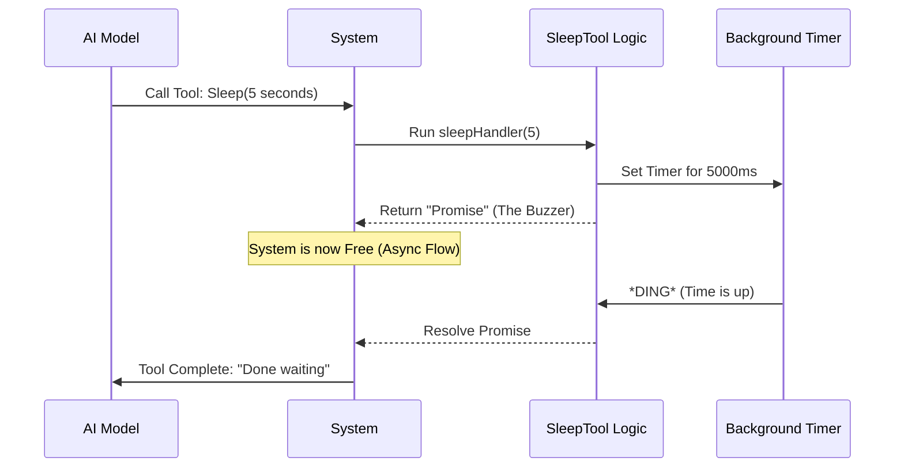

# Chapter 3: Asynchronous Flow Control

Welcome back! In the previous chapter, [Tool Behavior Definition](02_tool_behavior_definition.md), we gave our AI a set of "Standing Orders" so it knows *when* to sleep.

Now, we need to build the machinery that actually makes the waiting happen. This brings us to the core engineering concept of this tool: **Asynchronous Flow Control**.

### The Motivation: The Chef and the Dough
To understand why we build `SleepTool` this way, let's look at a kitchen analogy.

**Scenario A: The Blocking Chef (Synchronous)**
Imagine a chef making bread. They knead the dough and need to let it rise for one hour. In a "Blocking" scenario, the chef sets the dough on the counter and **stares at it for 60 minutes**. They don't move. They don't clean. If a customer walks in, the chef ignores them because they are "busy waiting."
*   *In code, this is like running `bash sleep 60`. The computer freezes on that task.*

**Scenario B: The Asynchronous Chef (Non-Blocking)**
The chef kneads the dough, sets a timer, and puts the dough aside. Now, while the dough rises, the chef chops vegetables, wipes the counter, or takes a new order. When the timer *dings*, the chef goes back to the dough.
*   *In code, this is `SleepTool`. The program sets a background timer and stays open to handle other requests.*

We want our AI to be the **Asynchronous Chef**.

---

### Key Concept: The Promise
In JavaScript (the language we are using), the tool allowing us to "do other things while waiting" is called a **Promise**.

Think of a Promise like a **Restaurant Pager/Buzzer**.
1.  You order food (call the function).
2.  The cashier gives you a plastic buzzer (the Promise).
3.  You go sit down and check your phone (do other work).
4.  When the food is ready, the buzzer lights up (the Promise "resolves").

We need our tool to hand the System a "buzzer" that goes off after a specific number of seconds.

---

### How It Works: The Handler Code
We define the logic in a file called `handler.ts`. This file contains the function that executes when the AI calls the tool.

#### 1. Accepting the Order (Input)
First, the function needs to know how long to wait. The AI sends this as an argument.

```typescript
// In handler.ts

interface SleepArgs {
  seconds: number;
}

// We define a function that takes these arguments
export const sleepHandler = async ({ seconds }: SleepArgs) => {
  // ... logic goes here ...
};
```

**Explanation:**
*   We expect an input called `seconds` (a number).
*   If the AI says "Sleep for 10 seconds," `seconds` equals 10.

#### 2. Setting the Timer (The Logic)
Now, we create the "Restaurant Buzzer." We use a built-in function called `setTimeout`.

```typescript
// Inside sleepHandler ...

console.error(`Sleeping for ${seconds}s...`);

// Return a "Buzzer" (Promise) that rings after the time is up
return new Promise((resolve) => {
  // Multiply by 1000 because computer time is in milliseconds
  setTimeout(resolve, seconds * 1000);
});
```

**Explanation:**
*   `new Promise`: Creates the buzzer.
*   `setTimeout`: This is the internal clock. It counts down in the background.
*   `resolve`: This is the action of the buzzer going off. It tells the system "I'm done waiting!"

---

### Internal Implementation Details
Let's visualize what happens in the system when the AI decides to use this tool. Notice how the System stays "awake" to watch the timer.



1.  **The Call:** The AI asks to sleep.
2.  **The Setup:** Our code calculates the time (5 seconds = 5000 milliseconds).
3.  **The Hand-off:** We tell the computer's background clock to wake us up later.
4.  **The Freedom:** Crucially, the *System* is not frozen. If the user presses `Ctrl+C` or sends a "Cancel" signal during this time, the System can hear it and stop the tool immediately.

### Putting It Together
Here is the complete, simplified implementation in `handler.ts`.

```typescript
// handler.ts

// The function exported to the system
export default async function sleep({ seconds }: { seconds: number }) {
  
  // Log so we can see it in the console
  process.stderr.write(`Sleeping for ${seconds}s... `)

  // The Async Magic: Wait without blocking
  await new Promise(resolve => setTimeout(resolve, seconds * 1000))
  
  // Return a success message to the AI
  return `Slept for ${seconds}s`
}
```

**Example Input/Output:**
*   **Input:** `{ seconds: 3 }`
*   **Action:** The terminal prints "Sleeping for 3s...", waits 3 seconds in the background.
*   **Output:** Returns the string `"Slept for 3s"` to the AI.

### Why This Matters for "Flow Control"
Because we used this asynchronous approach:
1.  **Interruptibility:** The user can stop the sleep halfway through.
2.  **Concurrency:** If we had multiple AI agents running, one could sleep while the other writes code.
3.  **Efficiency:** It doesn't use heavy system resources like creating a new shell process (`bash`) would.

---

### Conclusion
You have successfully implemented the engine of the `SleepTool`!

*   We learned the difference between **Blocking** (freezing) and **Async** (background waiting).
*   We used a **Promise** to act as a timer.
*   We wrote a handler that accepts `seconds` and waits.

However, there is a hidden risk. If the AI sleeps for a very long time (say, 30 minutes), the system might think the connection has died. We need a way to gently tap the AI on the shoulder to say, "I'm still here, just waiting."

We will solve this in the next chapter.

[Next Chapter: Periodic Heartbeat Handling](04_periodic_heartbeat_handling.md)

---

Generated by [Code IQ](https://github.com/adityasoni99/Code-IQ)