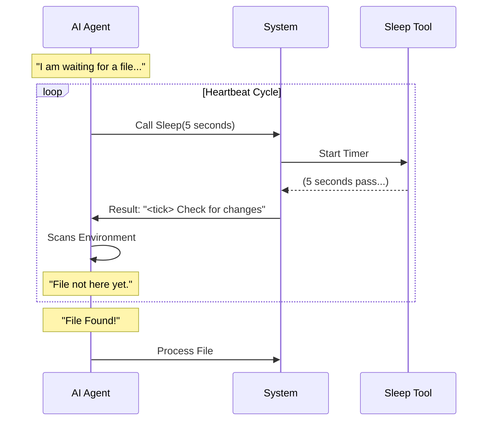

# Chapter 4: Periodic Heartbeat Handling

Welcome back! in [Asynchronous Flow Control](03_asynchronous_flow_control.md), we built the engine that allows our tool to wait for a specific amount of time without freezing the whole computer.

Now, we need to teach our AI how to wait **intelligently**.

### The Motivation: The "Deep Sleep" Problem

Imagine a lifeguard at a busy pool.

**Scenario A: The Deep Sleep**
The lifeguard decides to rest for 60 minutes. They put on noise-canceling headphones and close their eyes.
*   *Problem:* If a swimmer gets in trouble at minute 5, the lifeguard won't know until minute 60. That is dangerous.

**Scenario B: The Heartbeat (Polling)**
The lifeguard rests, but every 30 seconds, they open their eyes, scan the pool, and check for trouble. If everything is fine, they close their eyes for another 30 seconds.
*   *Result:* They are mostly resting, but they are responsive to changes.

In software, we call this **Polling** or a **Heartbeat**. We don't want the AI to sleep for an hour straight; we want it to sleep in short bursts so it can "check the pool" (look for new files, errors, or commands).

---

### Key Concept: The Tick Tag

To implement this, we use a concept called a "Tick." A Tick is simply the moment the AI wakes up, looks around, and decides what to do next.

We define a special marker for this in our code to ensure the AI recognizes this moment.

#### 1. Defining the Signal
We use a constant called `TICK_TAG`. This is a string literal (like `<tick>`) that acts as a visual cue for the AI model.

```typescript
// In constants/xml.ts (simulated)

export const TICK_TAG = 'tick'
```

**Explanation:**
This is just a label. Like a sticky note that says "CHECK POOL."

#### 2. The Loop Pattern
Periodic Heartbeat Handling isn't just one function; it is a **Cycle of Behavior** that the AI performs.

1.  **Work:** Do a task.
2.  **Wait:** Call `Sleep(seconds)`.
3.  **Tick:** Wake up and check context.
4.  **Repeat:** If no new work, go back to step 2.

---

### How It Works: The Implementation

We need to make sure the AI knows that when the `Sleep` tool finishes, it shouldn't just say "I'm done." It should treat that wake-up as a prompt to look for work.

We reinforce this in our prompt logic (which we touched on in [Tool Behavior Definition](02_tool_behavior_definition.md)).

```typescript
// prompt.ts
import { TICK_TAG } from '../../constants/xml.js'

// We insert the tag into the instructions
const instructions = `You may receive <${TICK_TAG}> prompts.
Look for useful work to do before sleeping.`
```

**Explanation:**
*   We import the tag to avoid typos.
*   We tell the AI: "When you see this tag, it's not just a blank screen. It is your cue to scan for changes."

#### The Result of Sleeping
When the `SleepTool` finishes its timer (from Chapter 3), it returns a value to the AI.

```typescript
// handler.ts

// When the timer finishes, we can return a status
return `Woke up after ${seconds}s. <${TICK_TAG}> Check for changes.`
```

**Explanation:**
Instead of just returning "Done," we return a message containing the `TICK_TAG`. This triggers the "Lifeguard" behavior in the AI's brain.

---

### Visualization: The Heartbeat Cycle

Let's look at how the System and the AI interact in a loop.



1.  **Sleep:** The AI naps for a short duration.
2.  **Tick:** The system wakes the AI up with the `<tick>` tag.
3.  **Scan:** The AI looks for "useful work" (like the file appearing).
4.  **Repeat:** If nothing is there, it loops back to Sleep.

---

### Internal Implementation Details

Why do we need a specific abstraction for this? Why not just let the AI figure it out?

Large Language Models (LLMs) can get "lazy" or "hallucinate" if they don't receive clear feedback. If the tool just returns an empty string `""`, the AI might think the tool failed or get confused.

By providing a structured **Heartbeat**, we keep the AI aligned.

#### Example: Checking the Environment
Here is a simplified example of how the AI logic processes this heartbeat internally.

```typescript
// conceptual_ai_logic.ts

async function runAgentLoop() {
  while (true) {
    // 1. Check for events (The Scan)
    const work = checkForNewFiles();

    if (work) {
      // 2. Act immediately
      await processWork(work);
    } else {
      // 3. Resting State (The Heartbeat)
      console.log("Nothing to do. Sleeping...");
      await callTool('Sleep', { seconds: 5 }); 
    }
  }
}
```

**Explanation:**
*   **Line 6:** The "Lifeguard" scans the pool.
*   **Line 14:** If the pool is empty, they take a SHORT nap (5 seconds), not a long one.
*   This loop ensures the agent never drifts into complete inactivity for too long.

### Example Input/Output

If the AI calls the tool:
*   **Input:** `Sleep(10)`
*   **Wait:** 10 seconds pass in the background.
*   **Output:** `"Check complete. <tick> Status: Nominal."`

The AI sees this output, realizes nothing is burning down, and feels safe to sleep again.

---

### Conclusion

You have learned how to turn a "dumb wait" into a **Smart Heartbeat**.

*   We use the `TICK_TAG` to signal a check-in.
*   We use short sleep durations to create a **Polling Loop**.
*   We ensure the AI is always ready to respond to new "useful work."

However, constant waking and sleeping has a cost. Every time the AI wakes up, it has to "remember" what it was doing. If we aren't careful, the AI might forget its instructions or cost us a lot of money in API tokens.

We will learn how to balance these costs in the final chapter.

[Next Chapter: Cache Lifecycle Management](05_cache_lifecycle_management.md)

---

Generated by [Code IQ](https://github.com/adityasoni99/Code-IQ)