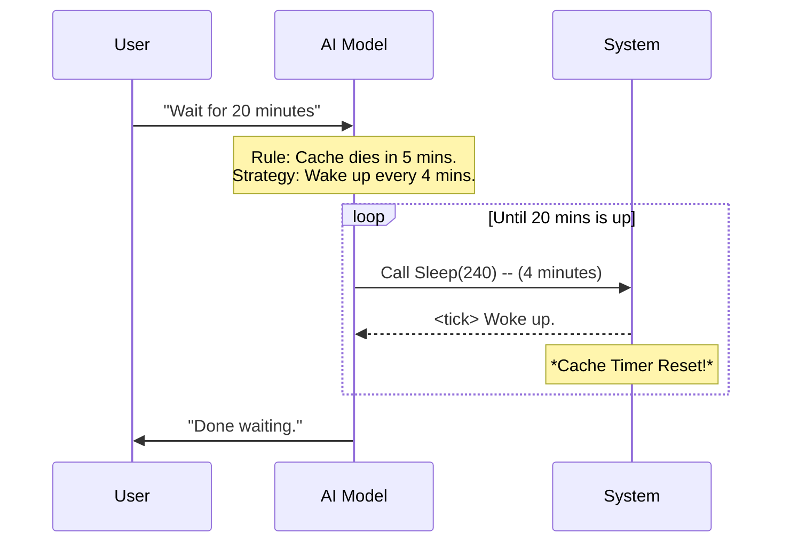

# Chapter 5: Cache Lifecycle Management

Welcome to the final chapter of the `SleepTool` tutorial!

In the previous chapter, [Periodic Heartbeat Handling](04_periodic_heartbeat_handling.md), we taught our AI to "check the pool" periodically to see if anything changed. We called this a **Heartbeat**.

But a new question arises: **How often should the heart beat?**

If it beats every second, we waste money. If it beats once an hour, the AI might "forget" what it was doing. This chapter covers **Cache Lifecycle Management**, which is the art of finding the economic "sweet spot."

### The Motivation: The Motion-Sensor Light
To understand this problem, imagine you are standing in a hallway with a motion-sensor light. The light stays on for **5 minutes** after it sees movement.

1.  **The "Paranoid" Approach:** You wave your arms every 2 seconds.
    *   *Result:* The light stays on, but you get tired and look silly. In AI terms, making API calls every few seconds is very expensive.
2.  **The "Lazy" Approach:** You stand perfectly still for 10 minutes.
    *   *Result:* The light turns off. You are now in the dark. In AI terms, the **Prompt Cache** expires, and the AI loses its short-term memory (Context).
3.  **The "Smart" Approach:** You wait 4 minutes and 50 seconds, then wave your hand once.
    *   *Result:* The light stays on, and you save energy.

We want our AI to use the **Smart Approach**.

---

### Key Concept: The Economic Trade-off

When building AI tools, we balance two costs:

1.  **Wake-up Cost (API Calls):** Every time the AI uses a tool (wakes up), it costs a small amount of money (tokens).
2.  **Context Loading Cost (Cache Miss):**
    *   The AI carries a "backpack" of memories (conversation history).
    *   The system caches (saves) this backpack on the server.
    *   **Rule:** If you don't use the backpack for 5 minutes, the server throws it away.
    *   If the cache is thrown away, you have to pay a *lot* of money to upload the backpack again.

**The Goal:** Wake up *just frequently enough* to keep the cache alive (reset the 5-minute timer), but *infrequently enough* to save money on API calls.

---

### Implementation: The Instructions

Unlike previous chapters where we wrote Typescript code for logic, this feature is implemented purely through **Prompt Engineering**. We rely on the AI's intelligence to manage its own schedule.

We simply explain the rules of the "game" to the AI in `prompt.ts`.

#### The Instruction Logic
We add a specific paragraph to our `SLEEP_TOOL_PROMPT` that explains the 5-minute rule.

```typescript
// In prompt.ts

export const SLEEP_TOOL_PROMPT = `...
Each wake-up costs an API call, but the prompt cache expires 
after 5 minutes of inactivity — balance accordingly.`
```

**Explanation:**
*   **"Each wake-up costs...":** Warning the AI not to loop too fast (don't wave hands every second).
*   **"Cache expires after 5 minutes":** Warning the AI not to sleep too long (don't let the light go out).
*   **"Balance accordingly":** We trust the AI to do the math.

---

### How It Works: The Decision Flow

When the user gives a command, the AI now calculates the optimal sleep time based on these instructions.

**Scenario:** The user says, "Wait for 20 minutes."

Without our instructions, the AI might call `Sleep(1200)` (20 minutes).
*   *Result:* The cache dies after minute 5. When it wakes up at minute 20, it has to reload everything (expensive).

**With our instructions**, the flow looks like this:



1.  The AI realizes 20 minutes > 5 minutes.
2.  It decides to split the sleep into chunks (e.g., 4 minutes).
3.  Every 4 minutes, it wakes up, which "waves a hand" at the server.
4.  The server keeps the memory (Context) cheap and accessible.

---

### Internal Implementation Details

Let's look at the final assembly of our `prompt.ts` file. This single string now controls Identity, Behavior, Heartbeats, and Cache Management.

```typescript
// prompt.ts
import { TICK_TAG } from '../../constants/xml.js'

// ... Metadata ...

export const SLEEP_TOOL_PROMPT = `Wait for a specified duration.
The user can interrupt the sleep at any time.

Use this when... (usage rules)

You may receive <${TICK_TAG}> prompts... (Heartbeat rules)

Each wake-up costs an API call, but the prompt cache expires 
after 5 minutes of inactivity — balance accordingly.` // (Cache rules)
```

**Example Input/Output:**

*   **User Input:** "Run a background task for 1 hour."
*   **AI Internal Thought:** "I need to keep the process running. If I sleep for 60 minutes, I lose context. I will sleep for 290 seconds (just under 5 mins) repeatedly."
*   **Action:** `Call Tool: Sleep(290)`
*   **System Event:** The cache lifetime is refreshed.

---

### Conclusion

Congratulations! You have built the complete `SleepTool`.

Let's review what you have accomplished across these five chapters:

1.  **[Tool Registration Metadata](01_tool_registration_metadata.md):** You created the "ID Badge" (`SLEEP_TOOL_NAME`) so the system can find your tool.
2.  **[Tool Behavior Definition](02_tool_behavior_definition.md):** You wrote the "Standing Orders" (`SLEEP_TOOL_PROMPT`) so the AI knows what the tool is for.
3.  **[Asynchronous Flow Control](03_asynchronous_flow_control.md):** You built the "Engine" (`setTimeout`) using Promises to wait without freezing the computer.
4.  **[Periodic Heartbeat Handling](04_periodic_heartbeat_handling.md):** You added the "Lifeguard Scan" (`TICK_TAG`) so the AI stays responsive.
5.  **Cache Lifecycle Management:** You taught the AI to be "Budget Conscious" by balancing wake-ups with cache expiration.

You now have a fully functional, efficient, and cost-effective tool that allows an AI Agent to exist over long periods of time. This is the foundation for building autonomous agents that can monitor servers, wait for emails, or manage long-running workflows.

**End of Tutorial.**

---

Generated by [Code IQ](https://github.com/adityasoni99/Code-IQ)