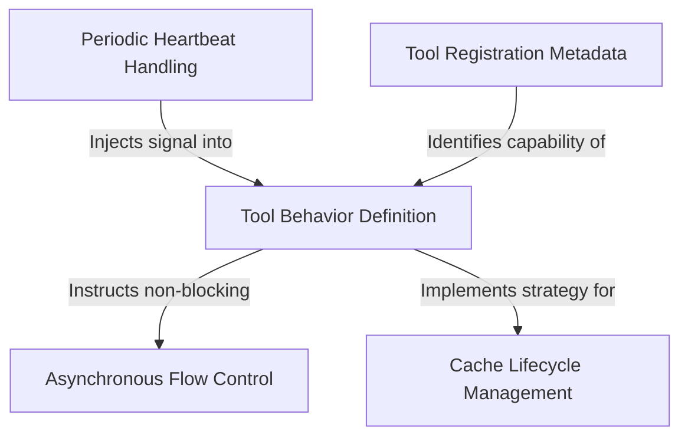

# Tutorial: SleepTool

The **SleepTool** provides a specialized mechanism for an AI to *wait* or rest for a specific duration without blocking other processes. Instead of shutting down completely, the tool uses a **smart waiting** approach that allows the AI to remain responsive to periodic *heartbeat check-ins* and user interruptions, while balancing API costs with memory cache limits.

## Chapters

1. [Tool Registration Metadata](01_tool_registration_metadata.md)
2. [Tool Behavior Definition](02_tool_behavior_definition.md)
3. [Asynchronous Flow Control](03_asynchronous_flow_control.md)
4. [Periodic Heartbeat Handling](04_periodic_heartbeat_handling.md)
5. [Cache Lifecycle Management](05_cache_lifecycle_management.md)

---

Generated by [Code IQ](https://github.com/adityasoni99/Code-IQ)