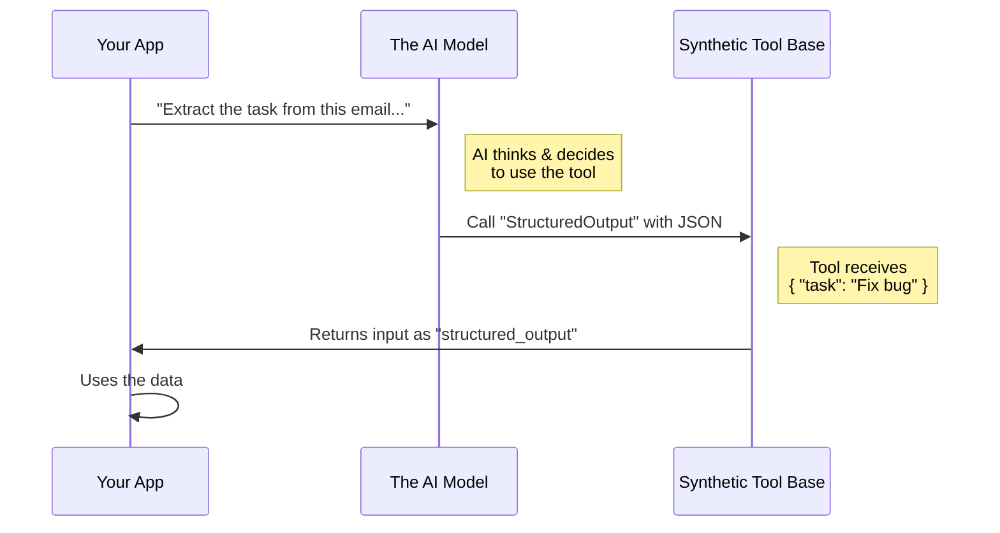

# Chapter 1: Synthetic Output Tool Base

Welcome to the first chapter of our journey into structured AI outputs!

If you have ever chatted with an AI (like ChatGPT), you know it loves to talk in paragraphs. It writes poems, essays, and code snippets. But what if you want the AI to fill out a database row, create a calendar event, or control a robot arm?

You don't want a paragraph; you want **Structured Data** (usually JSON).

This chapter introduces the **Synthetic Output Tool Base**—the foundational blueprint that teaches an AI how to stop chatting and start filling out forms.

## The Motivation: From Chatty to Structured

Imagine you have a messy email from a client:
> "Hey, can you fix the login bug on the homepage? It's really urgent, needs to be done by Friday!"

You want to turn this into a precise "To-Do" ticket in your system:
```json
{
  "task": "Fix login bug",
  "priority": "High",
  "deadline": "Friday"
}
```

How do we force the AI to give us that clean JSON instead of saying, *"Sure, I can help with that!"*?

We give the AI a **Tool**. A tool is like a fake function that the AI thinks it can "call." When the AI wants to give you the answer, it calls this tool with the data you asked for.

The **Synthetic Output Tool Base** is the generic definition of this tool. It is like a "Universal Form Filler" machine that is ready to accept data.

## Key Concept: The "Blank Form" Blueprint

The `SyntheticOutputTool` acts as a generic interface. It tells the AI three main things:

1.  **Identity:** "My name is `StructuredOutput`."
2.  **Purpose:** "I am used to returning final answers."
3.  **Protocol:** "Pass me the data, and I will hand it to the user."

At this stage (Chapter 1), the tool is a **Base**. It doesn't know *which* specific form fields (like "priority" or "deadline") are required yet. It simply knows how to handle *any* form.

## How It Works

Let's look at how we define this base tool in the code. We use a builder pattern to define its properties.

### 1. The Identity
First, we give the tool a constant name. The AI uses this name to find the tool.

```typescript
export const SYNTHETIC_OUTPUT_TOOL_NAME = 'StructuredOutput'

// We define the tool definition
export const SyntheticOutputTool = buildTool({
  name: SYNTHETIC_OUTPUT_TOOL_NAME,
  // ... other properties
})
```
**Explanation:** This acts like a nametag. When we later ask the AI to "use the StructuredOutput tool," it looks for this specific name.

### 2. The Instructions (Prompt)
We need to tell the AI *how* and *when* to use this tool. We do this via a prompt.

```typescript
// Inside SyntheticOutputTool definition...
async prompt(): Promise<string> {
  return `Use this tool to return your final response
  in the requested structured format.
  You MUST call this tool exactly once...`
}
```
**Explanation:** This is the instruction manual. We command the AI to use this tool "exactly once" at the end of the conversation. This ensures we get our data immediately.

### 3. The Generic Input (The Open Door)
Since this is just the *Base* tool, we don't want to restrict what data comes in yet. We set the input schema to accept "anything."

```typescript
// Allow any input object initially
const inputSchema = lazySchema(() => z.object({}).passthrough())

// Inside the tool definition...
get inputSchema(): InputSchema {
  return inputSchema()
},
```
**Explanation:** `z.object({}).passthrough()` is Zod (a validation library) speak for "I am an object, but I accept any extra properties you give me." It's an open door waiting for specific rules later.

### 4. The Execution (The Handoff)
When the AI actually calls the tool, what happens? The tool takes the input and hands it back to us.

```typescript
async call(input) {
  // The tool acts as a transparent carrier
  return {
    data: 'Structured output provided successfully',
    structured_output: input,
  }
},
```
**Explanation:** This is the "Form Filler" machine working. It doesn't calculate math or search the web. It takes the `input` (the JSON the AI generated) and wraps it up safely to return to the application.

## Internal Implementation: The Flow

To understand what happens under the hood, let's look at the sequence of events when an AI uses this tool.

### Visualizing the Interaction



### Deep Dive: Minimal Logic

The `SyntheticOutputTool` is designed to be lightweight. It is often used in non-interactive sessions (background scripts).

Here is the logic that determines if the tool should even be enabled:

```typescript
export function isSyntheticOutputToolEnabled(opts: {
  isNonInteractiveSession: boolean
}): boolean {
  // Only enable for scripts/background tasks
  return opts.isNonInteractiveSession
}
```

**Explanation:** We typically don't use this tool when a human is chatting with a bot (we prefer text there). We use this when a script is running automatically to extract data.

## Why use a Base?

You might wonder, "Why create a generic tool that accepts anything? Don't we want specific fields?"

Yes, we do! But in software engineering, we often create a **Base Class** or a **Template** first.

1.  **Standardization:** The `SyntheticOutputTool` Base ensures that *every* structured output request looks the same to the AI (same name, same prompt instructions).
2.  **Efficiency:** We define the heavy logic (permissions, error handling, output formatting) once in the Base.

However, a "Form Filler" isn't useful without a specific form to fill. We need a way to take this Base and stamp strict rules onto it (like "Must have a 'task' field").

That is where our next concept comes in. We need a factory that takes this Base and applies specific rules on the fly.

## Conclusion

In this chapter, we learned about the **Synthetic Output Tool Base**. It is the standard identity for our data extraction tool. It defines the name, the prompt instructions, and the mechanism for passing data back to the app, but it leaves the specific data fields undefined.

In the next chapter, we will learn how to take this generic base and dynamically inject specific requirements (schemas) using the **[Dynamic Tool Factory](02_dynamic_tool_factory.md)**.

---

Generated by [Code IQ](https://github.com/adityasoni99/Code-IQ)