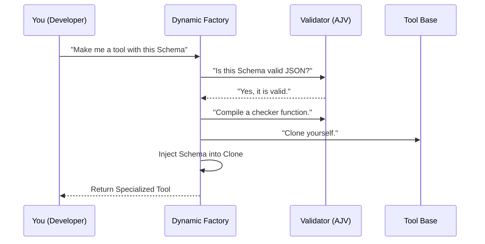

# Chapter 2: Dynamic Tool Factory

Welcome back! In the previous chapter, [Synthetic Output Tool Base](01_synthetic_output_tool_base.md), we built a "Universal Form Filler"—a tool that *can* accept data but doesn't yet know *what* data to accept.

It was like having a blank ID card. It has a spot for a name, but it's empty.

In this chapter, we introduce the **Dynamic Tool Factory**. This is the machine that takes that blank ID card and stamps specific fields onto it (like "Age," "Role," or "Bug Description") to create a tool ready for action.

## Motivation: The Need for Specifics

Imagine you are writing a script to automate your GitHub issues. You want the AI to read a user complaint and generate a **Bug Report**.

If you just use the **Base Tool**, the AI might give you this:
```json
{ "note": "I think the user is angry." }
```
This is useless to your code. You need:
```json
{ "title": "Login Failed", "severity": "High" }
```

You can't write a separate TypeScript class for every possible JSON shape you might ever need (`BugReportTool`, `SummaryTool`, `CalendarTool`). That would take forever!

### The Solution: The "Cookie Cutter" Factory

We need a factory function.
1.  **The Dough:** The `SyntheticOutputTool` Base (from Chapter 1).
2.  **The Cookie Cutter:** A JSON Schema (the shape you want).
3.  **The Factory:** `createSyntheticOutputTool`.

The factory takes the cutter, presses it into the dough, and hands you a tool perfectly shaped for the job.

## Using the Factory

Let's look at how to use this in practice. We will create a tool specifically designed to catch software bugs.

### Step 1: Define the Mold (Schema)

First, we define the shape of the data we want. We use a standard format called **JSON Schema**.

```typescript
// A simple blueprint for a bug report
const bugSchema = {
  type: "object",
  properties: {
    title: { type: "string" },
    severity: { type: "string", enum: ["Low", "High"] }
  },
  required: ["title", "severity"]
};
```
**Explanation:** This object is just a set of rules. It says: "I expect an object with a title (text) and severity (Low or High)."

### Step 2: Run the Factory

Now we feed this schema into our factory function.

```typescript
import { createSyntheticOutputTool } from './SyntheticOutputTool';

// Run the factory
const result = createSyntheticOutputTool(bugSchema);
```
**Explanation:** The function `createSyntheticOutputTool` does all the heavy lifting. It validates your schema and prepares the tool.

### Step 3: Handle the Result

The factory is safe. It might fail if your schema is broken (e.g., you made a typo in the JSON structure). So, it returns a result object that we must check.

```typescript
if ('error' in result) {
  // The factory rejected your mold!
  console.error("Invalid Schema:", result.error);
} else {
  // Success! We have a specialized tool.
  const myNewTool = result.tool;
  console.log("Tool created:", myNewTool.name);
}
```
**Explanation:** We check if `error` exists. If not, `result.tool` holds our brand new, customized tool instance. This `myNewTool` is what you pass to the AI.

## How It Works Under the Hood

What actually happens inside `createSyntheticOutputTool`? It performs a transformation process.

### Visualizing the Factory Floor



### The Code Implementation

Let's look at the actual code in `SyntheticOutputTool.ts`. It follows the steps in the diagram above.

#### 1. Validating the Blueprint

Before creating a tool, the factory checks if your instructions (the Schema) make sense using a library called `Ajv`.

```typescript
// Inside buildSyntheticOutputTool...
const ajv = new Ajv({ allErrors: true })

// 1. Check if the schema syntax is correct
const isValidSchema = ajv.validateSchema(jsonSchema)

if (!isValidSchema) {
  // If the blueprint is broken, stop immediately
  return { error: ajv.errorsText(ajv.errors) }
}
```
**Explanation:** If you forgot a curly brace or used an invalid type in your JSON schema, the factory catches it here and returns a helpful error string.

#### 2. Compiling the Validator

If the blueprint is valid, the factory "compiles" it. This creates a super-fast function specifically designed to check data against your rules.

```typescript
// 2. Compile the schema into a validator function
const validateSchema = ajv.compile(jsonSchema)
```
**Explanation:** `validateSchema` is now a function. If you pass data to it, it returns `true` or `false`. We will use this inside the tool later (in Chapter 3).

#### 3. Creating the Specialized Tool instance

Finally, we create the object. We take the **Base Tool**, copy it, and attach our new rules.

```typescript
return {
  tool: {
    ...SyntheticOutputTool, // Copy everything from Chapter 1
    
    // Attach the specific rules
    inputJSONSchema: jsonSchema as ToolInputJSONSchema,
    
    // We also attach the validator logic (covered in Ch 3)
    async call(input) { ... } 
  },
}
```
**Explanation:** The `...SyntheticOutputTool` syntax spreads (copies) all the generic properties (Name, Description, Prompt) from the base tool. Then, we overwrite `inputJSONSchema` with *your* specific schema.

Now, when the AI sees this tool, it sees the *specific* requirements (Title, Severity), not just a generic "Any Object" sign.

## Why is this "Dynamic"?

This approach is powerful because it happens at **Runtime**.

You don't need to restart your server to add a new type of form. Your application can generate schemas on the fly (maybe based on user preferences in a database) and instantly generate a valid AI tool to handle that data.

## Conclusion

In this chapter, we explored the **Dynamic Tool Factory**. We learned:
1.  How to use `createSyntheticOutputTool` to turn a JSON Schema into a usable AI Tool.
2.  How the factory validates your schema before creating the tool to prevent crashes.
3.  How the factory "clones" the Base Tool and injects your specific rules.

Now that we have a tool with rules, what happens when the AI tries to use it? Does it respect the rules? What if the AI makes a mistake?

In the next chapter, we will look inside the generated tool's execution logic to understand the **[Schema Validation Engine](03_schema_validation_engine.md)**.

---

Generated by [Code IQ](https://github.com/adityasoni99/Code-IQ)