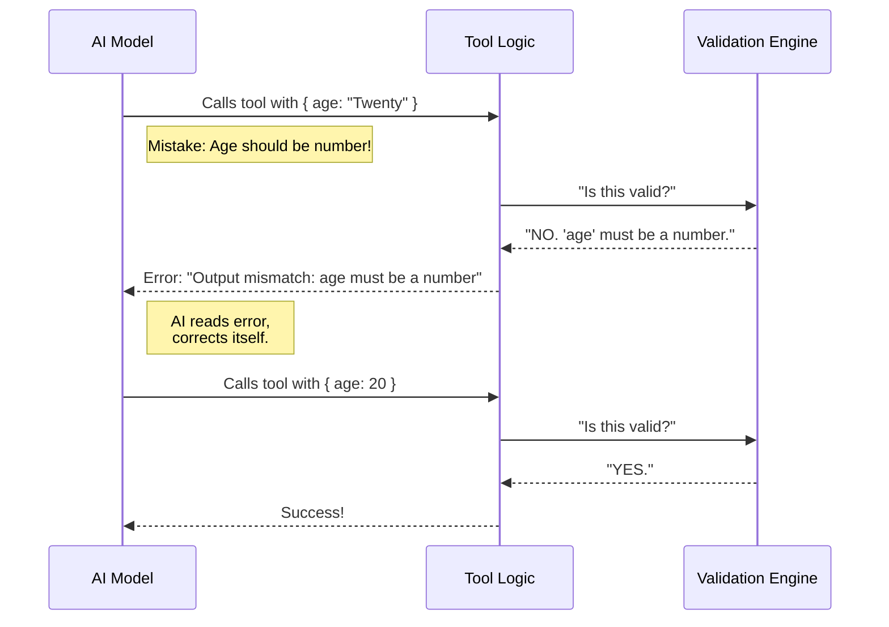

# Chapter 3: Schema Validation Engine

Welcome back! 

In [Chapter 1: Synthetic Output Tool Base](01_synthetic_output_tool_base.md), we built a generic form.
In [Chapter 2: Dynamic Tool Factory](02_dynamic_tool_factory.md), we learned how to create specific "cookie cutters" (Schemas) to define exactly what data we want.

Now, we face a new problem. Just because we gave the AI a rule, doesn't mean it will follow it perfectly every time. AIs can make mistakes—they might send text when we want a number, or forget a required field.

In this chapter, we build the **Schema Validation Engine**. This is the strict logic that acts like a **Bouncer** at a nightclub, checking every piece of data the AI tries to submit.

## The Motivation: The Strict Bouncer

Imagine you asked the AI for a weather report. You defined a strict rule: **Temperature must be a number.**

The AI tries to be helpful but "chatty":
```json
{ "temperature": "It is quite cold today" }
```

If your code tries to do math with that string (`"It is quite cold today" + 5`), your application will crash.

We need a mechanism that intercepts this bad data *before* it reaches your main application. If the data is wrong, we shouldn't just crash—we should throw a specific error back to the AI so it can fix its mistake.

## Key Concept: Compile, Check, Reject

The Schema Validation Engine relies on a library called `Ajv`. The process happens in three steps:

1.  **Compile:** We turn your JSON rules into a high-speed checking function.
2.  **Check:** When the AI sends data, we run it through that function.
3.  **Reject:** If the data is wrong, we stop the tool and generate an error message explaining exactly *why*.

## The "Call" Logic

In the previous chapter, we saw the Factory code. Now, let's zoom in specifically on the `call` function inside the tool it creates. This is where the magic happens.

### 1. The Setup (Compilation)

When we create the tool, we prepare the validator. This happens once, so it's very fast later.

```typescript
import { Ajv } from 'ajv'

// Create the validator engine
const ajv = new Ajv({ allErrors: true })

// "Compile" the schema into a function
// validFunc will return true or false
const validFunc = ajv.compile(jsonSchema)
```
**Explanation:** `ajv.compile` reads your rules (e.g., "Must be a number") and builds a tiny, specialized function (`validFunc`) dedicated to enforcing them.

### 2. The Execution (The Check)

When the AI actually calls the tool, we run the input through our compiled function.

```typescript
async call(input) {
  // Run the checker against the AI's input
  const isValid = validFunc(input)

  if (!isValid) {
    // STOP! The bouncer blocks the entry.
    // (See error handling below)
  }
  
  // PASS! Come on in.
  return { structured_output: input }
}
```
**Explanation:** If `isValid` is true, the data is safe. We return it. If it is false, we enter the "Reject" phase.

### 3. The Rejection (The Specific Error)

This is the most critical part for "Self-Healing." We don't just say "Error." We say *what* went wrong.

```typescript
if (!isValid) {
  // AJV gives us a list of errors
  const errorMsg = validFunc.errors
    .map(e => `${e.instancePath}: ${e.message}`)
    .join(', ')

  // We throw a safe error
  throw new Error(`Output mismatch: ${errorMsg}`)
}
```

**Explanation:**
1.  If the AI sends `"temp": "cold"`, `ajv` generates an error: `temp should be number`.
2.  We throw this error.
3.  **Magic Moment:** The AI *sees* this error in the conversation history! It realizes, "Oops, I sent a string. I should send a number."
4.  The AI automatically tries again with the correct format.

## Internal Implementation: The Flow

Let's visualize exactly what happens when the AI tries to submit data.



## Deep Dive: The Actual Code

Let's look at the implementation inside `SyntheticOutputTool.ts`. This is the code generated by our factory.

### The Specialized Tool Logic

This block resides inside the `buildSyntheticOutputTool` function we discussed in Chapter 2.

```typescript
// Inside the returned tool object...
async call(input) {
  // 1. Validate the input using the compiled function
  const isValid = validateSchema(input)

  // 2. Handle Invalid Data
  if (!isValid) {
    // Format the error message nicely
    const errors = validateSchema.errors
      ?.map(e => `${e.instancePath || 'root'}: ${e.message}`)
      .join(', ')

    // Throw the error so the AI knows it failed
    throw new TelemetrySafeError(
      `Output does not match required schema: ${errors}`,
      `StructuredOutput schema mismatch`
    )
  }

  // 3. Success! Return the data.
  return {
    data: 'Structured output provided successfully',
    structured_output: input,
  }
}
```

**Explanation:**
*   **`validateSchema(input)`**: This is the bouncer checking the ID card.
*   **`TelemetrySafeError`**: This is a custom error class used in this project. It ensures that sensitive user data isn't accidentally logged to server monitoring tools, while still giving the AI the detailed error message it needs to correct itself.
*   **`structured_output`**: We wrap the clean input in this object to signal to the main application that this is the final result.

## Why is this "Beginner Friendly"?

You might think, "Why do I need to know this? Doesn't the library handle it?"

Understanding this is vital because **Schema Design is Prompt Engineering**.

If your schema is vague, the Validator will accept vague data. If your schema is too strict, the Validator might reject valid attempts, causing the AI to get stuck in a loop of errors.

Knowing that there is a strict "Bouncer" (Ajv) checking your rules helps you write better schemas.

## Conclusion

In this chapter, we learned about the **Schema Validation Engine**.

1.  It acts as a **Bouncer**, protecting your app from bad data.
2.  It uses **Ajv** to compile your JSON schema into a fast checking function.
3.  It provides **Specific Error Messages**, allowing the AI to "self-heal" and correct its own mistakes.

Now we have a base tool, a factory to customize it, and a validation engine to enforce rules. But what if we want to turn this tool off completely in certain situations?

In the next chapter, we will learn about **[Feature Gating](04_feature_gating.md)**.

---

Generated by [Code IQ](https://github.com/adityasoni99/Code-IQ)