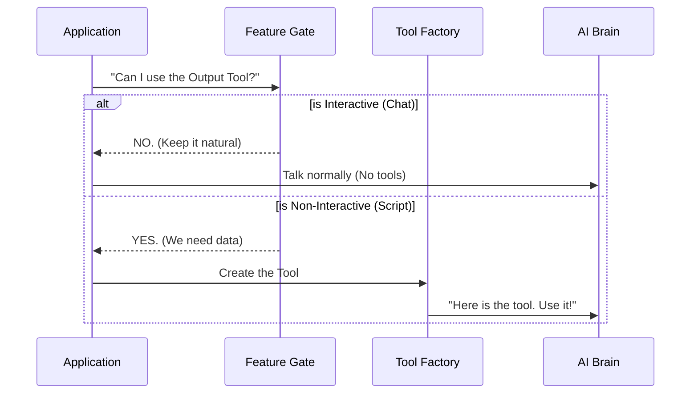

# Chapter 4: Feature Gating

Welcome back!

In the previous chapters, we built a powerful system. We started with the [Synthetic Output Tool Base](01_synthetic_output_tool_base.md), specialized it using the [Dynamic Tool Factory](02_dynamic_tool_factory.md), and secured it with the [Schema Validation Engine](03_schema_validation_engine.md).

We now have a tool that forces the AI to speak in perfect JSON. But here is a question: **Do we always *want* the AI to speak in JSON?**

If you are having a casual chat with the AI ("Tell me a joke"), you don't want the punchline wrapped in curly braces.

In this chapter, we introduce **Feature Gating**. This is the logic that decides *when* the AI is allowed to use our strict data extraction tool.

## The Motivation: Context Matters

Imagine a "Smart Home" system.
1.  **Scenario A (You are home):** You say "Turn on the lights." The system does it and says, "Lights are on."
2.  **Scenario B (You are away):** An automated security script runs. It checks the lights. It expects a status code `{ "lights": "on" }`.

If the AI sends a chatty paragraph to your security script, the script breaks.
If the AI sends raw JSON code to your grandmother asking about the weather, she gets confused.

We need a **Gatekeeper**. A simple switch that says:
*   **Chatting with Human?** Disable the Tool.
*   **Running a Script?** Enable the Tool.

## Key Concept: The "Non-Interactive" Switch

The concept here is straightforward. We check the **Environment** where the AI is running.

*   **Interactive Session:** A human is typing in a chat window.
*   **Non-Interactive Session:** A computer program (script) is triggering the AI in the background.

Our Feature Gating logic simply asks: *"Is this a non-interactive session?"*

## Implementation: The Guard Function

Let's look at the code. It is surprisingly simple but crucial for the system's architecture.

We define a function specifically to answer the question: "Should we turn this tool on?"

```typescript
// The input tells us about the current environment
type Options = {
  isNonInteractiveSession: boolean
}

// The Gatekeeper Function
export function isSyntheticOutputToolEnabled(opts: Options): boolean {
  // Only enable the tool if nobody is manually chatting
  return opts.isNonInteractiveSession
}
```

**Explanation:**
This function receives settings (`opts`). If `isNonInteractiveSession` is `true` (meaning a script is running), the function returns `true`. The tool is enabled.

## Visualizing the Gate

Before the AI even starts thinking, the application runs this check.



## How to Use It

In your main application logic, you use this gate to filter the list of tools you give to the AI.

Here is a simplified example of how you might use this in your app controller:

```typescript
import { isSyntheticOutputToolEnabled } from './SyntheticOutputTool';

// 1. Check the environment
const sessionInfo = { isNonInteractiveSession: true }; // or false

// 2. Ask the gatekeeper
const showTool = isSyntheticOutputToolEnabled(sessionInfo);

// 3. Decide to include the tool or not
const tools = [];
if (showTool) {
   // Only now do we build the tool!
   tools.push(createSyntheticOutputTool(mySchema));
}
```

**Explanation:**
1.  We determine if we are in a script or a chat (`sessionInfo`).
2.  We call `isSyntheticOutputToolEnabled`.
3.  If it returns `false`, the AI never even sees the tool. It doesn't know it exists, so it won't try to use it. It will just chat.

## Under the Hood: Why Gate?

You might wonder, "Why not just give the tool to the AI and tell it in the prompt *'Only use this if asked'*?"

We gate it at the code level for three reasons:

1.  **Safety:** If the tool isn't there, the AI *cannot* accidentally trigger it during a casual conversation.
2.  **Cost & Speed:** Defining tools takes up "tokens" (AI memory). If we don't need the tool, removing it saves money and makes the AI faster.
3.  **Clarity:** It reduces confusion for the AI. It doesn't have to decide "Should I chat or should I output data?" The environment decides for it.

## Internal Implementation Details

The implementation in the project `SyntheticOutputTool.ts` file is exactly as simple as the concept implies.

It is designed to be purely functional—input configuration, output boolean.

```typescript
// From SyntheticOutputTool.ts

export function isSyntheticOutputToolEnabled(opts: {
  isNonInteractiveSession: boolean
}): boolean {
  // Direct mapping: Non-interactive = Tool Enabled
  return opts.isNonInteractiveSession
}
```

The tool definition itself also has an `isEnabled` check, but the primary control happens before the tool is even instantiated.

```typescript
// Inside the tool definition
isEnabled() {
  // Once the tool is created, it is always considered 'on'.
  // The 'gating' happened before creation.
  return true
},
```

**Explanation:**
The `isEnabled` method inside the tool object is a backup. However, our main strategy is **Prevention**. We use the `isSyntheticOutputToolEnabled` function to prevent the [Dynamic Tool Factory](02_dynamic_tool_factory.md) from running at all if the tool isn't needed.

## Conclusion

In this chapter, we learned about **Feature Gating**.

It is the "Safety Switch" that ensures our strict data tool is only active when a computer script is listening, and inactive when a human wants to chat. This keeps the user experience clean and the system robust.

Now we have a system that is safe, specific, and gated. But there is one final performance hurdle.

If we run a script that processes 10,000 items, we call our **Factory** 10,000 times. Compiling those schemas takes time. How can we make it faster?

In the final chapter, we will learn about **[Compilation Caching](05_compilation_caching.md)**.

---

Generated by [Code IQ](https://github.com/adityasoni99/Code-IQ)