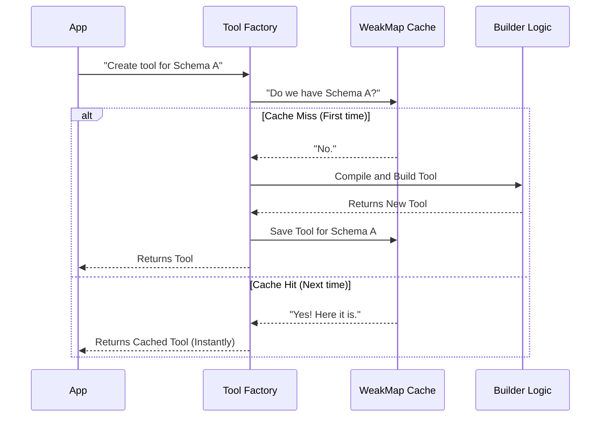

# Chapter 5: Compilation Caching

Welcome to the final chapter of our series!

In the previous chapters, we built a robust system:
1.  We created a generic **[Synthetic Output Tool Base](01_synthetic_output_tool_base.md)**.
2.  We specialized it with the **[Dynamic Tool Factory](02_dynamic_tool_factory.md)**.
3.  We enforced rules with the **[Schema Validation Engine](03_schema_validation_engine.md)**.
4.  We controlled access with **[Feature Gating](04_feature_gating.md)**.

Now, we have a working system. But is it **fast**?

In this chapter, we will optimize our tool factory using **Compilation Caching**. This ensures that even if you process thousands of items, your application remains lightning fast.

## The Motivation: The Forgetful Chef

Imagine a Chef (our code) who has a complex recipe (your Schema).

Every time an order comes in for that dish, the Chef:
1.  Pulls out the recipe book.
2.  Reads every single line carefully.
3.  Memorizes the steps.
4.  Finally starts cooking.

If 100 orders come in for the same dish, the Chef re-reads the recipe 100 times. This is slow and wasteful!

In our code, **Compiling a Schema** (reading the recipe) is the slow part.
*   The library (`Ajv`) has to read your JSON.
*   It has to generate new code (JIT compilation) to validate it.
*   This takes milliseconds.

If you run a script to process 1,000 documents, those milliseconds add up to seconds of wasted time.

## Key Concept: The "Recipe Card" (Object Reference)

We want the Chef to say: *"Oh, I recognize this piece of paper! I already memorized this one."*

To do this, we use a **Cache**.

A cache is a simple storage area.
*   **Key:** The Schema Object (The physical piece of paper).
*   **Value:** The Compiled Tool (The memorized steps).

When we ask for a tool, we check the cache first. If we have seen this specific object before, we return the pre-built tool instantly.

## How to Use It (The Pattern)

The good news is that the caching logic is built inside our factory. You, as the user of the factory, just need to follow one rule: **Reuse your Schema Object.**

### The Slow Way (Creating new objects)

If you define the schema *inside* a loop, you are printing a fresh "piece of paper" every time. The cache won't recognize it.

```typescript
// BAD: New object created in every loop iteration
for (const item of items) {
  // This {} creates a new object in memory every time
  const schema = { type: 'object', properties: { ... } }
  
  // The factory thinks this is a brand new request
  const result = createSyntheticOutputTool(schema) 
}
```

### The Fast Way (Reusing the object)

Define your schema once, outside the loop.

```typescript
// GOOD: Object created once
const mySchema = { type: 'object', properties: { ... } }

for (const item of items) {
  // We pass the EXACT SAME reference
  // The factory sees it's the same object
  const result = createSyntheticOutputTool(mySchema)
}
```

By moving the definition up, you turn 1,000 compilations into **1 compilation**.

## Internal Implementation: The Logic

Let's look at how we implemented this "Memory" inside `SyntheticOutputTool.ts`.

### Visualizing the Cache Flow



### The Code: Using WeakMap

We use a special JavaScript feature called a `WeakMap` for our cache.

```typescript
import { buildSyntheticOutputTool } from './internalBuilder' // imagined import

// 1. Create the memory storage
// Keys are Objects (Schemas), Values are Results (Tools)
const toolCache = new WeakMap<object, CreateResult>()
```

**Why `WeakMap`?**
A standard `Map` holds onto data forever. If you stop using a schema, a standard Map would keep it in memory, eventually causing a "Memory Leak" (running out of RAM).

A `WeakMap` is smart. If your application stops using the `schema` object, the `WeakMap` automatically lets go of the cached tool. It cleans up after itself!

### The Code: The Caching Wrapper

We wrap our heavy building logic (`buildSyntheticOutputTool`) with a lightweight check.

```typescript
export function createSyntheticOutputTool(
  jsonSchema: Record<string, unknown>,
): CreateResult {
  
  // 1. Check if we have seen this object before
  const cached = toolCache.get(jsonSchema)
  
  // 2. If yes, return it immediately!
  if (cached) return cached

  // ... (logic continues below)
```

If the cache misses, we do the hard work and save the result.

```typescript
  // 3. If no, do the heavy compilation work
  const result = buildSyntheticOutputTool(jsonSchema)
  
  // 4. Save it for next time
  toolCache.set(jsonSchema, result)
  
  return result
}
```

**Explanation:**
*   **`toolCache.get`**: This operation is incredibly fast (nanoseconds).
*   **`buildSyntheticOutputTool`**: This operation is slow (milliseconds).
*   By putting the fast check first, we skip the slow part 99% of the time.

## Performance Impact

The difference is drastic.

*   **Without Cache:**
    *   Validating input: ~0.05ms
    *   **Compiling Schema:** ~1.50ms
    *   Total per item: ~1.55ms

*   **With Cache:**
    *   Validating input: ~0.05ms
    *   **Cache Lookup:** ~0.001ms
    *   Total per item: ~0.051ms

In a workflow running 80 times, caching brings the total overhead from **~110ms** down to **~4ms**.

## Conclusion

Congratulations! You have completed the **Synthetic Output Tool** tutorial.

We have built a sophisticated AI tool system from scratch:

1.  **[Synthetic Output Tool Base](01_synthetic_output_tool_base.md)** gave us a standard identity.
2.  **[Dynamic Tool Factory](02_dynamic_tool_factory.md)** allowed us to create tools on the fly.
3.  **[Schema Validation Engine](03_schema_validation_engine.md)** ensured the AI never breaks our app with bad data.
4.  **[Feature Gating](04_feature_gating.md)** kept the tool safe and context-aware.
5.  **Compilation Caching** (this chapter) made it performant enough for production scale.

You now understand the architecture behind reliable, structured AI data extraction!

---

Generated by [Code IQ](https://github.com/adityasoni99/Code-IQ)